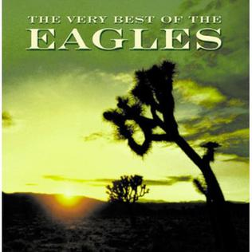

# The Very Best Of The Eagles

By **Eagles**

## Album Data

- **Catalog:** Beets
- **Format:** Digital, Album
- **Album:** The Very Best Of The Eagles
- **Artist:** Eagles
- **Albumartist:** Eagles
- **Genre:** Soft Rock
- **MusicBrainz Album Artist ID:** 
- **MusicBrainz Album ID:** 
- **MusicBrainz Release Group ID:** 
- **Year:** 2007
- **Catalog #:** 
- **Label:** 
- **Total Tracks:** 17

## Album Tracks

### Track 01 - Take It Easy

- **Artist:** Eagles
- **Format:** ALAC
- **Genre:** Soft Rock
- **Length:** 3:30
- **MusicBrainz Track ID:** 
- **Title:** Take It Easy
- **Track:** 01
- **Year:** 1972

### Track 02 - Witchy Woman

- **Artist:** Eagles
- **Format:** ALAC
- **Genre:** Country Rock
- **Length:** 4:11
- **MusicBrainz Track ID:** 
- **Title:** Witchy Woman
- **Track:** 02
- **Year:** 1972

### Track 03 - Peaceful Easy Feeling

- **Artist:** Eagles
- **Format:** ALAC
- **Genre:** Soft Rock
- **Length:** 4:16
- **MusicBrainz Track ID:** 
- **Title:** Peaceful Easy Feeling
- **Track:** 03
- **Year:** 1972

### Track 04 - Desperado

- **Artist:** Eagles
- **Format:** ALAC
- **Genre:** Soft Rock
- **Length:** 3:33
- **MusicBrainz Track ID:** 
- **Title:** Desperado
- **Track:** 04
- **Year:** 1973

### Track 05 - Tequila Sunrise

- **Artist:** Eagles
- **Format:** ALAC
- **Genre:** Soft Rock
- **Length:** 2:52
- **MusicBrainz Track ID:** 
- **Title:** Tequila Sunrise
- **Track:** 05
- **Year:** 1973

### Track 06 - Doolin Dalton

- **Artist:** Eagles
- **Format:** ALAC
- **Genre:** Folk Rock
- **Length:** 3:26
- **MusicBrainz Track ID:** 
- **Title:** Doolin Dalton
- **Track:** 06
- **Year:** 1973

### Track 07 - Already Gone

- **Artist:** Eagles
- **Format:** ALAC
- **Genre:** Soft Rock
- **Length:** 4:15
- **MusicBrainz Track ID:** 
- **Title:** Already Gone
- **Track:** 07
- **Year:** 1974

### Track 08 - Best Of My Love

- **Artist:** Eagles
- **Format:** ALAC
- **Genre:** Soft Rock
- **Length:** 4:34
- **MusicBrainz Track ID:** 
- **Title:** Best Of My Love
- **Track:** 08
- **Year:** 1974

### Track 09 - James Dean

- **Artist:** Eagles
- **Format:** ALAC
- **Genre:** Soft Rock
- **Length:** 3:38
- **MusicBrainz Track ID:** 
- **Title:** James Dean
- **Track:** 09
- **Year:** 1974

### Track 10 - Ol' 55

- **Artist:** Eagles
- **Format:** ALAC
- **Genre:** Soft Rock
- **Length:** 4:22
- **MusicBrainz Track ID:** 
- **Title:** Ol' 55
- **Track:** 10
- **Year:** 1974

### Track 11 - Midnight Flyer

- **Artist:** Eagles
- **Format:** ALAC
- **Genre:** Country Rock
- **Length:** 3:58
- **MusicBrainz Track ID:** 
- **Title:** Midnight Flyer
- **Track:** 11
- **Year:** 1974

### Track 12 - On The Border

- **Artist:** Eagles
- **Format:** ALAC
- **Genre:** Southern Rock
- **Length:** 4:22
- **MusicBrainz Track ID:** 
- **Title:** On The Border
- **Track:** 12
- **Year:** 1974

### Track 13 - Lyin' Eyes

- **Artist:** Eagles
- **Format:** ALAC
- **Genre:** Soft Rock
- **Length:** 6:20
- **MusicBrainz Track ID:** 
- **Title:** Lyin' Eyes
- **Track:** 13
- **Year:** 1975

### Track 14 - One Of These Nights

- **Artist:** Eagles
- **Format:** ALAC
- **Genre:** Soft Rock
- **Length:** 4:50
- **MusicBrainz Track ID:** 
- **Title:** One Of These Nights
- **Track:** 14
- **Year:** 1975

### Track 15 - Take It To The Limit

- **Artist:** Eagles
- **Format:** ALAC
- **Genre:** Soft Rock
- **Length:** 4:47
- **MusicBrainz Track ID:** 
- **Title:** Take It To The Limit
- **Track:** 15
- **Year:** 1975

### Track 16 - After The Thrill Is Gone

- **Artist:** Eagles
- **Format:** ALAC
- **Genre:** Soft Rock
- **Length:** 3:56
- **MusicBrainz Track ID:** 
- **Title:** After The Thrill Is Gone
- **Track:** 16
- **Year:** 1975

### Track 17 - Hotel California

- **Artist:** Eagles
- **Format:** ALAC
- **Genre:** Soft Rock
- **Length:** 6:30
- **MusicBrainz Track ID:** 
- **Title:** Hotel California
- **Track:** 17
- **Year:** 1977

## See also

- [Hotel California](Hotel_California.md)
- [The Very Best Of The Eagles [Disc 1]](The_Very_Best_Of_The_Eagles_[Disc_1].md)
- [The Very Best of The Eagles [Disc 2]](The_Very_Best_of_The_Eagles_[Disc_2].md)
- [Roon: Desperado](../../Roon/Eagles/Desperado.md)
- [Roon: Eagles](../../Roon/Eagles/Eagles.md)
- [Roon: Hotel California (2013 Remaster)](../../Roon/Eagles/Hotel_California_2013_Remaster.md)
- [Roon: One of These Nights](../../Roon/Eagles/One_of_These_Nights.md)
- [Roon: On the Border](../../Roon/Eagles/On_the_Border.md)
- [Roon: The Long Run](../../Roon/Eagles/The_Long_Run.md)
- [Roon: The Very Best Of The Eagles](../../Roon/Eagles/The_Very_Best_Of_The_Eagles.md)
- [Vinyl: Desperado](../../Vinyl/Eagles/Desperado.md)
- [Vinyl: ](../../Vinyl/Eagles/Eagles.md)
- [Vinyl: Hotel California](../../Vinyl/Eagles/Hotel_California.md)
- [Vinyl: On The Border](../../Vinyl/Eagles/On_The_Border.md)
