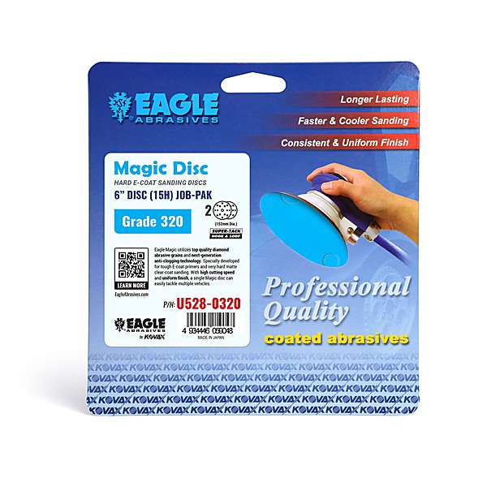

# The Very Best of The Eagles [Disc 2]

By **Eagles**

## Album Data

- **Catalog:** Beets
- **Format:** Digital, Album
- **Album:** The Very Best of The Eagles [Disc 2]
- **Artist:** Eagles
- **Albumartist:** Eagles
- **Genre:** Soft Rock
- **MusicBrainz Album Artist ID:** 
- **MusicBrainz Album ID:** 
- **MusicBrainz Release Group ID:** 
- **Year:** 1977
- **Catalog #:** 
- **Label:** 
- **Total Tracks:** 16

## Album Tracks

### Track 01 - Life In The Fast Lane

- **Artist:** Eagles
- **Format:** ALAC
- **Genre:** Country Rock
- **Length:** 4:45
- **MusicBrainz Track ID:** 
- **Title:** Life In The Fast Lane
- **Track:** 01
- **Year:** 1977

### Track 02 - Wasted Time

- **Artist:** Eagles
- **Format:** ALAC
- **Genre:** Soft Rock
- **Length:** 4:54
- **MusicBrainz Track ID:** 
- **Title:** Wasted Time
- **Track:** 02
- **Year:** 1976

### Track 03 - Victim Of Love

- **Artist:** Eagles
- **Format:** ALAC
- **Genre:** Hard Rock
- **Length:** 4:10
- **MusicBrainz Track ID:** 
- **Title:** Victim Of Love
- **Track:** 03
- **Year:** 2003

### Track 04 - The Last Resort

- **Artist:** Eagles
- **Format:** ALAC
- **Genre:** Soft Rock
- **Length:** 7:28
- **MusicBrainz Track ID:** 
- **Title:** The Last Resort
- **Track:** 04
- **Year:** 1976

### Track 05 - New Kid In Town

- **Artist:** Eagles
- **Format:** ALAC
- **Genre:** Soft Rock
- **Length:** 5:05
- **MusicBrainz Track ID:** 
- **Title:** New Kid In Town
- **Track:** 05
- **Year:** 1976

### Track 06 - Please Come Home For Christmas

- **Artist:** Eagles
- **Format:** ALAC
- **Genre:** Rock
- **Length:** 2:58
- **MusicBrainz Track ID:** 
- **Title:** Please Come Home For Christmas
- **Track:** 06
- **Year:** 2003

### Track 07 - Heartache Tonight

- **Artist:** Eagles
- **Format:** ALAC
- **Genre:** Country Rock
- **Length:** 4:25
- **MusicBrainz Track ID:** 
- **Title:** Heartache Tonight
- **Track:** 07
- **Year:** 1979

### Track 08 - The Sad Cafe

- **Artist:** Eagles
- **Format:** ALAC
- **Genre:** Southern Rock
- **Length:** 5:33
- **MusicBrainz Track ID:** 
- **Title:** The Sad Cafe
- **Track:** 08
- **Year:** 1979

### Track 09 - I Can't Tell You Why

- **Artist:** Eagles
- **Format:** ALAC
- **Genre:** Soft Rock
- **Length:** 4:53
- **MusicBrainz Track ID:** 
- **Title:** I Can't Tell You Why
- **Track:** 09
- **Year:** 1979

### Track 10 - The Long Run

- **Artist:** Eagles
- **Format:** ALAC
- **Genre:** Soft Rock
- **Length:** 3:41
- **MusicBrainz Track ID:** 
- **Title:** The Long Run
- **Track:** 10
- **Year:** 1979

### Track 11 - In The City

- **Artist:** Eagles
- **Format:** ALAC
- **Genre:** Soft Rock
- **Length:** 3:44
- **MusicBrainz Track ID:** 
- **Title:** In The City
- **Track:** 11
- **Year:** 1979

### Track 12 - Those Shoes

- **Artist:** Eagles
- **Format:** ALAC
- **Genre:** Southern Rock
- **Length:** 4:56
- **MusicBrainz Track ID:** 
- **Title:** Those Shoes
- **Track:** 12
- **Year:** 2003

### Track 13 - Seven Bridges Road (Live)

- **Artist:** Eagles
- **Format:** ALAC
- **Genre:** Soft Rock
- **Length:** 3:04
- **MusicBrainz Track ID:** 
- **Title:** Seven Bridges Road (Live)
- **Track:** 13
- **Year:** 2003

### Track 14 - Love Will Keep Us Alive

- **Artist:** Eagles
- **Format:** ALAC
- **Genre:** Soft Rock
- **Length:** 4:02
- **MusicBrainz Track ID:** 
- **Title:** Love Will Keep Us Alive
- **Track:** 14
- **Year:** 1994

### Track 15 - Get Over It

- **Artist:** Eagles
- **Format:** ALAC
- **Genre:** Southern Rock
- **Length:** 3:30
- **MusicBrainz Track ID:** 
- **Title:** Get Over It
- **Track:** 15
- **Year:** 1994

### Track 16 - Hole In The World

- **Artist:** Eagles
- **Format:** ALAC
- **Genre:** Soft Rock
- **Length:** 4:19
- **MusicBrainz Track ID:** 
- **Title:** Hole In The World
- **Track:** 16
- **Year:** 2003

## See also

- [Hotel California](Hotel_California.md)
- [The Very Best Of The Eagles [Disc 1]](The_Very_Best_Of_The_Eagles_[Disc_1].md)
- [The Very Best Of The Eagles](The_Very_Best_Of_The_Eagles.md)
- [Roon: Desperado](../../Roon/Eagles/Desperado.md)
- [Roon: Eagles](../../Roon/Eagles/Eagles.md)
- [Roon: Hotel California (2013 Remaster)](../../Roon/Eagles/Hotel_California_2013_Remaster.md)
- [Roon: One of These Nights](../../Roon/Eagles/One_of_These_Nights.md)
- [Roon: On the Border](../../Roon/Eagles/On_the_Border.md)
- [Roon: The Long Run](../../Roon/Eagles/The_Long_Run.md)
- [Roon: The Very Best Of The Eagles](../../Roon/Eagles/The_Very_Best_Of_The_Eagles.md)
- [Vinyl: Desperado](../../Vinyl/Eagles/Desperado.md)
- [Vinyl: ](../../Vinyl/Eagles/Eagles.md)
- [Vinyl: Hotel California](../../Vinyl/Eagles/Hotel_California.md)
- [Vinyl: On The Border](../../Vinyl/Eagles/On_The_Border.md)
