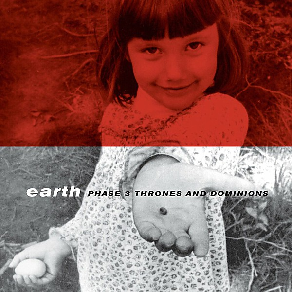

# Phase 3

By **Earth**

## Album Data

- **Catalog:** Beets
- **Format:** Digital, Album
- **Album:** Phase 3
- **Artist:** Earth
- **Albumartist:** Earth
- **Genre:** Stoner Metal
- **MusicBrainz Album Artist ID:** [https](https://musicbrainz.org/artist/https)
- **MusicBrainz Album ID:** [https](https://musicbrainz.org/release/https)
- **MusicBrainz Release Group ID:** 
- **Year:** 1995
- **Catalog #:** 
- **Label:** 
- **Total Tracks:** 08

## Album Tracks

### Track 01 - The Fiery

- **Artist:** Earth
- **Format:** AAC
- **Genre:** Stoner Rock
- **Length:** 2:54
- **MusicBrainz Track ID:** 
- **Title:** The Fiery
- **Track:** 01
- **Year:** 0000

### Track 02 - Red Torino

- **Artist:** Earth
- **Format:** AAC
- **Genre:** Stoner Rock
- **Length:** 7:43
- **MusicBrainz Track ID:** 
- **Title:** Red Torino
- **Track:** 02
- **Year:** 0000

## See also

- [Sp262d](Sp262d.md)
