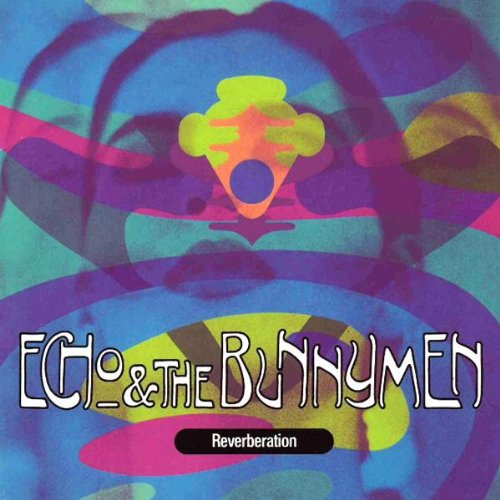

# Reverberation

By **Echo & the Bunnymen**

## Album Data

- **Catalog:** Beets
- **Format:** Digital, Album
- **Album:** Reverberation
- **Artist:** Echo & The Bunnymen
- **Albumartist:** Echo & the Bunnymen
- **Genre:** Neo-Psychedelia
- **MusicBrainz Album Artist ID:** [ccd4879c-5e88-4385-b131-bf65296bf245](https://musicbrainz.org/artist/ccd4879c-5e88-4385-b131-bf65296bf245)
- **MusicBrainz Album ID:** [edc9b959-d863-36f3-b554-b83e6c54710e](https://musicbrainz.org/release/edc9b959-d863-36f3-b554-b83e6c54710e)
- **MusicBrainz Release Group ID:** [a5dc11f2-03f3-3153-acff-0d90a771e798](https://musicbrainz.org/release-group/a5dc11f2-03f3-3153-acff-0d90a771e798)
- **Year:** 1990
- **Catalog #:** 9 26388-2
- **Label:** Sire Records
- **Total Tracks:** 10

## Album Tracks

### Track 01 - Gone, Gone, Gone

- **Artist:** Echo & the Bunnymen
- **Format:** MP3
- **Genre:** Madchester
- **Length:** 4:12
- **MusicBrainz Track ID:** [329e9eac-a868-4b4c-9931-b3ab91663454](https://musicbrainz.org/recording/329e9eac-a868-4b4c-9931-b3ab91663454)
- **Title:** Gone, Gone, Gone
- **Track:** 01
- **Year:** 1990

### Track 02 - Enlighten Me

- **Artist:** Echo & the Bunnymen
- **Format:** MP3
- **Genre:** Madchester
- **Length:** 5:01
- **MusicBrainz Track ID:** [90e4ba68-536c-4169-8907-505938b51320](https://musicbrainz.org/recording/90e4ba68-536c-4169-8907-505938b51320)
- **Title:** Enlighten Me
- **Track:** 02
- **Year:** 1990

### Track 03 - Cut & Dried

- **Artist:** Echo & the Bunnymen
- **Format:** MP3
- **Genre:** Neo-Psychedelia
- **Length:** 3:46
- **MusicBrainz Track ID:** [5fbc5e7b-46ef-4a6a-ae69-5d0c29c57bc8](https://musicbrainz.org/recording/5fbc5e7b-46ef-4a6a-ae69-5d0c29c57bc8)
- **Title:** Cut & Dried
- **Track:** 03
- **Year:** 1990

### Track 04 - King of Your Castle

- **Artist:** Echo & the Bunnymen
- **Format:** MP3
- **Genre:** Neo-Psychedelia
- **Length:** 4:36
- **MusicBrainz Track ID:** [cb1e7eec-1213-46dd-a9f7-dc86e58bcbe0](https://musicbrainz.org/recording/cb1e7eec-1213-46dd-a9f7-dc86e58bcbe0)
- **Title:** King of Your Castle
- **Track:** 04
- **Year:** 1990

### Track 05 - Devilment

- **Artist:** Echo & the Bunnymen
- **Format:** MP3
- **Genre:** Neo-Psychedelia
- **Length:** 4:43
- **MusicBrainz Track ID:** [c93b15df-c31e-4042-9732-91aaed8a2b0d](https://musicbrainz.org/recording/c93b15df-c31e-4042-9732-91aaed8a2b0d)
- **Title:** Devilment
- **Track:** 05
- **Year:** 1990

### Track 06 - Thick Skinned World

- **Artist:** Echo & the Bunnymen
- **Format:** MP3
- **Genre:** Neo-Psychedelia
- **Length:** 4:18
- **MusicBrainz Track ID:** [40c8854b-e5e1-44c8-8815-c9f1d810a640](https://musicbrainz.org/recording/40c8854b-e5e1-44c8-8815-c9f1d810a640)
- **Title:** Thick Skinned World
- **Track:** 06
- **Year:** 1990

### Track 07 - Freaks Dwell

- **Artist:** Echo & the Bunnymen
- **Format:** MP3
- **Genre:** Neo-Psychedelia
- **Length:** 3:50
- **MusicBrainz Track ID:** [a9185811-3128-4f47-9591-faaee3ff2785](https://musicbrainz.org/recording/a9185811-3128-4f47-9591-faaee3ff2785)
- **Title:** Freaks Dwell
- **Track:** 07
- **Year:** 1990

### Track 08 - Senseless

- **Artist:** Echo & the Bunnymen
- **Format:** MP3
- **Genre:** Neo-Psychedelia
- **Length:** 4:54
- **MusicBrainz Track ID:** [eeddeb8d-2966-4b41-8de1-e2f2448d3fb2](https://musicbrainz.org/recording/eeddeb8d-2966-4b41-8de1-e2f2448d3fb2)
- **Title:** Senseless
- **Track:** 08
- **Year:** 1990

### Track 09 - Flaming Red

- **Artist:** Echo & the Bunnymen
- **Format:** MP3
- **Genre:** Neo-Psychedelia
- **Length:** 5:33
- **MusicBrainz Track ID:** [02b46853-3a5a-42b7-8d34-28a250794e1d](https://musicbrainz.org/recording/02b46853-3a5a-42b7-8d34-28a250794e1d)
- **Title:** Flaming Red
- **Track:** 09
- **Year:** 1990

### Track 10 - False Goodbyes

- **Artist:** Echo & the Bunnymen
- **Format:** MP3
- **Genre:** Neo-Psychedelia
- **Length:** 5:39
- **MusicBrainz Track ID:** [2171094a-89d4-40c9-b843-598561abd90d](https://musicbrainz.org/recording/2171094a-89d4-40c9-b843-598561abd90d)
- **Title:** False Goodbyes
- **Track:** 10
- **Year:** 1990

