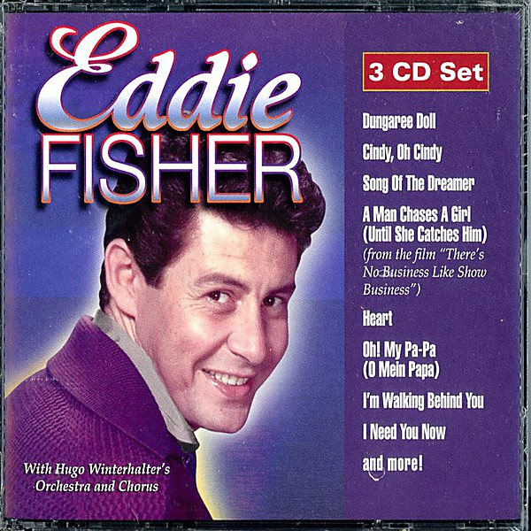

# All-Time Greatest Hits

By **Eddie Fisher**

## Album Data

- **Catalog:** Beets
- **Format:** Digital, Album
- **Album:** All-Time Greatest Hits
- **Artist:** Eddie Fisher
- **Albumartist:** Eddie Fisher
- **Genre:** Orchestra
- **MusicBrainz Album Artist ID:** 
- **MusicBrainz Album ID:** 
- **MusicBrainz Release Group ID:** 
- **Year:** 1991
- **Catalog #:** 
- **Label:** 
- **Total Tracks:** 00

## Album Tracks

### Track 13 - I Need You Now

- **Artist:** Eddie Fisher
- **Format:** AAC
- **Genre:** Orchestra
- **Length:** 2:30
- **MusicBrainz Track ID:** 
- **Title:** I Need You Now
- **Track:** 13
- **Year:** 0000

## See also

- [All Time Greatest Hits](All_Time_Greatest_Hits.md)
- [Back To The Fifties Disk 2](Back_To_The_Fifties_Disk_2.md)
- [Unknown Album](Unknown_Album.md)
- [Vinyl: ](../../Vinyl/Eddie_Fisher/Eddie_Fisher.md)
- [Vinyl: I Need You Now / Heaven Was Never Like This](../../Vinyl/Eddie_Fisher/I_Need_You_Now_-_Heaven_Was_Never_Like_This.md)
