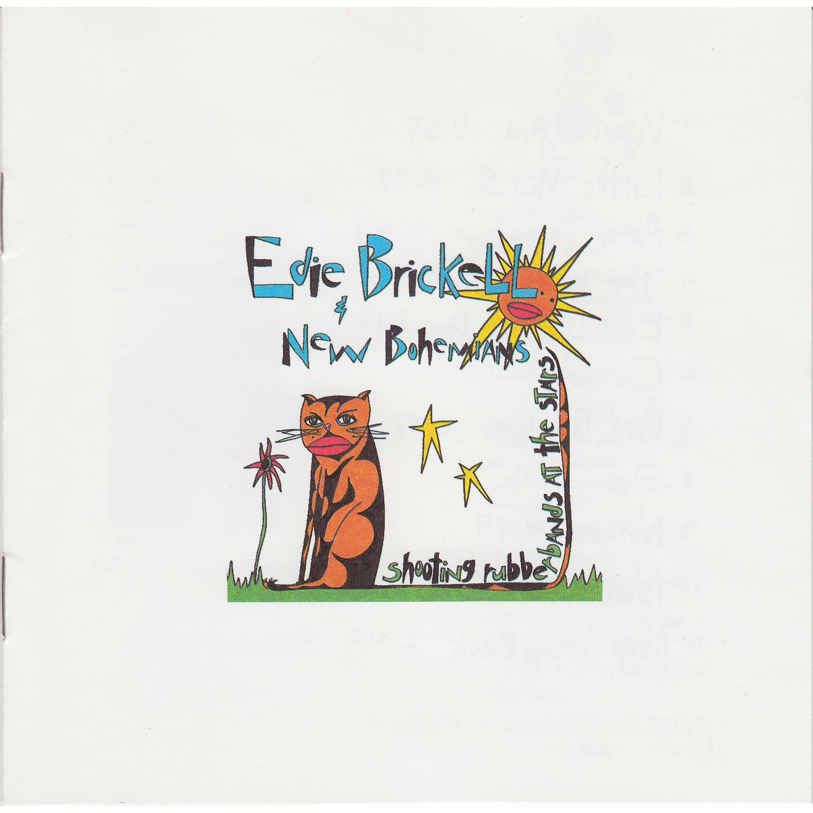

# Shooting Rubberbands at the Stars

By **Edie Brickell & New Bohemians**

## Album Data

- **Catalog:** Beets
- **Format:** Digital, Album
- **Album:** Shooting Rubberbands at the Stars
- **Artist:** Edie Brickell & New Bohemians
- **Albumartist:** Edie Brickell & New Bohemians
- **Genre:** Pop Rock
- **MusicBrainz Album Artist ID:** [df87d5be-c4b5-48e4-97b2-6440b77ca4fb](https://musicbrainz.org/artist/df87d5be-c4b5-48e4-97b2-6440b77ca4fb)
- **MusicBrainz Album ID:** [f07cb980-4763-3183-9efe-904cbc0167cc](https://musicbrainz.org/release/f07cb980-4763-3183-9efe-904cbc0167cc)
- **MusicBrainz Release Group ID:** [fde27ae8-1b44-3076-8224-1f6ea20fbd6a](https://musicbrainz.org/release-group/fde27ae8-1b44-3076-8224-1f6ea20fbd6a)
- **Year:** 1988
- **Catalog #:** 9 24192-2
- **Label:** Geffen Records
- **Total Tracks:** 12

## Album Tracks

### Track 01 - What I Am

- **Artist:** Edie Brickell & New Bohemians
- **Format:** ALAC
- **Genre:** Alternative Rock
- **Length:** 4:58
- **MusicBrainz Track ID:** [956da784-ccf2-44b1-a311-9359e02471b3](https://musicbrainz.org/recording/956da784-ccf2-44b1-a311-9359e02471b3)
- **Title:** What I Am
- **Track:** 01
- **Year:** 1988

### Track 02 - Little Miss S.

- **Artist:** Edie Brickell & New Bohemians
- **Format:** ALAC
- **Genre:** Indie Pop
- **Length:** 3:39
- **MusicBrainz Track ID:** [237672cd-1d3e-476d-a703-aae8c7e7fbab](https://musicbrainz.org/recording/237672cd-1d3e-476d-a703-aae8c7e7fbab)
- **Title:** Little Miss S.
- **Track:** 02
- **Year:** 1988

### Track 03 - Air of December

- **Artist:** Edie Brickell & New Bohemians
- **Format:** ALAC
- **Genre:** Soft Rock
- **Length:** 5:59
- **MusicBrainz Track ID:** [9411d514-5459-408f-94eb-2340ec2d8a3b](https://musicbrainz.org/recording/9411d514-5459-408f-94eb-2340ec2d8a3b)
- **Title:** Air of December
- **Track:** 03
- **Year:** 1988

### Track 04 - The Wheel

- **Artist:** Edie Brickell & New Bohemians
- **Format:** ALAC
- **Genre:** Pop Rock
- **Length:** 3:54
- **MusicBrainz Track ID:** [e1f85f00-c397-4c10-9286-f52b96739b72](https://musicbrainz.org/recording/e1f85f00-c397-4c10-9286-f52b96739b72)
- **Title:** The Wheel
- **Track:** 04
- **Year:** 1988

### Track 05 - Love Like We Do

- **Artist:** Edie Brickell & New Bohemians
- **Format:** ALAC
- **Genre:** Folk Rock
- **Length:** 3:09
- **MusicBrainz Track ID:** [78b2a18e-487b-4931-854c-b96bf9d20776](https://musicbrainz.org/recording/78b2a18e-487b-4931-854c-b96bf9d20776)
- **Title:** Love Like We Do
- **Track:** 05
- **Year:** 1988

### Track 06 - Circle

- **Artist:** Edie Brickell & New Bohemians
- **Format:** ALAC
- **Genre:** Indie Rock
- **Length:** 3:13
- **MusicBrainz Track ID:** [8948cd26-7364-4674-a50b-7b06159ed6e7](https://musicbrainz.org/recording/8948cd26-7364-4674-a50b-7b06159ed6e7)
- **Title:** Circle
- **Track:** 06
- **Year:** 1988

### Track 07 - Beat the Time

- **Artist:** Edie Brickell & New Bohemians
- **Format:** ALAC
- **Genre:** Folk Rock
- **Length:** 2:58
- **MusicBrainz Track ID:** [34a10094-7be8-4cab-98e5-3319705f74b4](https://musicbrainz.org/recording/34a10094-7be8-4cab-98e5-3319705f74b4)
- **Title:** Beat the Time
- **Track:** 07
- **Year:** 1988

### Track 08 - She

- **Artist:** Edie Brickell & New Bohemians
- **Format:** ALAC
- **Genre:** Britpop
- **Length:** 5:08
- **MusicBrainz Track ID:** [7726fa96-c3dc-46c9-b93a-457fc00f9256](https://musicbrainz.org/recording/7726fa96-c3dc-46c9-b93a-457fc00f9256)
- **Title:** She
- **Track:** 08
- **Year:** 1988

### Track 09 - Nothing

- **Artist:** Edie Brickell & New Bohemians
- **Format:** ALAC
- **Genre:** Folk Rock
- **Length:** 4:51
- **MusicBrainz Track ID:** [04e7aa0d-935d-47a1-b26d-94afd164ffb9](https://musicbrainz.org/recording/04e7aa0d-935d-47a1-b26d-94afd164ffb9)
- **Title:** Nothing
- **Track:** 09
- **Year:** 1988

### Track 10 - Now

- **Artist:** Edie Brickell & New Bohemians
- **Format:** ALAC
- **Genre:** Rock
- **Length:** 6:04
- **MusicBrainz Track ID:** [ac1d9bdc-0b2b-448a-8a3d-714c676a8176](https://musicbrainz.org/recording/ac1d9bdc-0b2b-448a-8a3d-714c676a8176)
- **Title:** Now
- **Track:** 10
- **Year:** 1988

### Track 11 - Keep Coming Back

- **Artist:** Edie Brickell & New Bohemians
- **Format:** ALAC
- **Genre:** Alternative Rock
- **Length:** 2:46
- **MusicBrainz Track ID:** [369f6e15-8839-4444-ab9e-ba45a9518256](https://musicbrainz.org/recording/369f6e15-8839-4444-ab9e-ba45a9518256)
- **Title:** Keep Coming Back
- **Track:** 11
- **Year:** 1988

### Track 12 - I Do

- **Artist:** Edie Brickell & New Bohemians
- **Format:** ALAC
- **Genre:** Folk Rock
- **Length:** 2:00
- **MusicBrainz Track ID:** [80f8d791-1802-4c09-bd53-ffcc53774c1b](https://musicbrainz.org/recording/80f8d791-1802-4c09-bd53-ffcc53774c1b)
- **Title:** I Do
- **Track:** 12
- **Year:** 1988

## See also

- [Ghost of a Dog](Ghost_of_a_Dog.md)
- [Roon: Hunter and the Dog Star](../../Roon/Edie_Brickell_and_New_Bohemians/Hunter_and_the_Dog_Star.md)
- [Roon: Shooting Rubberbands At The Stars](../../Roon/Edie_Brickell_and_New_Bohemians/Shooting_Rubberbands_At_The_Stars.md)
