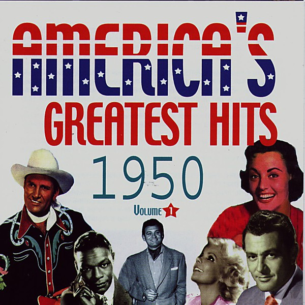

# 1950

By **Eileen Barton**

## Album Data

- **Catalog:** Beets
- **Format:** Digital, Album
- **Album:** 1950
- **Artist:** Eileen Barton
- **Albumartist:** Eileen Barton
- **Genre:** Pop
- **MusicBrainz Album Artist ID:** 
- **MusicBrainz Album ID:** 
- **MusicBrainz Release Group ID:** 
- **Year:** 1950
- **Catalog #:** 
- **Label:** 
- **Total Tracks:** 00

## Album Tracks

### Track 22 - If I Knew You Were Comin' (I'd 've Baked a Cake)

- **Artist:** Eileen Barton
- **Format:** AAC
- **Genre:** Pop
- **Length:** 2:38
- **MusicBrainz Track ID:** 
- **Title:** If I Knew You Were Comin' (I'd 've Baked a Cake)
- **Track:** 22
- **Year:** 1950

