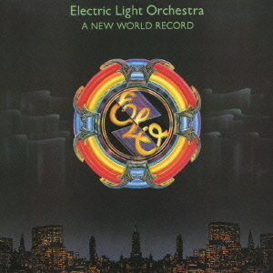

# A New World Record

By **Electric Light Orchestra**

## Album Data

- **Catalog:** Beets
- **Format:** Digital, Album
- **Album:** A New World Record
- **Artist:** Electric Light Orchestra
- **Albumartist:** Electric Light Orchestra
- **Genre:** Progressive Rock
- **MusicBrainz Album Artist ID:** [0c502791-4ee9-4c5f-9696-0602b721ff3b](https://musicbrainz.org/artist/0c502791-4ee9-4c5f-9696-0602b721ff3b)
- **MusicBrainz Album ID:** [7016df33-ef41-44ad-a78e-83398cf83839](https://musicbrainz.org/release/7016df33-ef41-44ad-a78e-83398cf83839)
- **MusicBrainz Release Group ID:** [e3fb6403-71d2-3815-b85a-4f4edb18a556](https://musicbrainz.org/release-group/e3fb6403-71d2-3815-b85a-4f4edb18a556)
- **Year:** 2006
- **Catalog #:** 
- **Label:** Columbia
- **Total Tracks:** 12

## Album Tracks

### Track 01 - When I Was a Boy

- **Artist:** Electric Light Orchestra
- **Format:** ALAC
- **Genre:** Pop
- **Length:** 3:12
- **MusicBrainz Track ID:** [41a21670-ecf0-4ddc-817c-ecee2efa3a2e](https://musicbrainz.org/recording/41a21670-ecf0-4ddc-817c-ecee2efa3a2e)
- **Title:** When I Was a Boy
- **Track:** 01
- **Year:** 2015

### Track 02 - Love and Rain

- **Artist:** Electric Light Orchestra
- **Format:** ALAC
- **Genre:** Pop Rock
- **Length:** 3:30
- **MusicBrainz Track ID:** [c971d996-4b64-42ea-a40b-41cb9f3db162](https://musicbrainz.org/recording/c971d996-4b64-42ea-a40b-41cb9f3db162)
- **Title:** Love and Rain
- **Track:** 02
- **Year:** 2015

### Track 03 - Dirty to the Bone

- **Artist:** Electric Light Orchestra
- **Format:** ALAC
- **Genre:** Pop Rock
- **Length:** 3:06
- **MusicBrainz Track ID:** [abe59282-6fdd-42e0-b750-5fd5e021aea3](https://musicbrainz.org/recording/abe59282-6fdd-42e0-b750-5fd5e021aea3)
- **Title:** Dirty to the Bone
- **Track:** 03
- **Year:** 2015

### Track 04 - When the Night Comes

- **Artist:** Electric Light Orchestra
- **Format:** ALAC
- **Genre:** Pop Rock
- **Length:** 3:22
- **MusicBrainz Track ID:** [a635ed5a-ef0f-4ff3-bba7-ef1792380785](https://musicbrainz.org/recording/a635ed5a-ef0f-4ff3-bba7-ef1792380785)
- **Title:** When the Night Comes
- **Track:** 04
- **Year:** 2015

### Track 05 - The Sun Will Shine on You

- **Artist:** Electric Light Orchestra
- **Format:** ALAC
- **Genre:** Pop Rock
- **Length:** 3:30
- **MusicBrainz Track ID:** [db4c5e2e-b04b-4fcd-bf21-6c99a47eb66d](https://musicbrainz.org/recording/db4c5e2e-b04b-4fcd-bf21-6c99a47eb66d)
- **Title:** The Sun Will Shine on You
- **Track:** 05
- **Year:** 2015

### Track 06 - Ain’t It a Drag

- **Artist:** Electric Light Orchestra
- **Format:** ALAC
- **Genre:** Pop Rock
- **Length:** 2:36
- **MusicBrainz Track ID:** [42b3605d-e727-4bae-9072-8484e4a3859c](https://musicbrainz.org/recording/42b3605d-e727-4bae-9072-8484e4a3859c)
- **Title:** Ain’t It a Drag
- **Track:** 06
- **Year:** 2015

### Track 07 - All My Life

- **Artist:** Electric Light Orchestra
- **Format:** ALAC
- **Genre:** Pop Rock
- **Length:** 2:51
- **MusicBrainz Track ID:** [c8666ead-8191-4261-9d96-f9c4bea570cd](https://musicbrainz.org/recording/c8666ead-8191-4261-9d96-f9c4bea570cd)
- **Title:** All My Life
- **Track:** 07
- **Year:** 2015

### Track 08 - I’m Leaving You

- **Artist:** Electric Light Orchestra
- **Format:** ALAC
- **Genre:** Pop Rock
- **Length:** 3:08
- **MusicBrainz Track ID:** [0a20d807-f016-4049-a32c-35ae8b9917d5](https://musicbrainz.org/recording/0a20d807-f016-4049-a32c-35ae8b9917d5)
- **Title:** I’m Leaving You
- **Track:** 08
- **Year:** 2015

### Track 09 - One Step at a Time

- **Artist:** Electric Light Orchestra
- **Format:** ALAC
- **Genre:** Pop Rock
- **Length:** 3:21
- **MusicBrainz Track ID:** [28a12c08-879a-444f-a222-f9fdead41467](https://musicbrainz.org/recording/28a12c08-879a-444f-a222-f9fdead41467)
- **Title:** One Step at a Time
- **Track:** 09
- **Year:** 2015

### Track 10 - Alone in the Universe

- **Artist:** Electric Light Orchestra
- **Format:** ALAC
- **Genre:** Pop Rock
- **Length:** 3:55
- **MusicBrainz Track ID:** [ed53832f-81d0-40df-83f6-3bbf49d69594](https://musicbrainz.org/recording/ed53832f-81d0-40df-83f6-3bbf49d69594)
- **Title:** Alone in the Universe
- **Track:** 10
- **Year:** 2015

### Track 11 - Fault Line

- **Artist:** Electric Light Orchestra
- **Format:** ALAC
- **Genre:** Pop Rock
- **Length:** 2:07
- **MusicBrainz Track ID:** [af52193d-3a09-4ac3-a194-1b551cd199a6](https://musicbrainz.org/recording/af52193d-3a09-4ac3-a194-1b551cd199a6)
- **Title:** Fault Line
- **Track:** 11
- **Year:** 2015

### Track 12 - Blue

- **Artist:** Electric Light Orchestra
- **Format:** ALAC
- **Genre:** Pop Rock
- **Length:** 2:34
- **MusicBrainz Track ID:** [731eec87-96fa-40c7-8174-6e4fd940b2aa](https://musicbrainz.org/recording/731eec87-96fa-40c7-8174-6e4fd940b2aa)
- **Title:** Blue
- **Track:** 12
- **Year:** 2015

## See also

- [Alone in the Universe](Alone_in_the_Universe.md)
- [Balance of Power](Balance_of_Power.md)
- [Discovery](Discovery.md)
- [ELO II](ELO_II.md)
- [Face the Music](Face_the_Music.md)
- [Flashback](Flashback.md)
- [No Answer](No_Answer.md)
- [On The Third Day](On_The_Third_Day.md)
- [Out of the Blue](Out_of_the_Blue.md)
- [Secret Messages](Secret_Messages.md)
- [The Early Years](The_Early_Years.md)
- [Time](Time.md)
- [Unknown Album (6/19/2007 4](Unknown_Album_6-19-2007_4.md)
- [Unknown Album (6/19/2007 5](Unknown_Album_6-19-2007_5.md)
- [CD: A New World Record](../../CD/Electric_Light_Orchestra/A_New_World_Record.md)
- [CD: Balance Of Power](../../CD/Electric_Light_Orchestra/Balance_Of_Power.md)
- [CD: Discovery](../../CD/Electric_Light_Orchestra/Discovery.md)
- [CD: Eldorado](../../CD/Electric_Light_Orchestra/Eldorado.md)
- [CD: ](../../CD/Electric_Light_Orchestra/Electric_Light_Orchestra.md)
- [CD: Elo Ii](../../CD/Electric_Light_Orchestra/Elo_Ii.md)
- [CD: Face The Music](../../CD/Electric_Light_Orchestra/Face_The_Music.md)
- [CD: No Answer](../../CD/Electric_Light_Orchestra/No_Answer.md)
- [CD: On The Third Day](../../CD/Electric_Light_Orchestra/On_The_Third_Day.md)
- [CD: Out Of The Blue](../../CD/Electric_Light_Orchestra/Out_Of_The_Blue.md)
- [CD: Secret Messages](../../CD/Electric_Light_Orchestra/Secret_Messages.md)
- [CD: Time](../../CD/Electric_Light_Orchestra/Time.md)
- [Roon: A New World Record](../../Roon/Electric_Light_Orchestra/A_New_World_Record.md)
- [Roon: Balance of Power](../../Roon/Electric_Light_Orchestra/Balance_of_Power.md)
- [Roon: Discovery](../../Roon/Electric_Light_Orchestra/Discovery.md)
- [Roon: Eldorado](../../Roon/Electric_Light_Orchestra/Eldorado.md)
- [Roon: Electric Light Orchestra II](../../Roon/Electric_Light_Orchestra/Electric_Light_Orchestra_II.md)
- [Roon: Face the Music](../../Roon/Electric_Light_Orchestra/Face_the_Music.md)
- [Roon: Flashback](../../Roon/Electric_Light_Orchestra/Flashback.md)
- [Roon: Jeff Lynne's ELO - Alone In The Universe (bonus track version)](../../Roon/Electric_Light_Orchestra/Jeff_Lynnes_ELO_-_Alone_In_The_Universe_bonus_track_version.md)
- [Roon: Jeff Lynne's ELO - Alone in the Universe](../../Roon/Electric_Light_Orchestra/Jeff_Lynnes_ELO_-_Alone_in_the_Universe.md)
- [Roon: No Answer](../../Roon/Electric_Light_Orchestra/No_Answer.md)
- [Roon: On the Third Day](../../Roon/Electric_Light_Orchestra/On_the_Third_Day.md)
- [Roon: Out of the Blue](../../Roon/Electric_Light_Orchestra/Out_of_the_Blue.md)
- [Roon: Secret Messages](../../Roon/Electric_Light_Orchestra/Secret_Messages.md)
- [Roon: The Collection](../../Roon/Electric_Light_Orchestra/The_Collection.md)
- [Roon: Time](../../Roon/Electric_Light_Orchestra/Time.md)
- [Vinyl: Eldorado - A Symphony By The Electric Light Orchestra](../../Vinyl/Electric_Light_Orchestra/Eldorado_-_A_Symphony_By_The_Electric_Light_Orchestra.md)
- [Vinyl: ](../../Vinyl/Electric_Light_Orchestra/Electric_Light_Orchestra.md)
- [Vinyl: Face The Music](../../Vinyl/Electric_Light_Orchestra/Face_The_Music.md)
