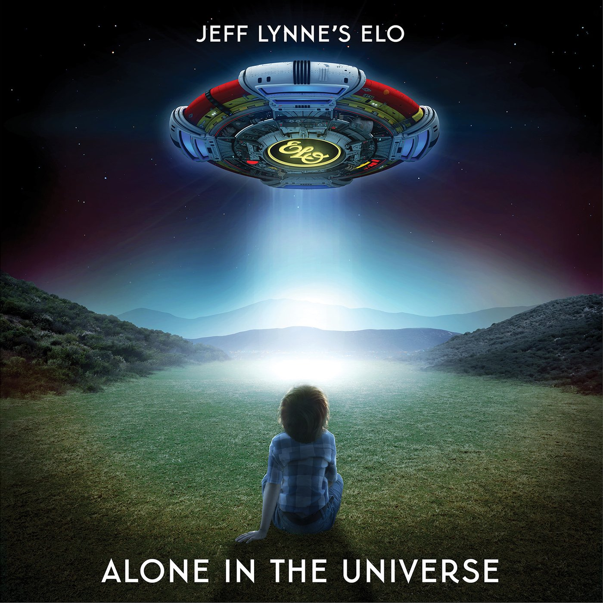

# Alone in the Universe

By **Electric Light Orchestra**

## Album Data

- **Catalog:** Beets
- **Format:** Digital, Album
- **Album:** Alone in the Universe
- **Artist:** Electric Light Orchestra
- **Albumartist:** Electric Light Orchestra
- **Genre:** Pop Rock
- **MusicBrainz Album Artist ID:** [0c502791-4ee9-4c5f-9696-0602b721ff3b](https://musicbrainz.org/artist/0c502791-4ee9-4c5f-9696-0602b721ff3b)
- **MusicBrainz Album ID:** [2b81ff82-f5cd-4d1c-862f-94affd034223](https://musicbrainz.org/release/2b81ff82-f5cd-4d1c-862f-94affd034223)
- **MusicBrainz Release Group ID:** [66252478-bb2b-4069-ac4e-81f2a1e7c58b](https://musicbrainz.org/release-group/66252478-bb2b-4069-ac4e-81f2a1e7c58b)
- **Year:** 2015
- **Catalog #:** 
- **Label:** 
- **Total Tracks:** 17

## Album Tracks

### Track 01 - Heaven Only Knows

- **Artist:** Electric Light Orchestra
- **Format:** ALAC
- **Genre:** Synthpop
- **Length:** 2:56
- **MusicBrainz Track ID:** [a3849a09-8f65-4f52-82e9-4170292dc404](https://musicbrainz.org/recording/a3849a09-8f65-4f52-82e9-4170292dc404)
- **Title:** Heaven Only Knows
- **Track:** 01
- **Year:** 2007

### Track 02 - So Serious

- **Artist:** Electric Light Orchestra
- **Format:** ALAC
- **Genre:** Rock
- **Length:** 2:43
- **MusicBrainz Track ID:** [3efb9aca-b6bb-4689-ba51-3b66919c865c](https://musicbrainz.org/recording/3efb9aca-b6bb-4689-ba51-3b66919c865c)
- **Title:** So Serious
- **Track:** 02
- **Year:** 2007

### Track 03 - Getting to the Point

- **Artist:** Electric Light Orchestra
- **Format:** ALAC
- **Genre:** Soft Rock
- **Length:** 4:30
- **MusicBrainz Track ID:** [3701571b-9a3c-48d2-84e8-65a79b292161](https://musicbrainz.org/recording/3701571b-9a3c-48d2-84e8-65a79b292161)
- **Title:** Getting to the Point
- **Track:** 03
- **Year:** 2007

### Track 04 - Secret Lives

- **Artist:** Electric Light Orchestra
- **Format:** ALAC
- **Genre:** Progressive Rock
- **Length:** 3:31
- **MusicBrainz Track ID:** [0c3c704b-0f8c-46c1-8c54-8b0b8d471049](https://musicbrainz.org/recording/0c3c704b-0f8c-46c1-8c54-8b0b8d471049)
- **Title:** Secret Lives
- **Track:** 04
- **Year:** 2007

### Track 05 - Is It Alright

- **Artist:** Electric Light Orchestra
- **Format:** ALAC
- **Genre:** Pop Rock
- **Length:** 3:27
- **MusicBrainz Track ID:** [e10dcdc5-3cc1-45b6-bb29-560255df5ef1](https://musicbrainz.org/recording/e10dcdc5-3cc1-45b6-bb29-560255df5ef1)
- **Title:** Is It Alright
- **Track:** 05
- **Year:** 2007

### Track 06 - Sorrow About to Fall

- **Artist:** Electric Light Orchestra
- **Format:** ALAC
- **Genre:** Soft Rock
- **Length:** 4:04
- **MusicBrainz Track ID:** [f391c7f9-1848-405c-91c3-d5a2e9c24c73](https://musicbrainz.org/recording/f391c7f9-1848-405c-91c3-d5a2e9c24c73)
- **Title:** Sorrow About to Fall
- **Track:** 06
- **Year:** 2007

### Track 07 - Without Someone

- **Artist:** Electric Light Orchestra
- **Format:** ALAC
- **Genre:** Progressive Rock
- **Length:** 3:51
- **MusicBrainz Track ID:** [df172c77-b1e3-477a-ba76-363e2476d5dc](https://musicbrainz.org/recording/df172c77-b1e3-477a-ba76-363e2476d5dc)
- **Title:** Without Someone
- **Track:** 07
- **Year:** 2007

### Track 08 - Calling America

- **Artist:** Electric Light Orchestra
- **Format:** ALAC
- **Genre:** Rock
- **Length:** 3:30
- **MusicBrainz Track ID:** [a46e41f7-69fc-4f91-be00-ac005508e03f](https://musicbrainz.org/recording/a46e41f7-69fc-4f91-be00-ac005508e03f)
- **Title:** Calling America
- **Track:** 08
- **Year:** 2007

### Track 09 - Endless Lies

- **Artist:** Electric Light Orchestra
- **Format:** ALAC
- **Genre:** Rock
- **Length:** 3:00
- **MusicBrainz Track ID:** [28c013ec-7c16-4798-b180-b9c08d6e4319](https://musicbrainz.org/recording/28c013ec-7c16-4798-b180-b9c08d6e4319)
- **Title:** Endless Lies
- **Track:** 09
- **Year:** 2007

### Track 10 - Send It

- **Artist:** Electric Light Orchestra
- **Format:** ALAC
- **Genre:** New Wave
- **Length:** 3:10
- **MusicBrainz Track ID:** [f2174279-674e-41d1-b1e5-66b324ebbafb](https://musicbrainz.org/recording/f2174279-674e-41d1-b1e5-66b324ebbafb)
- **Title:** Send It
- **Track:** 10
- **Year:** 2007

### Track 11 - Opening

- **Artist:** Electric Light Orchestra
- **Format:** ALAC
- **Genre:** Pop
- **Length:** 0:24
- **MusicBrainz Track ID:** [d2d1b930-8d00-4039-ae4c-a2d05c4b8687](https://musicbrainz.org/recording/d2d1b930-8d00-4039-ae4c-a2d05c4b8687)
- **Title:** Opening
- **Track:** 11
- **Year:** 2007

### Track 12 - Heaven Only Knows (alternate version)

- **Artist:** Electric Light Orchestra
- **Format:** ALAC
- **Genre:** Synthpop
- **Length:** 2:34
- **MusicBrainz Track ID:** [2a7f28f9-88cc-4995-b337-859e7c757143](https://musicbrainz.org/recording/2a7f28f9-88cc-4995-b337-859e7c757143)
- **Title:** Heaven Only Knows (alternate version)
- **Track:** 12
- **Year:** 2007

### Track 13 - In for the Kill

- **Artist:** Electric Light Orchestra
- **Format:** ALAC
- **Genre:** Pop
- **Length:** 3:16
- **MusicBrainz Track ID:** [e1d5f780-99d8-4c1e-a5ee-d99b8c4d26d4](https://musicbrainz.org/recording/e1d5f780-99d8-4c1e-a5ee-d99b8c4d26d4)
- **Title:** In for the Kill
- **Track:** 13
- **Year:** 2007

### Track 14 - Secret Lives (alternate mix)

- **Artist:** Electric Light Orchestra
- **Format:** ALAC
- **Genre:** Synthpop
- **Length:** 3:26
- **MusicBrainz Track ID:** [ac192140-57da-4941-a14c-4764484fb391](https://musicbrainz.org/recording/ac192140-57da-4941-a14c-4764484fb391)
- **Title:** Secret Lives (alternate mix)
- **Track:** 14
- **Year:** 2007

### Track 15 - Sorrow About to Fall (alternate mix)

- **Artist:** Electric Light Orchestra
- **Format:** ALAC
- **Genre:** Synthpop
- **Length:** 3:50
- **MusicBrainz Track ID:** [47fde414-a926-43e5-a07d-a4afda46a30a](https://musicbrainz.org/recording/47fde414-a926-43e5-a07d-a4afda46a30a)
- **Title:** Sorrow About to Fall (alternate mix)
- **Track:** 15
- **Year:** 2007

### Track 16 - Caught in a Trap (UK B-Side)

- **Artist:** Electric Light Orchestra
- **Format:** ALAC
- **Genre:** Synthpop
- **Length:** 3:47
- **MusicBrainz Track ID:** [ab771468-c7f7-40d6-a610-2ba4b7cc83de](https://musicbrainz.org/recording/ab771468-c7f7-40d6-a610-2ba4b7cc83de)
- **Title:** Caught in a Trap (UK B-Side)
- **Track:** 16
- **Year:** 2007

### Track 17 - Destination Unknown (UK B-Side)

- **Artist:** Electric Light Orchestra
- **Format:** ALAC
- **Genre:** Synthpop
- **Length:** 4:10
- **MusicBrainz Track ID:** [f00adbc1-4e3e-40cc-a79b-7998ebb24ed1](https://musicbrainz.org/recording/f00adbc1-4e3e-40cc-a79b-7998ebb24ed1)
- **Title:** Destination Unknown (UK B-Side)
- **Track:** 17
- **Year:** 2007

## See also

- [A New World Record](A_New_World_Record.md)
- [Balance of Power](Balance_of_Power.md)
- [Discovery](Discovery.md)
- [ELO II](ELO_II.md)
- [Face the Music](Face_the_Music.md)
- [Flashback](Flashback.md)
- [No Answer](No_Answer.md)
- [On The Third Day](On_The_Third_Day.md)
- [Out of the Blue](Out_of_the_Blue.md)
- [Secret Messages](Secret_Messages.md)
- [The Early Years](The_Early_Years.md)
- [Time](Time.md)
- [Unknown Album (6/19/2007 4](Unknown_Album_6-19-2007_4.md)
- [Unknown Album (6/19/2007 5](Unknown_Album_6-19-2007_5.md)
- [CD: A New World Record](../../CD/Electric_Light_Orchestra/A_New_World_Record.md)
- [CD: Balance Of Power](../../CD/Electric_Light_Orchestra/Balance_Of_Power.md)
- [CD: Discovery](../../CD/Electric_Light_Orchestra/Discovery.md)
- [CD: Eldorado](../../CD/Electric_Light_Orchestra/Eldorado.md)
- [CD: ](../../CD/Electric_Light_Orchestra/Electric_Light_Orchestra.md)
- [CD: Elo Ii](../../CD/Electric_Light_Orchestra/Elo_Ii.md)
- [CD: Face The Music](../../CD/Electric_Light_Orchestra/Face_The_Music.md)
- [CD: No Answer](../../CD/Electric_Light_Orchestra/No_Answer.md)
- [CD: On The Third Day](../../CD/Electric_Light_Orchestra/On_The_Third_Day.md)
- [CD: Out Of The Blue](../../CD/Electric_Light_Orchestra/Out_Of_The_Blue.md)
- [CD: Secret Messages](../../CD/Electric_Light_Orchestra/Secret_Messages.md)
- [CD: Time](../../CD/Electric_Light_Orchestra/Time.md)
- [Roon: A New World Record](../../Roon/Electric_Light_Orchestra/A_New_World_Record.md)
- [Roon: Balance of Power](../../Roon/Electric_Light_Orchestra/Balance_of_Power.md)
- [Roon: Discovery](../../Roon/Electric_Light_Orchestra/Discovery.md)
- [Roon: Eldorado](../../Roon/Electric_Light_Orchestra/Eldorado.md)
- [Roon: Electric Light Orchestra II](../../Roon/Electric_Light_Orchestra/Electric_Light_Orchestra_II.md)
- [Roon: Face the Music](../../Roon/Electric_Light_Orchestra/Face_the_Music.md)
- [Roon: Flashback](../../Roon/Electric_Light_Orchestra/Flashback.md)
- [Roon: Jeff Lynne's ELO - Alone In The Universe (bonus track version)](../../Roon/Electric_Light_Orchestra/Jeff_Lynnes_ELO_-_Alone_In_The_Universe_bonus_track_version.md)
- [Roon: Jeff Lynne's ELO - Alone in the Universe](../../Roon/Electric_Light_Orchestra/Jeff_Lynnes_ELO_-_Alone_in_the_Universe.md)
- [Roon: No Answer](../../Roon/Electric_Light_Orchestra/No_Answer.md)
- [Roon: On the Third Day](../../Roon/Electric_Light_Orchestra/On_the_Third_Day.md)
- [Roon: Out of the Blue](../../Roon/Electric_Light_Orchestra/Out_of_the_Blue.md)
- [Roon: Secret Messages](../../Roon/Electric_Light_Orchestra/Secret_Messages.md)
- [Roon: The Collection](../../Roon/Electric_Light_Orchestra/The_Collection.md)
- [Roon: Time](../../Roon/Electric_Light_Orchestra/Time.md)
- [Vinyl: Eldorado - A Symphony By The Electric Light Orchestra](../../Vinyl/Electric_Light_Orchestra/Eldorado_-_A_Symphony_By_The_Electric_Light_Orchestra.md)
- [Vinyl: ](../../Vinyl/Electric_Light_Orchestra/Electric_Light_Orchestra.md)
- [Vinyl: Face The Music](../../Vinyl/Electric_Light_Orchestra/Face_The_Music.md)
