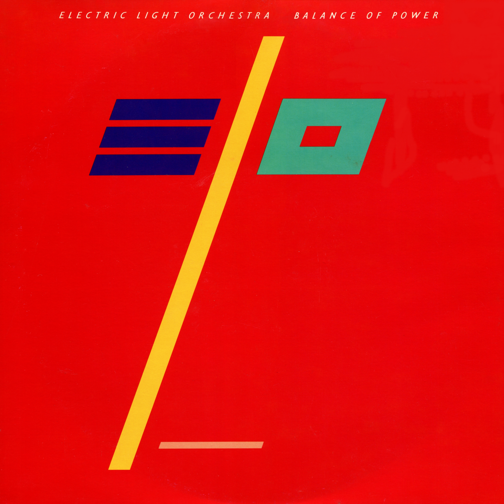

# Balance of Power

By **Electric Light Orchestra**

## Album Data

- **Catalog:** Beets
- **Format:** Digital, Album
- **Album:** Balance of Power
- **Artist:** Electric Light Orchestra
- **Albumartist:** Electric Light Orchestra
- **Genre:** Synthpop
- **MusicBrainz Album Artist ID:** [0c502791-4ee9-4c5f-9696-0602b721ff3b](https://musicbrainz.org/artist/0c502791-4ee9-4c5f-9696-0602b721ff3b)
- **MusicBrainz Album ID:** [92088aba-2ced-49b2-b7f8-9a23029554be](https://musicbrainz.org/release/92088aba-2ced-49b2-b7f8-9a23029554be)
- **MusicBrainz Release Group ID:** [9e484c34-e248-374a-a438-d5fd1bffe1b9](https://musicbrainz.org/release-group/9e484c34-e248-374a-a438-d5fd1bffe1b9)
- **Year:** 2007
- **Catalog #:** 
- **Label:** 
- **Total Tracks:** 12

## Album Tracks

### Track 01 - Shine A Little Love

- **Artist:** Electric Light Orchestra
- **Format:** ALAC
- **Genre:** Uk Garage
- **Length:** 4:42
- **MusicBrainz Track ID:** 
- **Title:** Shine A Little Love
- **Track:** 01
- **Year:** 1979

### Track 02 - Confusion

- **Artist:** Electric Light Orchestra
- **Format:** ALAC
- **Genre:** Progressive Rock
- **Length:** 3:42
- **MusicBrainz Track ID:** 
- **Title:** Confusion
- **Track:** 02
- **Year:** 1979

### Track 03 - Need Her Love

- **Artist:** Electric Light Orchestra
- **Format:** ALAC
- **Genre:** Progressive Rock
- **Length:** 5:11
- **MusicBrainz Track ID:** 
- **Title:** Need Her Love
- **Track:** 03
- **Year:** 1979

### Track 04 - The Diary Of Horace Wimp

- **Artist:** Electric Light Orchestra
- **Format:** ALAC
- **Genre:** Progressive Rock
- **Length:** 4:17
- **MusicBrainz Track ID:** 
- **Title:** The Diary Of Horace Wimp
- **Track:** 04
- **Year:** 1979

### Track 05 - Last Train To London

- **Artist:** Electric Light Orchestra
- **Format:** ALAC
- **Genre:** Progressive Rock
- **Length:** 4:31
- **MusicBrainz Track ID:** 
- **Title:** Last Train To London
- **Track:** 05
- **Year:** 1979

### Track 06 - Midnight Blue

- **Artist:** Electric Light Orchestra
- **Format:** ALAC
- **Genre:** Soft Rock
- **Length:** 4:19
- **MusicBrainz Track ID:** 
- **Title:** Midnight Blue
- **Track:** 06
- **Year:** 1979

### Track 07 - On The Run

- **Artist:** Electric Light Orchestra
- **Format:** ALAC
- **Genre:** Pop Rock
- **Length:** 3:55
- **MusicBrainz Track ID:** 
- **Title:** On The Run
- **Track:** 07
- **Year:** 1979

### Track 08 - Wishing

- **Artist:** Electric Light Orchestra
- **Format:** ALAC
- **Genre:** Progressive Rock
- **Length:** 4:13
- **MusicBrainz Track ID:** 
- **Title:** Wishing
- **Track:** 08
- **Year:** 1979

### Track 09 - Don't Bring Me Down

- **Artist:** Electric Light Orchestra
- **Format:** ALAC
- **Genre:** Progressive Rock
- **Length:** 4:06
- **MusicBrainz Track ID:** 
- **Title:** Don't Bring Me Down
- **Track:** 09
- **Year:** 1979

### Track 10 - On The Run (Home Demo)

- **Artist:** Electric Light Orchestra
- **Format:** ALAC
- **Genre:** Pop
- **Length:** 1:01
- **MusicBrainz Track ID:** 
- **Title:** On The Run (Home Demo)
- **Track:** 10
- **Year:** 1979

### Track 11 - Second Time Around (Home Demo)

- **Artist:** Electric Light Orchestra
- **Format:** ALAC
- **Genre:** Progressive Rock
- **Length:** 0:43
- **MusicBrainz Track ID:** 
- **Title:** Second Time Around (Home Demo)
- **Track:** 11
- **Year:** 1979

### Track 12 - Little Town Flirt

- **Artist:** Electric Light Orchestra
- **Format:** ALAC
- **Genre:** Rock
- **Length:** 2:53
- **MusicBrainz Track ID:** 
- **Title:** Little Town Flirt
- **Track:** 12
- **Year:** 1979

