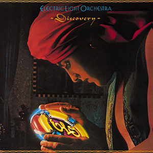

# Discovery

By **Electric Light Orchestra**

## Album Data

- **Catalog:** Beets
- **Format:** Digital, Album
- **Album:** Discovery
- **Artist:** Electric Light Orchestra
- **Albumartist:** Electric Light Orchestra
- **Genre:** Progressive Rock
- **MusicBrainz Album Artist ID:** 
- **MusicBrainz Album ID:** 
- **MusicBrainz Release Group ID:** 
- **Year:** 1979
- **Catalog #:** 
- **Label:** 
- **Total Tracks:** 09

## Album Tracks

### Track 01 - In Old England Town (Boogie No. 2)

- **Artist:** Electric Light Orchestra
- **Format:** ALAC
- **Genre:** Progressive Rock
- **Length:** 6:57
- **MusicBrainz Track ID:** 
- **Title:** In Old England Town (Boogie No. 2)
- **Track:** 01
- **Year:** 1973

### Track 02 - Mama

- **Artist:** Electric Light Orchestra
- **Format:** ALAC
- **Genre:** Progressive Rock
- **Length:** 6:59
- **MusicBrainz Track ID:** 
- **Title:** Mama
- **Track:** 02
- **Year:** 1973

### Track 03 - Roll Over Beethoven

- **Artist:** Electric Light Orchestra
- **Format:** ALAC
- **Genre:** Rock And Roll
- **Length:** 7:04
- **MusicBrainz Track ID:** 
- **Title:** Roll Over Beethoven
- **Track:** 03
- **Year:** 1973

### Track 04 - From The Sun To The World (Boogie No. 1)

- **Artist:** Electric Light Orchestra
- **Format:** ALAC
- **Genre:** Progressive Rock
- **Length:** 8:17
- **MusicBrainz Track ID:** 
- **Title:** From The Sun To The World (Boogie No. 1)
- **Track:** 04
- **Year:** 1973

### Track 05 - Kuiama

- **Artist:** Electric Light Orchestra
- **Format:** ALAC
- **Genre:** Progressive Rock
- **Length:** 11:17
- **MusicBrainz Track ID:** 
- **Title:** Kuiama
- **Track:** 05
- **Year:** 1973

### Track 06 - In Old England Town (instrumental) albums_by_artist.sh albums-info.sh album_tracks.sh bak Beets_Albums_by_Artist.md data dupart mbids.txt mkalbums scripts tracks-info.sh

- **Artist:** Electric Light Orchestra
- **Format:** ALAC
- **Genre:** Progressive Rock
- **Length:** 2:43
- **MusicBrainz Track ID:** 
- **Title:** In Old England Town (instrumental) albums_by_artist.sh albums-info.sh album_tracks.sh bak Beets_Albums_by_Artist.md data dupart mbids.txt mkalbums scripts tracks-info.sh
- **Track:** 06
- **Year:** 1972

### Track 07 - Baby I Apologize (session outtake) albums_by_artist.sh albums-info.sh album_tracks.sh bak Beets_Albums_by_Artist.md data dupart mbids.txt mkalbums scripts tracks-info.sh

- **Artist:** Electric Light Orchestra
- **Format:** ALAC
- **Genre:** Progressive Rock
- **Length:** 3:43
- **MusicBrainz Track ID:** 
- **Title:** Baby I Apologize (session outtake) albums_by_artist.sh albums-info.sh album_tracks.sh bak Beets_Albums_by_Artist.md data dupart mbids.txt mkalbums scripts tracks-info.sh
- **Track:** 07
- **Year:** 1972

### Track 08 - In Old England Town (take 1/alternate mix) albums_by_artist.sh albums-info.sh album_tracks.sh bak Beets_Albums_by_Artist.md data dupart mbids.txt mkalbums scripts tracks-info.sh

- **Artist:** Electric Light Orchestra
- **Format:** ALAC
- **Genre:** Progressive Rock
- **Length:** 6:56
- **MusicBrainz Track ID:** 
- **Title:** In Old England Town (take 1/alternate mix) albums_by_artist.sh albums-info.sh album_tracks.sh bak Beets_Albums_by_Artist.md data dupart mbids.txt mkalbums scripts tracks-info.sh
- **Track:** 08
- **Year:** 1972

### Track 09 - Roll Over Beethoven (take 1/alternate mix) albums_by_artist.sh albums-info.sh album_tracks.sh bak Beets_Albums_by_Artist.md data dupart mbids.txt mkalbums scripts tracks-info.sh

- **Artist:** Electric Light Orchestra
- **Format:** ALAC
- **Genre:** Progressive Rock
- **Length:** 8:15
- **MusicBrainz Track ID:** 
- **Title:** Roll Over Beethoven (take 1/alternate mix) albums_by_artist.sh albums-info.sh album_tracks.sh bak Beets_Albums_by_Artist.md data dupart mbids.txt mkalbums scripts tracks-info.sh
- **Track:** 09
- **Year:** 1972

## See also

- [Alone in the Universe](Alone_in_the_Universe.md)
- [A New World Record](A_New_World_Record.md)
- [Balance of Power](Balance_of_Power.md)
- [ELO II](ELO_II.md)
- [Face the Music](Face_the_Music.md)
- [Flashback](Flashback.md)
- [No Answer](No_Answer.md)
- [On The Third Day](On_The_Third_Day.md)
- [Out of the Blue](Out_of_the_Blue.md)
- [Secret Messages](Secret_Messages.md)
- [The Early Years](The_Early_Years.md)
- [Time](Time.md)
- [Unknown Album (6/19/2007 4](Unknown_Album_6-19-2007_4.md)
- [Unknown Album (6/19/2007 5](Unknown_Album_6-19-2007_5.md)
- [CD: A New World Record](../../CD/Electric_Light_Orchestra/A_New_World_Record.md)
- [CD: Balance Of Power](../../CD/Electric_Light_Orchestra/Balance_Of_Power.md)
- [CD: Discovery](../../CD/Electric_Light_Orchestra/Discovery.md)
- [CD: Eldorado](../../CD/Electric_Light_Orchestra/Eldorado.md)
- [CD: ](../../CD/Electric_Light_Orchestra/Electric_Light_Orchestra.md)
- [CD: Elo Ii](../../CD/Electric_Light_Orchestra/Elo_Ii.md)
- [CD: Face The Music](../../CD/Electric_Light_Orchestra/Face_The_Music.md)
- [CD: No Answer](../../CD/Electric_Light_Orchestra/No_Answer.md)
- [CD: On The Third Day](../../CD/Electric_Light_Orchestra/On_The_Third_Day.md)
- [CD: Out Of The Blue](../../CD/Electric_Light_Orchestra/Out_Of_The_Blue.md)
- [CD: Secret Messages](../../CD/Electric_Light_Orchestra/Secret_Messages.md)
- [CD: Time](../../CD/Electric_Light_Orchestra/Time.md)
- [Roon: A New World Record](../../Roon/Electric_Light_Orchestra/A_New_World_Record.md)
- [Roon: Balance of Power](../../Roon/Electric_Light_Orchestra/Balance_of_Power.md)
- [Roon: Discovery](../../Roon/Electric_Light_Orchestra/Discovery.md)
- [Roon: Eldorado](../../Roon/Electric_Light_Orchestra/Eldorado.md)
- [Roon: Electric Light Orchestra II](../../Roon/Electric_Light_Orchestra/Electric_Light_Orchestra_II.md)
- [Roon: Face the Music](../../Roon/Electric_Light_Orchestra/Face_the_Music.md)
- [Roon: Flashback](../../Roon/Electric_Light_Orchestra/Flashback.md)
- [Roon: Jeff Lynne's ELO - Alone In The Universe (bonus track version)](../../Roon/Electric_Light_Orchestra/Jeff_Lynnes_ELO_-_Alone_In_The_Universe_bonus_track_version.md)
- [Roon: Jeff Lynne's ELO - Alone in the Universe](../../Roon/Electric_Light_Orchestra/Jeff_Lynnes_ELO_-_Alone_in_the_Universe.md)
- [Roon: No Answer](../../Roon/Electric_Light_Orchestra/No_Answer.md)
- [Roon: On the Third Day](../../Roon/Electric_Light_Orchestra/On_the_Third_Day.md)
- [Roon: Out of the Blue](../../Roon/Electric_Light_Orchestra/Out_of_the_Blue.md)
- [Roon: Secret Messages](../../Roon/Electric_Light_Orchestra/Secret_Messages.md)
- [Roon: The Collection](../../Roon/Electric_Light_Orchestra/The_Collection.md)
- [Roon: Time](../../Roon/Electric_Light_Orchestra/Time.md)
- [Vinyl: Eldorado - A Symphony By The Electric Light Orchestra](../../Vinyl/Electric_Light_Orchestra/Eldorado_-_A_Symphony_By_The_Electric_Light_Orchestra.md)
- [Vinyl: ](../../Vinyl/Electric_Light_Orchestra/Electric_Light_Orchestra.md)
- [Vinyl: Face The Music](../../Vinyl/Electric_Light_Orchestra/Face_The_Music.md)
