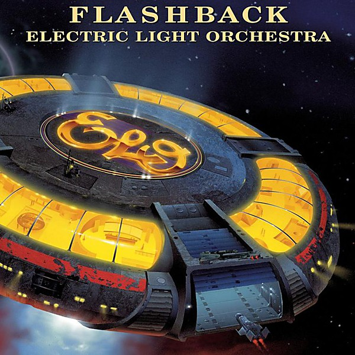

# Flashback

By **Electric Light Orchestra**

## Album Data

- **Catalog:** Beets
- **Format:** Digital, Album
- **Album:** Flashback
- **Artist:** Electric Light Orchestra
- **Albumartist:** Electric Light Orchestra
- **Genre:** Pop
- **MusicBrainz Album Artist ID:** 
- **MusicBrainz Album ID:** 
- **MusicBrainz Release Group ID:** 
- **Year:** 2000
- **Catalog #:** 82796 94270 2
- **Label:** Epic
- **Total Tracks:** 13

## Album Tracks

### Track 01 - 10538 Overture

- **Artist:** Electric Light Orchestra
- **Format:** ALAC
- **Genre:** Progressive Rock
- **Length:** 5:30
- **MusicBrainz Track ID:** [d4af8475-cbb3-49d4-acfb-b458118590cc](https://musicbrainz.org/recording/d4af8475-cbb3-49d4-acfb-b458118590cc)
- **Title:** 10538 Overture
- **Track:** 01
- **Year:** 2006

### Track 02 - Look at Me Now

- **Artist:** Electric Light Orchestra
- **Format:** ALAC
- **Genre:** Progressive Rock
- **Length:** 3:17
- **MusicBrainz Track ID:** [baf82008-a15a-4c1b-82d5-fc230199bc17](https://musicbrainz.org/recording/baf82008-a15a-4c1b-82d5-fc230199bc17)
- **Title:** Look at Me Now
- **Track:** 02
- **Year:** 2006

### Track 03 - Nellie Takes Her Bow

- **Artist:** Electric Light Orchestra
- **Format:** ALAC
- **Genre:** Britpop
- **Length:** 5:59
- **MusicBrainz Track ID:** [afe836d0-5a38-41b0-804f-33788b182cbd](https://musicbrainz.org/recording/afe836d0-5a38-41b0-804f-33788b182cbd)
- **Title:** Nellie Takes Her Bow
- **Track:** 03
- **Year:** 2006

### Track 04 - The Battle of Marston Moor (July 2nd 1644)

- **Artist:** Electric Light Orchestra
- **Format:** ALAC
- **Genre:** Progressive Rock
- **Length:** 6:03
- **MusicBrainz Track ID:** [20eb2288-ebdb-4e61-985a-c102b6940f47](https://musicbrainz.org/recording/20eb2288-ebdb-4e61-985a-c102b6940f47)
- **Title:** The Battle of Marston Moor (July 2nd 1644)
- **Track:** 04
- **Year:** 2006

### Track 05 - First Movement (Jumping Biz)

- **Artist:** Electric Light Orchestra
- **Format:** ALAC
- **Genre:** Progressive Rock
- **Length:** 3:00
- **MusicBrainz Track ID:** [813895b7-5ff3-4a25-a9df-8f3c03b4830a](https://musicbrainz.org/recording/813895b7-5ff3-4a25-a9df-8f3c03b4830a)
- **Title:** First Movement (Jumping Biz)
- **Track:** 05
- **Year:** 2006

### Track 06 - Mr. Radio

- **Artist:** Electric Light Orchestra
- **Format:** ALAC
- **Genre:** Britpop
- **Length:** 5:04
- **MusicBrainz Track ID:** [18325d58-bf55-437c-9422-561890eff461](https://musicbrainz.org/recording/18325d58-bf55-437c-9422-561890eff461)
- **Title:** Mr. Radio
- **Track:** 06
- **Year:** 2006

### Track 07 - Manhattan Rumble (49th Street Massacre)

- **Artist:** Electric Light Orchestra
- **Format:** ALAC
- **Genre:** Symphonic
- **Length:** 4:22
- **MusicBrainz Track ID:** [3a7c58bb-16e9-41bd-be87-93797d7feaa3](https://musicbrainz.org/recording/3a7c58bb-16e9-41bd-be87-93797d7feaa3)
- **Title:** Manhattan Rumble (49th Street Massacre)
- **Track:** 07
- **Year:** 2006

### Track 08 - Queen of the Hours

- **Artist:** Electric Light Orchestra
- **Format:** ALAC
- **Genre:** Progressive Rock
- **Length:** 3:22
- **MusicBrainz Track ID:** [3caccec4-4292-41f6-9746-20d0357a7f57](https://musicbrainz.org/recording/3caccec4-4292-41f6-9746-20d0357a7f57)
- **Title:** Queen of the Hours
- **Track:** 08
- **Year:** 2006

### Track 09 - Whisper in the Night

- **Artist:** Electric Light Orchestra
- **Format:** ALAC
- **Genre:** Progressive Rock
- **Length:** 4:50
- **MusicBrainz Track ID:** [896f50a2-8733-420a-bd22-1d542592ad44](https://musicbrainz.org/recording/896f50a2-8733-420a-bd22-1d542592ad44)
- **Title:** Whisper in the Night
- **Track:** 09
- **Year:** 2006

### Track 10 - The Battle of Marston Moor (July 2nd 1644) (alternate mix, take 1)

- **Artist:** Electric Light Orchestra
- **Format:** ALAC
- **Genre:** Progressive Rock
- **Length:** 1:00
- **MusicBrainz Track ID:** [67da4541-f483-4cc0-9864-19b96390e1c7](https://musicbrainz.org/recording/67da4541-f483-4cc0-9864-19b96390e1c7)
- **Title:** The Battle of Marston Moor (July 2nd 1644) (alternate mix, take 1)
- **Track:** 10
- **Year:** 2006

### Track 11 - Nellie Takes Her Bow (alternate mix)

- **Artist:** Electric Light Orchestra
- **Format:** ALAC
- **Genre:** Progressive Rock
- **Length:** 6:02
- **MusicBrainz Track ID:** [e0a49860-b520-4c33-bfa9-e1cd66840e37](https://musicbrainz.org/recording/e0a49860-b520-4c33-bfa9-e1cd66840e37)
- **Title:** Nellie Takes Her Bow (alternate mix)
- **Track:** 11
- **Year:** 2006

### Track 12 - Mr. Radio (alternate mix, take 9)

- **Artist:** Electric Light Orchestra
- **Format:** ALAC
- **Genre:** Progressive Rock
- **Length:** 5:19
- **MusicBrainz Track ID:** [b2d40379-cf91-4908-ac20-ff1d18b15105](https://musicbrainz.org/recording/b2d40379-cf91-4908-ac20-ff1d18b15105)
- **Title:** Mr. Radio (alternate mix, take 9)
- **Track:** 12
- **Year:** 2006

### Track 13 - 10538 Overture (alternate mix, take 1)

- **Artist:** Electric Light Orchestra
- **Format:** ALAC
- **Genre:** Progressive Rock
- **Length:** 5:46
- **MusicBrainz Track ID:** [e8601cc0-5fba-4f41-989e-d90656b4779a](https://musicbrainz.org/recording/e8601cc0-5fba-4f41-989e-d90656b4779a)
- **Title:** 10538 Overture (alternate mix, take 1)
- **Track:** 13
- **Year:** 2006

## See also

- [Alone in the Universe](Alone_in_the_Universe.md)
- [A New World Record](A_New_World_Record.md)
- [Balance of Power](Balance_of_Power.md)
- [Discovery](Discovery.md)
- [ELO II](ELO_II.md)
- [Face the Music](Face_the_Music.md)
- [No Answer](No_Answer.md)
- [On The Third Day](On_The_Third_Day.md)
- [Out of the Blue](Out_of_the_Blue.md)
- [Secret Messages](Secret_Messages.md)
- [The Early Years](The_Early_Years.md)
- [Time](Time.md)
- [Unknown Album (6/19/2007 4](Unknown_Album_6-19-2007_4.md)
- [Unknown Album (6/19/2007 5](Unknown_Album_6-19-2007_5.md)
- [CD: A New World Record](../../CD/Electric_Light_Orchestra/A_New_World_Record.md)
- [CD: Balance Of Power](../../CD/Electric_Light_Orchestra/Balance_Of_Power.md)
- [CD: Discovery](../../CD/Electric_Light_Orchestra/Discovery.md)
- [CD: Eldorado](../../CD/Electric_Light_Orchestra/Eldorado.md)
- [CD: ](../../CD/Electric_Light_Orchestra/Electric_Light_Orchestra.md)
- [CD: Elo Ii](../../CD/Electric_Light_Orchestra/Elo_Ii.md)
- [CD: Face The Music](../../CD/Electric_Light_Orchestra/Face_The_Music.md)
- [CD: No Answer](../../CD/Electric_Light_Orchestra/No_Answer.md)
- [CD: On The Third Day](../../CD/Electric_Light_Orchestra/On_The_Third_Day.md)
- [CD: Out Of The Blue](../../CD/Electric_Light_Orchestra/Out_Of_The_Blue.md)
- [CD: Secret Messages](../../CD/Electric_Light_Orchestra/Secret_Messages.md)
- [CD: Time](../../CD/Electric_Light_Orchestra/Time.md)
- [Roon: A New World Record](../../Roon/Electric_Light_Orchestra/A_New_World_Record.md)
- [Roon: Balance of Power](../../Roon/Electric_Light_Orchestra/Balance_of_Power.md)
- [Roon: Discovery](../../Roon/Electric_Light_Orchestra/Discovery.md)
- [Roon: Eldorado](../../Roon/Electric_Light_Orchestra/Eldorado.md)
- [Roon: Electric Light Orchestra II](../../Roon/Electric_Light_Orchestra/Electric_Light_Orchestra_II.md)
- [Roon: Face the Music](../../Roon/Electric_Light_Orchestra/Face_the_Music.md)
- [Roon: Flashback](../../Roon/Electric_Light_Orchestra/Flashback.md)
- [Roon: Jeff Lynne's ELO - Alone In The Universe (bonus track version)](../../Roon/Electric_Light_Orchestra/Jeff_Lynnes_ELO_-_Alone_In_The_Universe_bonus_track_version.md)
- [Roon: Jeff Lynne's ELO - Alone in the Universe](../../Roon/Electric_Light_Orchestra/Jeff_Lynnes_ELO_-_Alone_in_the_Universe.md)
- [Roon: No Answer](../../Roon/Electric_Light_Orchestra/No_Answer.md)
- [Roon: On the Third Day](../../Roon/Electric_Light_Orchestra/On_the_Third_Day.md)
- [Roon: Out of the Blue](../../Roon/Electric_Light_Orchestra/Out_of_the_Blue.md)
- [Roon: Secret Messages](../../Roon/Electric_Light_Orchestra/Secret_Messages.md)
- [Roon: The Collection](../../Roon/Electric_Light_Orchestra/The_Collection.md)
- [Roon: Time](../../Roon/Electric_Light_Orchestra/Time.md)
- [Vinyl: Eldorado - A Symphony By The Electric Light Orchestra](../../Vinyl/Electric_Light_Orchestra/Eldorado_-_A_Symphony_By_The_Electric_Light_Orchestra.md)
- [Vinyl: ](../../Vinyl/Electric_Light_Orchestra/Electric_Light_Orchestra.md)
- [Vinyl: Face The Music](../../Vinyl/Electric_Light_Orchestra/Face_The_Music.md)
