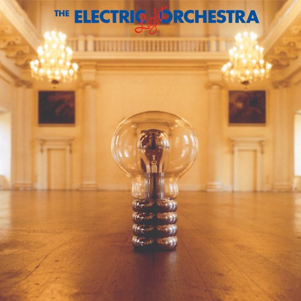

# No Answer

By **Electric Light Orchestra**

## Album Data

- **Catalog:** Beets
- **Format:** Digital, Album
- **Album:** No Answer
- **Artist:** Electric Light Orchestra
- **Albumartist:** Electric Light Orchestra
- **Genre:** Progressive Rock
- **MusicBrainz Album Artist ID:** [0c502791-4ee9-4c5f-9696-0602b721ff3b](https://musicbrainz.org/artist/0c502791-4ee9-4c5f-9696-0602b721ff3b)
- **MusicBrainz Album ID:** [abdd4255-ad85-4b01-8b0f-7ffaa2efd29b](https://musicbrainz.org/release/abdd4255-ad85-4b01-8b0f-7ffaa2efd29b)
- **MusicBrainz Release Group ID:** [06c9ea56-a66c-37a1-866e-939100e73998](https://musicbrainz.org/release-group/06c9ea56-a66c-37a1-866e-939100e73998)
- **Year:** 2006
- **Catalog #:** 
- **Label:** 
- **Total Tracks:** 14

## Album Tracks

### Track 01 - Ocean Breakup / King of the Universe

- **Artist:** Electric Light Orchestra
- **Format:** ALAC
- **Genre:** Progressive Rock
- **Length:** 4:07
- **MusicBrainz Track ID:** 
- **Title:** Ocean Breakup / King of the Universe
- **Track:** 01
- **Year:** 1973

### Track 02 - Bluebird Is Dead

- **Artist:** Electric Light Orchestra
- **Format:** ALAC
- **Genre:** Space Rock
- **Length:** 4:42
- **MusicBrainz Track ID:** 
- **Title:** Bluebird Is Dead
- **Track:** 02
- **Year:** 1973

### Track 03 - Oh No Not Susan

- **Artist:** Electric Light Orchestra
- **Format:** ALAC
- **Genre:** Rock
- **Length:** 3:07
- **MusicBrainz Track ID:** 
- **Title:** Oh No Not Susan
- **Track:** 03
- **Year:** 1973

### Track 04 - New World Rising / Ocean Breakup Reprise

- **Artist:** Electric Light Orchestra
- **Format:** ALAC
- **Genre:** Progressive Rock
- **Length:** 4:05
- **MusicBrainz Track ID:** 
- **Title:** New World Rising / Ocean Breakup Reprise
- **Track:** 04
- **Year:** 1973

### Track 05 - Showdown

- **Artist:** Electric Light Orchestra
- **Format:** ALAC
- **Genre:** Progressive Rock
- **Length:** 4:09
- **MusicBrainz Track ID:** 
- **Title:** Showdown
- **Track:** 05
- **Year:** 1973

### Track 06 - Daybreaker

- **Artist:** Electric Light Orchestra
- **Format:** ALAC
- **Genre:** Space Rock
- **Length:** 3:51
- **MusicBrainz Track ID:** 
- **Title:** Daybreaker
- **Track:** 06
- **Year:** 1973

### Track 07 - Ma-Ma-Ma Belle

- **Artist:** Electric Light Orchestra
- **Format:** ALAC
- **Genre:** Progressive Rock
- **Length:** 3:56
- **MusicBrainz Track ID:** 
- **Title:** Ma-Ma-Ma Belle
- **Track:** 07
- **Year:** 1973

### Track 08 - Dreaming of 4000

- **Artist:** Electric Light Orchestra
- **Format:** ALAC
- **Genre:** Space Rock
- **Length:** 5:04
- **MusicBrainz Track ID:** 
- **Title:** Dreaming of 4000
- **Track:** 08
- **Year:** 1973

### Track 09 - In the Hall of the Mountain King

- **Artist:** Electric Light Orchestra
- **Format:** ALAC
- **Genre:** Space Rock
- **Length:** 6:37
- **MusicBrainz Track ID:** 
- **Title:** In the Hall of the Mountain King
- **Track:** 09
- **Year:** 1973

### Track 10 - Auntie (Ma-Ma-Ma Belle) (Take 1)

- **Artist:** Electric Light Orchestra
- **Format:** ALAC
- **Genre:** Progressive Rock
- **Length:** 1:19
- **MusicBrainz Track ID:** 
- **Title:** Auntie (Ma-Ma-Ma Belle) (Take 1)
- **Track:** 10
- **Year:** 1973

### Track 11 - Auntie (Ma-Ma-Ma Belle) (Take 2)

- **Artist:** Electric Light Orchestra
- **Format:** ALAC
- **Genre:** Progressive Rock
- **Length:** 4:05
- **MusicBrainz Track ID:** 
- **Title:** Auntie (Ma-Ma-Ma Belle) (Take 2)
- **Track:** 11
- **Year:** 1973

### Track 12 - Mambo (Dreaming of 4000) (Alternate Mix)

- **Artist:** Electric Light Orchestra
- **Format:** ALAC
- **Genre:** Progressive Rock
- **Length:** 5:05
- **MusicBrainz Track ID:** 
- **Title:** Mambo (Dreaming of 4000) (Alternate Mix)
- **Track:** 12
- **Year:** 1973

### Track 13 - Everyone's Born to Die

- **Artist:** Electric Light Orchestra
- **Format:** ALAC
- **Genre:** Progressive Rock
- **Length:** 3:43
- **MusicBrainz Track ID:** 
- **Title:** Everyone's Born to Die
- **Track:** 13
- **Year:** 1973

### Track 14 - Interludes

- **Artist:** Electric Light Orchestra
- **Format:** ALAC
- **Genre:** Progressive Rock
- **Length:** 3:40
- **MusicBrainz Track ID:** 
- **Title:** Interludes
- **Track:** 14
- **Year:** 1973

## See also

- [Alone in the Universe](Alone_in_the_Universe.md)
- [A New World Record](A_New_World_Record.md)
- [Balance of Power](Balance_of_Power.md)
- [Discovery](Discovery.md)
- [ELO II](ELO_II.md)
- [Face the Music](Face_the_Music.md)
- [Flashback](Flashback.md)
- [On The Third Day](On_The_Third_Day.md)
- [Out of the Blue](Out_of_the_Blue.md)
- [Secret Messages](Secret_Messages.md)
- [The Early Years](The_Early_Years.md)
- [Time](Time.md)
- [Unknown Album (6/19/2007 4](Unknown_Album_6-19-2007_4.md)
- [Unknown Album (6/19/2007 5](Unknown_Album_6-19-2007_5.md)
- [CD: A New World Record](../../CD/Electric_Light_Orchestra/A_New_World_Record.md)
- [CD: Balance Of Power](../../CD/Electric_Light_Orchestra/Balance_Of_Power.md)
- [CD: Discovery](../../CD/Electric_Light_Orchestra/Discovery.md)
- [CD: Eldorado](../../CD/Electric_Light_Orchestra/Eldorado.md)
- [CD: ](../../CD/Electric_Light_Orchestra/Electric_Light_Orchestra.md)
- [CD: Elo Ii](../../CD/Electric_Light_Orchestra/Elo_Ii.md)
- [CD: Face The Music](../../CD/Electric_Light_Orchestra/Face_The_Music.md)
- [CD: No Answer](../../CD/Electric_Light_Orchestra/No_Answer.md)
- [CD: On The Third Day](../../CD/Electric_Light_Orchestra/On_The_Third_Day.md)
- [CD: Out Of The Blue](../../CD/Electric_Light_Orchestra/Out_Of_The_Blue.md)
- [CD: Secret Messages](../../CD/Electric_Light_Orchestra/Secret_Messages.md)
- [CD: Time](../../CD/Electric_Light_Orchestra/Time.md)
- [Roon: A New World Record](../../Roon/Electric_Light_Orchestra/A_New_World_Record.md)
- [Roon: Balance of Power](../../Roon/Electric_Light_Orchestra/Balance_of_Power.md)
- [Roon: Discovery](../../Roon/Electric_Light_Orchestra/Discovery.md)
- [Roon: Eldorado](../../Roon/Electric_Light_Orchestra/Eldorado.md)
- [Roon: Electric Light Orchestra II](../../Roon/Electric_Light_Orchestra/Electric_Light_Orchestra_II.md)
- [Roon: Face the Music](../../Roon/Electric_Light_Orchestra/Face_the_Music.md)
- [Roon: Flashback](../../Roon/Electric_Light_Orchestra/Flashback.md)
- [Roon: Jeff Lynne's ELO - Alone In The Universe (bonus track version)](../../Roon/Electric_Light_Orchestra/Jeff_Lynnes_ELO_-_Alone_In_The_Universe_bonus_track_version.md)
- [Roon: Jeff Lynne's ELO - Alone in the Universe](../../Roon/Electric_Light_Orchestra/Jeff_Lynnes_ELO_-_Alone_in_the_Universe.md)
- [Roon: No Answer](../../Roon/Electric_Light_Orchestra/No_Answer.md)
- [Roon: On the Third Day](../../Roon/Electric_Light_Orchestra/On_the_Third_Day.md)
- [Roon: Out of the Blue](../../Roon/Electric_Light_Orchestra/Out_of_the_Blue.md)
- [Roon: Secret Messages](../../Roon/Electric_Light_Orchestra/Secret_Messages.md)
- [Roon: The Collection](../../Roon/Electric_Light_Orchestra/The_Collection.md)
- [Roon: Time](../../Roon/Electric_Light_Orchestra/Time.md)
- [Vinyl: Eldorado - A Symphony By The Electric Light Orchestra](../../Vinyl/Electric_Light_Orchestra/Eldorado_-_A_Symphony_By_The_Electric_Light_Orchestra.md)
- [Vinyl: ](../../Vinyl/Electric_Light_Orchestra/Electric_Light_Orchestra.md)
- [Vinyl: Face The Music](../../Vinyl/Electric_Light_Orchestra/Face_The_Music.md)
