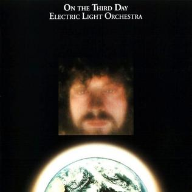

# On The Third Day

By **Electric Light Orchestra**

## Album Data

- **Catalog:** Beets
- **Format:** Digital, Album
- **Album:** On The Third Day
- **Artist:** Electric Light Orchestra
- **Albumartist:** Electric Light Orchestra
- **Genre:** Progressive Rock
- **MusicBrainz Album Artist ID:** 
- **MusicBrainz Album ID:** 
- **MusicBrainz Release Group ID:** 
- **Year:** 1973
- **Catalog #:** 82796942722
- **Label:** Epic
- **Total Tracks:** 20

## Album Tracks

### Track 01 - Turn to Stone

- **Artist:** Electric Light Orchestra
- **Format:** ALAC
- **Genre:** Progressive Rock
- **Length:** 3:49
- **MusicBrainz Track ID:** [b625ab99-f3bd-4bec-99ec-712e02443619](https://musicbrainz.org/recording/b625ab99-f3bd-4bec-99ec-712e02443619)
- **Title:** Turn to Stone
- **Track:** 01
- **Year:** 2007

### Track 02 - It’s Over

- **Artist:** Electric Light Orchestra
- **Format:** ALAC
- **Genre:** Progressive Rock
- **Length:** 4:08
- **MusicBrainz Track ID:** [67df42a9-844e-40bf-a492-4be8eafc1756](https://musicbrainz.org/recording/67df42a9-844e-40bf-a492-4be8eafc1756)
- **Title:** It’s Over
- **Track:** 02
- **Year:** 2007

### Track 03 - Sweet Talkin’ Woman

- **Artist:** Electric Light Orchestra
- **Format:** ALAC
- **Genre:** Progressive Rock
- **Length:** 3:49
- **MusicBrainz Track ID:** [73bf1a38-6a5d-4a82-b1b6-b2b04c1f4e1d](https://musicbrainz.org/recording/73bf1a38-6a5d-4a82-b1b6-b2b04c1f4e1d)
- **Title:** Sweet Talkin’ Woman
- **Track:** 03
- **Year:** 2007

### Track 04 - Across the Border

- **Artist:** Electric Light Orchestra
- **Format:** ALAC
- **Genre:** Progressive Rock
- **Length:** 3:53
- **MusicBrainz Track ID:** [a0513960-3f54-4d68-b262-13414092fbd7](https://musicbrainz.org/recording/a0513960-3f54-4d68-b262-13414092fbd7)
- **Title:** Across the Border
- **Track:** 04
- **Year:** 2007

### Track 05 - Night in the City

- **Artist:** Electric Light Orchestra
- **Format:** ALAC
- **Genre:** Progressive Rock
- **Length:** 4:03
- **MusicBrainz Track ID:** [3f32715f-af2d-4f12-8d43-b03ab601732e](https://musicbrainz.org/recording/3f32715f-af2d-4f12-8d43-b03ab601732e)
- **Title:** Night in the City
- **Track:** 05
- **Year:** 2007

### Track 06 - Starlight

- **Artist:** Electric Light Orchestra
- **Format:** ALAC
- **Genre:** Progressive Rock
- **Length:** 4:31
- **MusicBrainz Track ID:** [0c77108a-b157-4de1-96c1-0845137053bf](https://musicbrainz.org/recording/0c77108a-b157-4de1-96c1-0845137053bf)
- **Title:** Starlight
- **Track:** 06
- **Year:** 2007

### Track 07 - Jungle

- **Artist:** Electric Light Orchestra
- **Format:** ALAC
- **Genre:** Progressive Rock
- **Length:** 3:53
- **MusicBrainz Track ID:** [dc52830e-4da3-4678-9791-5eb718fe04a6](https://musicbrainz.org/recording/dc52830e-4da3-4678-9791-5eb718fe04a6)
- **Title:** Jungle
- **Track:** 07
- **Year:** 2007

### Track 08 - Believe Me Now

- **Artist:** Electric Light Orchestra
- **Format:** ALAC
- **Genre:** Progressive Rock
- **Length:** 1:21
- **MusicBrainz Track ID:** [d2129561-b741-4574-af4f-edd5e90daf67](https://musicbrainz.org/recording/d2129561-b741-4574-af4f-edd5e90daf67)
- **Title:** Believe Me Now
- **Track:** 08
- **Year:** 2007

### Track 09 - Steppin’ Out

- **Artist:** Electric Light Orchestra
- **Format:** ALAC
- **Genre:** Progressive Rock
- **Length:** 4:40
- **MusicBrainz Track ID:** [43a43a06-600a-4dbe-9198-9a8dbdda5b25](https://musicbrainz.org/recording/43a43a06-600a-4dbe-9198-9a8dbdda5b25)
- **Title:** Steppin’ Out
- **Track:** 09
- **Year:** 2007

### Track 10 - Standin’ in the Rain

- **Artist:** Electric Light Orchestra
- **Format:** ALAC
- **Genre:** Progressive Rock
- **Length:** 3:59
- **MusicBrainz Track ID:** [2ae9d634-98ec-4d55-b20b-62cf40d6f98c](https://musicbrainz.org/recording/2ae9d634-98ec-4d55-b20b-62cf40d6f98c)
- **Title:** Standin’ in the Rain
- **Track:** 10
- **Year:** 2007

### Track 11 - Big Wheels

- **Artist:** Electric Light Orchestra
- **Format:** ALAC
- **Genre:** Rock
- **Length:** 5:32
- **MusicBrainz Track ID:** [d61f6872-ee5c-4d34-9ef6-a2e023f574c6](https://musicbrainz.org/recording/d61f6872-ee5c-4d34-9ef6-a2e023f574c6)
- **Title:** Big Wheels
- **Track:** 11
- **Year:** 2007

### Track 12 - Summer and Lightning

- **Artist:** Electric Light Orchestra
- **Format:** ALAC
- **Genre:** Rock
- **Length:** 4:14
- **MusicBrainz Track ID:** [d2361950-20d0-4604-a73c-e5df702d652e](https://musicbrainz.org/recording/d2361950-20d0-4604-a73c-e5df702d652e)
- **Title:** Summer and Lightning
- **Track:** 12
- **Year:** 2007

### Track 13 - Mr. Blue Sky

- **Artist:** Electric Light Orchestra
- **Format:** ALAC
- **Genre:** Progressive Rock
- **Length:** 5:03
- **MusicBrainz Track ID:** [6e33056b-2a34-4ed0-b49c-f7a8ae2c5bcc](https://musicbrainz.org/recording/6e33056b-2a34-4ed0-b49c-f7a8ae2c5bcc)
- **Title:** Mr. Blue Sky
- **Track:** 13
- **Year:** 2007

### Track 14 - Sweet Is the Night

- **Artist:** Electric Light Orchestra
- **Format:** ALAC
- **Genre:** Rock
- **Length:** 3:27
- **MusicBrainz Track ID:** [d30e09c3-a08b-4137-82cc-b75882b4f7ad](https://musicbrainz.org/recording/d30e09c3-a08b-4137-82cc-b75882b4f7ad)
- **Title:** Sweet Is the Night
- **Track:** 14
- **Year:** 2007

### Track 15 - The Whale

- **Artist:** Electric Light Orchestra
- **Format:** ALAC
- **Genre:** Symphonic
- **Length:** 5:07
- **MusicBrainz Track ID:** [63b8d5d6-5d7c-4337-b021-b427655aafed](https://musicbrainz.org/recording/63b8d5d6-5d7c-4337-b021-b427655aafed)
- **Title:** The Whale
- **Track:** 15
- **Year:** 2007

### Track 16 - Birmingham Blues

- **Artist:** Electric Light Orchestra
- **Format:** ALAC
- **Genre:** Progressive Rock
- **Length:** 4:23
- **MusicBrainz Track ID:** [006fe222-b3ad-410d-8b38-f3d8b712cf70](https://musicbrainz.org/recording/006fe222-b3ad-410d-8b38-f3d8b712cf70)
- **Title:** Birmingham Blues
- **Track:** 16
- **Year:** 2007

### Track 17 - Wild West Hero

- **Artist:** Electric Light Orchestra
- **Format:** ALAC
- **Genre:** Progressive Rock
- **Length:** 4:45
- **MusicBrainz Track ID:** [41512247-e29f-45f5-9e55-967cdb887622](https://musicbrainz.org/recording/41512247-e29f-45f5-9e55-967cdb887622)
- **Title:** Wild West Hero
- **Track:** 17
- **Year:** 2007

### Track 18 - Wild West Hero (alternate bridge, home demo)

- **Artist:** Electric Light Orchestra
- **Format:** ALAC
- **Genre:** Progressive Rock
- **Length:** 0:26
- **MusicBrainz Track ID:** [65624c6f-ca39-45d8-b9b9-816b13981bf7](https://musicbrainz.org/recording/65624c6f-ca39-45d8-b9b9-816b13981bf7)
- **Title:** Wild West Hero (alternate bridge, home demo)
- **Track:** 18
- **Year:** 2007

### Track 19 - The Quick and the Daft

- **Artist:** Electric Light Orchestra
- **Format:** ALAC
- **Genre:** Rock
- **Length:** 1:49
- **MusicBrainz Track ID:** [2db85729-90a2-47bd-a931-84c38b462b6e](https://musicbrainz.org/recording/2db85729-90a2-47bd-a931-84c38b462b6e)
- **Title:** The Quick and the Daft
- **Track:** 19
- **Year:** 2007

### Track 20 - Latitude 88 North

- **Artist:** Electric Light Orchestra
- **Format:** ALAC
- **Genre:** Progressive Rock
- **Length:** 3:24
- **MusicBrainz Track ID:** [1ff01900-779c-407c-9c94-1f4d18ed42e3](https://musicbrainz.org/recording/1ff01900-779c-407c-9c94-1f4d18ed42e3)
- **Title:** Latitude 88 North
- **Track:** 20
- **Year:** 2007

## See also

- [Alone in the Universe](Alone_in_the_Universe.md)
- [A New World Record](A_New_World_Record.md)
- [Balance of Power](Balance_of_Power.md)
- [Discovery](Discovery.md)
- [ELO II](ELO_II.md)
- [Face the Music](Face_the_Music.md)
- [Flashback](Flashback.md)
- [No Answer](No_Answer.md)
- [Out of the Blue](Out_of_the_Blue.md)
- [Secret Messages](Secret_Messages.md)
- [The Early Years](The_Early_Years.md)
- [Time](Time.md)
- [Unknown Album (6/19/2007 4](Unknown_Album_6-19-2007_4.md)
- [Unknown Album (6/19/2007 5](Unknown_Album_6-19-2007_5.md)
- [CD: A New World Record](../../CD/Electric_Light_Orchestra/A_New_World_Record.md)
- [CD: Balance Of Power](../../CD/Electric_Light_Orchestra/Balance_Of_Power.md)
- [CD: Discovery](../../CD/Electric_Light_Orchestra/Discovery.md)
- [CD: Eldorado](../../CD/Electric_Light_Orchestra/Eldorado.md)
- [CD: ](../../CD/Electric_Light_Orchestra/Electric_Light_Orchestra.md)
- [CD: Elo Ii](../../CD/Electric_Light_Orchestra/Elo_Ii.md)
- [CD: Face The Music](../../CD/Electric_Light_Orchestra/Face_The_Music.md)
- [CD: No Answer](../../CD/Electric_Light_Orchestra/No_Answer.md)
- [CD: On The Third Day](../../CD/Electric_Light_Orchestra/On_The_Third_Day.md)
- [CD: Out Of The Blue](../../CD/Electric_Light_Orchestra/Out_Of_The_Blue.md)
- [CD: Secret Messages](../../CD/Electric_Light_Orchestra/Secret_Messages.md)
- [CD: Time](../../CD/Electric_Light_Orchestra/Time.md)
- [Roon: A New World Record](../../Roon/Electric_Light_Orchestra/A_New_World_Record.md)
- [Roon: Balance of Power](../../Roon/Electric_Light_Orchestra/Balance_of_Power.md)
- [Roon: Discovery](../../Roon/Electric_Light_Orchestra/Discovery.md)
- [Roon: Eldorado](../../Roon/Electric_Light_Orchestra/Eldorado.md)
- [Roon: Electric Light Orchestra II](../../Roon/Electric_Light_Orchestra/Electric_Light_Orchestra_II.md)
- [Roon: Face the Music](../../Roon/Electric_Light_Orchestra/Face_the_Music.md)
- [Roon: Flashback](../../Roon/Electric_Light_Orchestra/Flashback.md)
- [Roon: Jeff Lynne's ELO - Alone In The Universe (bonus track version)](../../Roon/Electric_Light_Orchestra/Jeff_Lynnes_ELO_-_Alone_In_The_Universe_bonus_track_version.md)
- [Roon: Jeff Lynne's ELO - Alone in the Universe](../../Roon/Electric_Light_Orchestra/Jeff_Lynnes_ELO_-_Alone_in_the_Universe.md)
- [Roon: No Answer](../../Roon/Electric_Light_Orchestra/No_Answer.md)
- [Roon: On the Third Day](../../Roon/Electric_Light_Orchestra/On_the_Third_Day.md)
- [Roon: Out of the Blue](../../Roon/Electric_Light_Orchestra/Out_of_the_Blue.md)
- [Roon: Secret Messages](../../Roon/Electric_Light_Orchestra/Secret_Messages.md)
- [Roon: The Collection](../../Roon/Electric_Light_Orchestra/The_Collection.md)
- [Roon: Time](../../Roon/Electric_Light_Orchestra/Time.md)
- [Vinyl: Eldorado - A Symphony By The Electric Light Orchestra](../../Vinyl/Electric_Light_Orchestra/Eldorado_-_A_Symphony_By_The_Electric_Light_Orchestra.md)
- [Vinyl: ](../../Vinyl/Electric_Light_Orchestra/Electric_Light_Orchestra.md)
- [Vinyl: Face The Music](../../Vinyl/Electric_Light_Orchestra/Face_The_Music.md)
