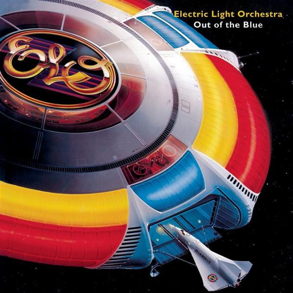

# Out of the Blue

By **Electric Light Orchestra**

## Album Data

- **Catalog:** Beets
- **Format:** Digital, Album
- **Album:** Out of the Blue
- **Artist:** Electric Light Orchestra
- **Albumartist:** Electric Light Orchestra
- **Genre:** Progressive Rock
- **MusicBrainz Album Artist ID:** [0c502791-4ee9-4c5f-9696-0602b721ff3b](https://musicbrainz.org/artist/0c502791-4ee9-4c5f-9696-0602b721ff3b)
- **MusicBrainz Album ID:** [853ea6d1-2501-4dd5-808c-d642da949e0f](https://musicbrainz.org/release/853ea6d1-2501-4dd5-808c-d642da949e0f)
- **MusicBrainz Release Group ID:** [a720436f-9c8e-439a-a147-18e83441edab](https://musicbrainz.org/release-group/a720436f-9c8e-439a-a147-18e83441edab)
- **Year:** 2007
- **Catalog #:** EK 85424
- **Label:** Epic
- **Total Tracks:** 14

## Album Tracks

### Track 01 - Secret Messages

- **Artist:** Electric Light Orchestra
- **Format:** ALAC
- **Genre:** Progressive Rock
- **Length:** 4:43
- **MusicBrainz Track ID:** [6c6cf6d5-4323-4bd3-8f2d-5354a54ab04a](https://musicbrainz.org/recording/6c6cf6d5-4323-4bd3-8f2d-5354a54ab04a)
- **Title:** Secret Messages
- **Track:** 01
- **Year:** 2001

### Track 02 - Loser Gone Wild

- **Artist:** Electric Light Orchestra
- **Format:** ALAC
- **Genre:** Art Rock
- **Length:** 5:27
- **MusicBrainz Track ID:** [58a25a9d-5b26-42d3-950f-42b57c80882e](https://musicbrainz.org/recording/58a25a9d-5b26-42d3-950f-42b57c80882e)
- **Title:** Loser Gone Wild
- **Track:** 02
- **Year:** 2001

### Track 03 - Bluebird

- **Artist:** Electric Light Orchestra
- **Format:** ALAC
- **Genre:** Britpop
- **Length:** 4:13
- **MusicBrainz Track ID:** [5f2ad91f-10e8-495b-865a-18d9e4507524](https://musicbrainz.org/recording/5f2ad91f-10e8-495b-865a-18d9e4507524)
- **Title:** Bluebird
- **Track:** 03
- **Year:** 2001

### Track 04 - Take Me On and On

- **Artist:** Electric Light Orchestra
- **Format:** ALAC
- **Genre:** Electro
- **Length:** 4:57
- **MusicBrainz Track ID:** [90d73d7b-9a59-461d-aeae-a53c2f9caedd](https://musicbrainz.org/recording/90d73d7b-9a59-461d-aeae-a53c2f9caedd)
- **Title:** Take Me On and On
- **Track:** 04
- **Year:** 2001

### Track 05 - Time After Time

- **Artist:** Electric Light Orchestra
- **Format:** ALAC
- **Genre:** Art Rock
- **Length:** 4:01
- **MusicBrainz Track ID:** [85c28a8a-1520-43be-8a87-0ee5945e1bdb](https://musicbrainz.org/recording/85c28a8a-1520-43be-8a87-0ee5945e1bdb)
- **Title:** Time After Time
- **Track:** 05
- **Year:** 2001

### Track 06 - Four Little Diamonds

- **Artist:** Electric Light Orchestra
- **Format:** ALAC
- **Genre:** Progressive Rock
- **Length:** 4:05
- **MusicBrainz Track ID:** [b91a9d46-98fd-4e13-8a05-6899db3fee59](https://musicbrainz.org/recording/b91a9d46-98fd-4e13-8a05-6899db3fee59)
- **Title:** Four Little Diamonds
- **Track:** 06
- **Year:** 2001

### Track 07 - Stranger

- **Artist:** Electric Light Orchestra
- **Format:** ALAC
- **Genre:** Progressive Rock
- **Length:** 4:27
- **MusicBrainz Track ID:** [9c170e9f-8712-4794-8870-67f0d64375cd](https://musicbrainz.org/recording/9c170e9f-8712-4794-8870-67f0d64375cd)
- **Title:** Stranger
- **Track:** 07
- **Year:** 2001

### Track 08 - Danger Ahead

- **Artist:** Electric Light Orchestra
- **Format:** ALAC
- **Genre:** Art Rock
- **Length:** 3:52
- **MusicBrainz Track ID:** [4800b259-793a-4cdc-81a3-8e33f0407e96](https://musicbrainz.org/recording/4800b259-793a-4cdc-81a3-8e33f0407e96)
- **Title:** Danger Ahead
- **Track:** 08
- **Year:** 2001

### Track 09 - Letter From Spain

- **Artist:** Electric Light Orchestra
- **Format:** ALAC
- **Genre:** Art Rock
- **Length:** 2:51
- **MusicBrainz Track ID:** [34a7ae19-7aa5-47da-8b49-b4949a083c6d](https://musicbrainz.org/recording/34a7ae19-7aa5-47da-8b49-b4949a083c6d)
- **Title:** Letter From Spain
- **Track:** 09
- **Year:** 2001

### Track 10 - Train of Gold

- **Artist:** Electric Light Orchestra
- **Format:** ALAC
- **Genre:** Progressive Rock
- **Length:** 4:20
- **MusicBrainz Track ID:** [666f455f-8e71-433a-ad57-5267046ebf7b](https://musicbrainz.org/recording/666f455f-8e71-433a-ad57-5267046ebf7b)
- **Title:** Train of Gold
- **Track:** 10
- **Year:** 2001

### Track 11 - Rock 'n' Roll Is King

- **Artist:** Electric Light Orchestra
- **Format:** ALAC
- **Genre:** Rock And Roll
- **Length:** 3:49
- **MusicBrainz Track ID:** [5e46453a-d379-45fc-bd30-40a59cd60dd0](https://musicbrainz.org/recording/5e46453a-d379-45fc-bd30-40a59cd60dd0)
- **Title:** Rock 'n' Roll Is King
- **Track:** 11
- **Year:** 2001

### Track 12 - No Way Out

- **Artist:** Electric Light Orchestra
- **Format:** ALAC
- **Genre:** Progressive Rock
- **Length:** 3:28
- **MusicBrainz Track ID:** [f617c6ab-af2b-4cd7-b063-451db5d47779](https://musicbrainz.org/recording/f617c6ab-af2b-4cd7-b063-451db5d47779)
- **Title:** No Way Out
- **Track:** 12
- **Year:** 2001

### Track 13 - Endless Lies

- **Artist:** Electric Light Orchestra
- **Format:** ALAC
- **Genre:** Rock
- **Length:** 3:26
- **MusicBrainz Track ID:** [cb2f1287-f275-40a1-8dbb-56ab0a69fc3f](https://musicbrainz.org/recording/cb2f1287-f275-40a1-8dbb-56ab0a69fc3f)
- **Title:** Endless Lies
- **Track:** 13
- **Year:** 2001

### Track 14 - After All

- **Artist:** Electric Light Orchestra
- **Format:** ALAC
- **Genre:** Progressive Rock
- **Length:** 2:23
- **MusicBrainz Track ID:** [7b0039ea-26cb-44f8-b11e-5d7ea07221a2](https://musicbrainz.org/recording/7b0039ea-26cb-44f8-b11e-5d7ea07221a2)
- **Title:** After All
- **Track:** 14
- **Year:** 2001

## See also

- [Alone in the Universe](Alone_in_the_Universe.md)
- [A New World Record](A_New_World_Record.md)
- [Balance of Power](Balance_of_Power.md)
- [Discovery](Discovery.md)
- [ELO II](ELO_II.md)
- [Face the Music](Face_the_Music.md)
- [Flashback](Flashback.md)
- [No Answer](No_Answer.md)
- [On The Third Day](On_The_Third_Day.md)
- [Secret Messages](Secret_Messages.md)
- [The Early Years](The_Early_Years.md)
- [Time](Time.md)
- [Unknown Album (6/19/2007 4](Unknown_Album_6-19-2007_4.md)
- [Unknown Album (6/19/2007 5](Unknown_Album_6-19-2007_5.md)
- [CD: A New World Record](../../CD/Electric_Light_Orchestra/A_New_World_Record.md)
- [CD: Balance Of Power](../../CD/Electric_Light_Orchestra/Balance_Of_Power.md)
- [CD: Discovery](../../CD/Electric_Light_Orchestra/Discovery.md)
- [CD: Eldorado](../../CD/Electric_Light_Orchestra/Eldorado.md)
- [CD: ](../../CD/Electric_Light_Orchestra/Electric_Light_Orchestra.md)
- [CD: Elo Ii](../../CD/Electric_Light_Orchestra/Elo_Ii.md)
- [CD: Face The Music](../../CD/Electric_Light_Orchestra/Face_The_Music.md)
- [CD: No Answer](../../CD/Electric_Light_Orchestra/No_Answer.md)
- [CD: On The Third Day](../../CD/Electric_Light_Orchestra/On_The_Third_Day.md)
- [CD: Out Of The Blue](../../CD/Electric_Light_Orchestra/Out_Of_The_Blue.md)
- [CD: Secret Messages](../../CD/Electric_Light_Orchestra/Secret_Messages.md)
- [CD: Time](../../CD/Electric_Light_Orchestra/Time.md)
- [Roon: A New World Record](../../Roon/Electric_Light_Orchestra/A_New_World_Record.md)
- [Roon: Balance of Power](../../Roon/Electric_Light_Orchestra/Balance_of_Power.md)
- [Roon: Discovery](../../Roon/Electric_Light_Orchestra/Discovery.md)
- [Roon: Eldorado](../../Roon/Electric_Light_Orchestra/Eldorado.md)
- [Roon: Electric Light Orchestra II](../../Roon/Electric_Light_Orchestra/Electric_Light_Orchestra_II.md)
- [Roon: Face the Music](../../Roon/Electric_Light_Orchestra/Face_the_Music.md)
- [Roon: Flashback](../../Roon/Electric_Light_Orchestra/Flashback.md)
- [Roon: Jeff Lynne's ELO - Alone In The Universe (bonus track version)](../../Roon/Electric_Light_Orchestra/Jeff_Lynnes_ELO_-_Alone_In_The_Universe_bonus_track_version.md)
- [Roon: Jeff Lynne's ELO - Alone in the Universe](../../Roon/Electric_Light_Orchestra/Jeff_Lynnes_ELO_-_Alone_in_the_Universe.md)
- [Roon: No Answer](../../Roon/Electric_Light_Orchestra/No_Answer.md)
- [Roon: On the Third Day](../../Roon/Electric_Light_Orchestra/On_the_Third_Day.md)
- [Roon: Out of the Blue](../../Roon/Electric_Light_Orchestra/Out_of_the_Blue.md)
- [Roon: Secret Messages](../../Roon/Electric_Light_Orchestra/Secret_Messages.md)
- [Roon: The Collection](../../Roon/Electric_Light_Orchestra/The_Collection.md)
- [Roon: Time](../../Roon/Electric_Light_Orchestra/Time.md)
- [Vinyl: Eldorado - A Symphony By The Electric Light Orchestra](../../Vinyl/Electric_Light_Orchestra/Eldorado_-_A_Symphony_By_The_Electric_Light_Orchestra.md)
- [Vinyl: ](../../Vinyl/Electric_Light_Orchestra/Electric_Light_Orchestra.md)
- [Vinyl: Face The Music](../../Vinyl/Electric_Light_Orchestra/Face_The_Music.md)
