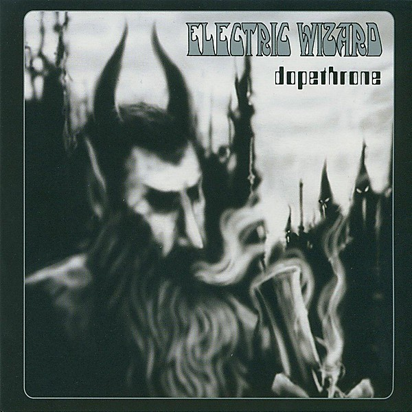

# Dopethrone

By **Electric Wizard**

## Album Data

- **Catalog:** Beets
- **Format:** Digital, Album
- **Album:** Dopethrone
- **Artist:** Electric Wizard
- **Albumartist:** Electric Wizard
- **Genre:** Stoner Metal
- **MusicBrainz Album Artist ID:** [da7d57e6-0619-4f0f-8d15-d0b4195c3f55](https://musicbrainz.org/artist/da7d57e6-0619-4f0f-8d15-d0b4195c3f55)
- **MusicBrainz Album ID:** [69646f41-9c0d-339d-ba44-85372e03ebbd](https://musicbrainz.org/release/69646f41-9c0d-339d-ba44-85372e03ebbd)
- **MusicBrainz Release Group ID:** [5ebf4f0a-61ba-3829-9d0c-0a0e5ad8897e](https://musicbrainz.org/release-group/5ebf4f0a-61ba-3829-9d0c-0a0e5ad8897e)
- **Year:** 2006
- **Catalog #:** RISECD073
- **Label:** Rise Above Records
- **Total Tracks:** 09

## Album Tracks

### Track 01 - Vinum Sabbathi

- **Artist:** Electric Wizard
- **Format:** AAC
- **Genre:** Stoner Metal
- **Length:** 3:05
- **MusicBrainz Track ID:** [c5d7aa2d-3d30-4b70-bb61-5d92bc81a75e](https://musicbrainz.org/recording/c5d7aa2d-3d30-4b70-bb61-5d92bc81a75e)
- **Title:** Vinum Sabbathi
- **Track:** 01
- **Year:** 2006

### Track 02 - Funeralopolis

- **Artist:** Electric Wizard
- **Format:** AAC
- **Genre:** Stoner Metal
- **Length:** 8:43
- **MusicBrainz Track ID:** [b6b2ca19-1297-4cf0-a6fe-e13a8b0c2cc3](https://musicbrainz.org/recording/b6b2ca19-1297-4cf0-a6fe-e13a8b0c2cc3)
- **Title:** Funeralopolis
- **Track:** 02
- **Year:** 2006

### Track 03 - Weird Tales

- **Artist:** Electric Wizard
- **Format:** AAC
- **Genre:** Stoner Metal
- **Length:** 15:04
- **MusicBrainz Track ID:** [576bab17-b781-457f-b04d-f6bd2b2bc8c2](https://musicbrainz.org/recording/576bab17-b781-457f-b04d-f6bd2b2bc8c2)
- **Title:** Weird Tales
- **Track:** 03
- **Year:** 2006

### Track 04 - Barbarian

- **Artist:** Electric Wizard
- **Format:** AAC
- **Genre:** Stoner Metal
- **Length:** 6:29
- **MusicBrainz Track ID:** [d5a2142a-0a8a-44c1-82c1-b77d2172e6ad](https://musicbrainz.org/recording/d5a2142a-0a8a-44c1-82c1-b77d2172e6ad)
- **Title:** Barbarian
- **Track:** 04
- **Year:** 2006

### Track 05 - I, the Witchfinder

- **Artist:** Electric Wizard
- **Format:** AAC
- **Genre:** Stoner Metal
- **Length:** 11:03
- **MusicBrainz Track ID:** [f9fb1def-eda9-4622-9e50-07c288b4b0f6](https://musicbrainz.org/recording/f9fb1def-eda9-4622-9e50-07c288b4b0f6)
- **Title:** I, the Witchfinder
- **Track:** 05
- **Year:** 2006

### Track 06 - The Hills Have Eyes

- **Artist:** Electric Wizard
- **Format:** AAC
- **Genre:** Stoner Metal
- **Length:** 0:47
- **MusicBrainz Track ID:** [a395fad5-342f-4e3b-8dee-08dafa4984c5](https://musicbrainz.org/recording/a395fad5-342f-4e3b-8dee-08dafa4984c5)
- **Title:** The Hills Have Eyes
- **Track:** 06
- **Year:** 2006

### Track 07 - We Hate You

- **Artist:** Electric Wizard
- **Format:** AAC
- **Genre:** Stoner Metal
- **Length:** 5:08
- **MusicBrainz Track ID:** [9b5d0209-3db9-4fd5-8630-1d0e16dcc342](https://musicbrainz.org/recording/9b5d0209-3db9-4fd5-8630-1d0e16dcc342)
- **Title:** We Hate You
- **Track:** 07
- **Year:** 2006

### Track 08 - Dopethrone

- **Artist:** Electric Wizard
- **Format:** AAC
- **Genre:** Stoner Metal
- **Length:** 10:36
- **MusicBrainz Track ID:** [8dd4c4bb-77c3-4410-b42b-712835cba2f6](https://musicbrainz.org/recording/8dd4c4bb-77c3-4410-b42b-712835cba2f6)
- **Title:** Dopethrone
- **Track:** 08
- **Year:** 2006

### Track 09 - Mind Transferral

- **Artist:** Electric Wizard
- **Format:** AAC
- **Genre:** Stoner Metal
- **Length:** 14:56
- **MusicBrainz Track ID:** [6273e50e-633f-4b33-a1e8-bd901c513c4d](https://musicbrainz.org/recording/6273e50e-633f-4b33-a1e8-bd901c513c4d)
- **Title:** Mind Transferral
- **Track:** 09
- **Year:** 2006

