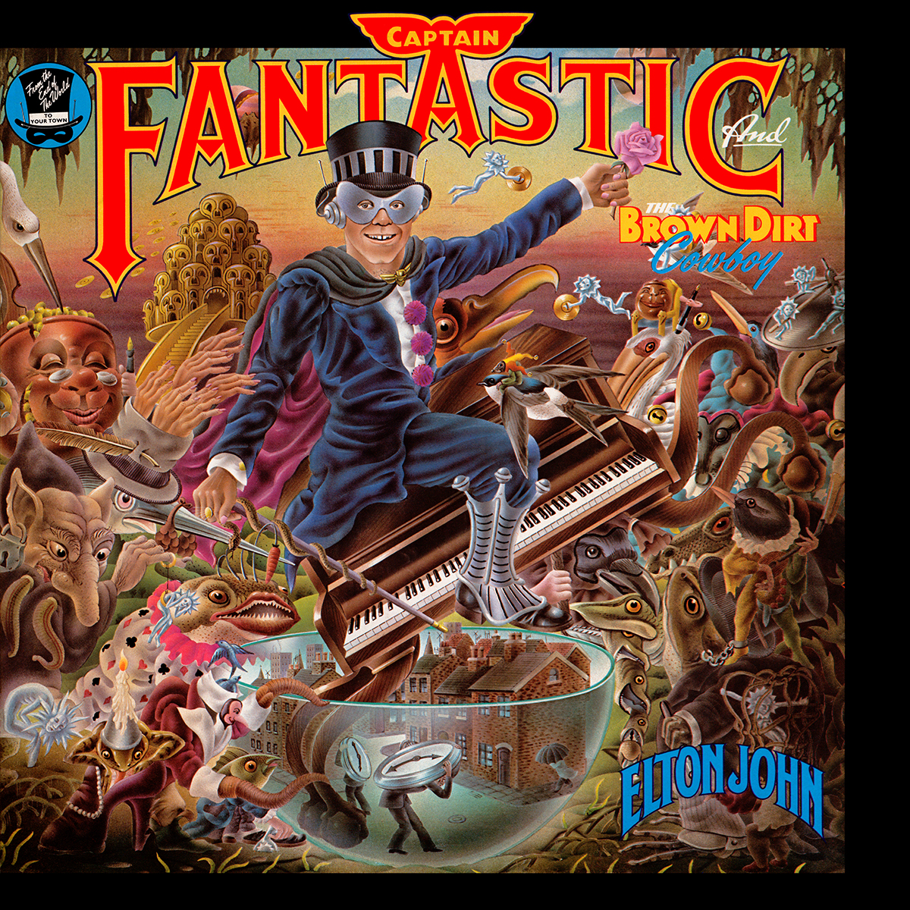

# Captain Fantastic and the Brown Dirt Cowboy

By **Elton John**

## Album Data

- **Catalog:** Beets
- **Format:** Digital, Album
- **Album:** Captain Fantastic and the Brown Dirt Cowboy
- **Artist:** Elton John
- **Albumartist:** Elton John
- **Genre:** Soft Rock
- **MusicBrainz Album Artist ID:** [b83bc61f-8451-4a5d-8b8e-7e9ed295e822](https://musicbrainz.org/artist/b83bc61f-8451-4a5d-8b8e-7e9ed295e822)
- **MusicBrainz Album ID:** [d29b272b-70e8-4a27-916c-f560fd1e1fb7](https://musicbrainz.org/release/d29b272b-70e8-4a27-916c-f560fd1e1fb7)
- **MusicBrainz Release Group ID:** [31edc094-37e7-3b02-b79b-f8442cc3fbdb](https://musicbrainz.org/release-group/31edc094-37e7-3b02-b79b-f8442cc3fbdb)
- **Year:** 1996
- **Catalog #:** MCAD-1614
- **Label:** MCA Records
- **Total Tracks:** 10

## Album Tracks

### Track 01 - Your Song

- **Artist:** Elton John
- **Format:** ALAC
- **Genre:** Soft Rock
- **Length:** 4:03
- **MusicBrainz Track ID:** [60572fab-c835-4733-aa5a-2864c318c9c8](https://musicbrainz.org/recording/60572fab-c835-4733-aa5a-2864c318c9c8)
- **Title:** Your Song
- **Track:** 01
- **Year:** 1986

### Track 02 - I Need You to Turn To

- **Artist:** Elton John
- **Format:** ALAC
- **Genre:** Soft Rock
- **Length:** 2:33
- **MusicBrainz Track ID:** [5219257c-b260-4e43-ba81-a6d70bcb2ed3](https://musicbrainz.org/recording/5219257c-b260-4e43-ba81-a6d70bcb2ed3)
- **Title:** I Need You to Turn To
- **Track:** 02
- **Year:** 1986

### Track 03 - Take Me to the Pilot

- **Artist:** Elton John
- **Format:** ALAC
- **Genre:** Pop Rock
- **Length:** 3:46
- **MusicBrainz Track ID:** [5b00d076-cec3-40ab-9172-1791ea2ca486](https://musicbrainz.org/recording/5b00d076-cec3-40ab-9172-1791ea2ca486)
- **Title:** Take Me to the Pilot
- **Track:** 03
- **Year:** 1986

### Track 04 - No Shoe Strings on Louise

- **Artist:** Elton John
- **Format:** ALAC
- **Genre:** Soft Rock
- **Length:** 3:31
- **MusicBrainz Track ID:** [6d9b8370-a516-4f3d-8d81-316eadbcd39f](https://musicbrainz.org/recording/6d9b8370-a516-4f3d-8d81-316eadbcd39f)
- **Title:** No Shoe Strings on Louise
- **Track:** 04
- **Year:** 1986

### Track 05 - First Episode at Hienton

- **Artist:** Elton John
- **Format:** ALAC
- **Genre:** Rock
- **Length:** 4:48
- **MusicBrainz Track ID:** [89819e74-35e3-4065-80e7-1ed50b827458](https://musicbrainz.org/recording/89819e74-35e3-4065-80e7-1ed50b827458)
- **Title:** First Episode at Hienton
- **Track:** 05
- **Year:** 1986

### Track 06 - Sixty Years On

- **Artist:** Elton John
- **Format:** ALAC
- **Genre:** Soft Rock
- **Length:** 4:34
- **MusicBrainz Track ID:** [c76bf8e6-03c1-4fd4-9606-0cc80e5ddd55](https://musicbrainz.org/recording/c76bf8e6-03c1-4fd4-9606-0cc80e5ddd55)
- **Title:** Sixty Years On
- **Track:** 06
- **Year:** 1986

### Track 07 - Border Song

- **Artist:** Elton John
- **Format:** ALAC
- **Genre:** Soul
- **Length:** 3:21
- **MusicBrainz Track ID:** [9bb24681-db91-45dc-ae75-fe37965480a3](https://musicbrainz.org/recording/9bb24681-db91-45dc-ae75-fe37965480a3)
- **Title:** Border Song
- **Track:** 07
- **Year:** 1986

### Track 08 - The Greatest Discovery

- **Artist:** Elton John
- **Format:** ALAC
- **Genre:** Soft Rock
- **Length:** 4:12
- **MusicBrainz Track ID:** [3e8afb38-8e2b-41cd-a88c-6d61e5bdff2e](https://musicbrainz.org/recording/3e8afb38-8e2b-41cd-a88c-6d61e5bdff2e)
- **Title:** The Greatest Discovery
- **Track:** 08
- **Year:** 1986

### Track 09 - The Cage

- **Artist:** Elton John
- **Format:** ALAC
- **Genre:** Rock
- **Length:** 3:30
- **MusicBrainz Track ID:** [3f3c33af-3237-4879-9f19-9d4d5d4e1328](https://musicbrainz.org/recording/3f3c33af-3237-4879-9f19-9d4d5d4e1328)
- **Title:** The Cage
- **Track:** 09
- **Year:** 1986

### Track 10 - The King Must Die

- **Artist:** Elton John
- **Format:** ALAC
- **Genre:** Rock
- **Length:** 5:06
- **MusicBrainz Track ID:** [76c95d0c-0c59-444e-b41b-fb7a7fedbb06](https://musicbrainz.org/recording/76c95d0c-0c59-444e-b41b-fb7a7fedbb06)
- **Title:** The King Must Die
- **Track:** 10
- **Year:** 1986

## See also

- [Elton John Live in Australia](Elton_John_Live_in_Australia.md)
- [Elton John](Elton_John.md)
- [Friends](Friends.md)
- [Goodbye Yellow Brick Road (40th Anniversary Celebration)](Goodbye_Yellow_Brick_Road_40th_Anniversary_Celebration.md)
- [Goodbye Yellow Brick Road](Goodbye_Yellow_Brick_Road.md)
- [Madman Across the Water](Madman_Across_the_Water.md)
- [Tumbleweed Connection](Tumbleweed_Connection.md)
- [Roon: Captain Fantastic And The Brown Dirt Cowboy](../../Roon/Elton_John/Captain_Fantastic_And_The_Brown_Dirt_Cowboy.md)
- [Roon: Elton John](../../Roon/Elton_John/Elton_John.md)
- [Roon: Goodbye Yellow Brick Road (40th Anniversary Celebration)](../../Roon/Elton_John/Goodbye_Yellow_Brick_Road_40th_Anniversary_Celebration.md)
- [Roon: Jewel Box](../../Roon/Elton_John/Jewel_Box.md)
- [Roon: Madman Across The Water](../../Roon/Elton_John/Madman_Across_The_Water.md)
- [Roon: Rare Masters](../../Roon/Elton_John/Rare_Masters.md)
- [Roon: Tumbleweed Connection (Deluxe Edition)](../../Roon/Elton_John/Tumbleweed_Connection_Deluxe_Edition.md)
- [Vinyl: Captain Fantastic And The Brown Dirt Cowboy](../../Vinyl/Elton_John/Captain_Fantastic_And_The_Brown_Dirt_Cowboy.md)
- [Vinyl: Don't Shoot Me I'm Only The Piano Player](../../Vinyl/Elton_John/Dont_Shoot_Me_Im_Only_The_Piano_Player.md)
- [Vinyl: ](../../Vinyl/Elton_John/Elton_John_index.md)
- [Vinyl: Elton John](../../Vinyl/Elton_John/Elton_John.md)
- [Vinyl: Goodbye Yellow Brick Road](../../Vinyl/Elton_John/Goodbye_Yellow_Brick_Road.md)
- [Vinyl: Madman Across The Water](../../Vinyl/Elton_John/Madman_Across_The_Water.md)
