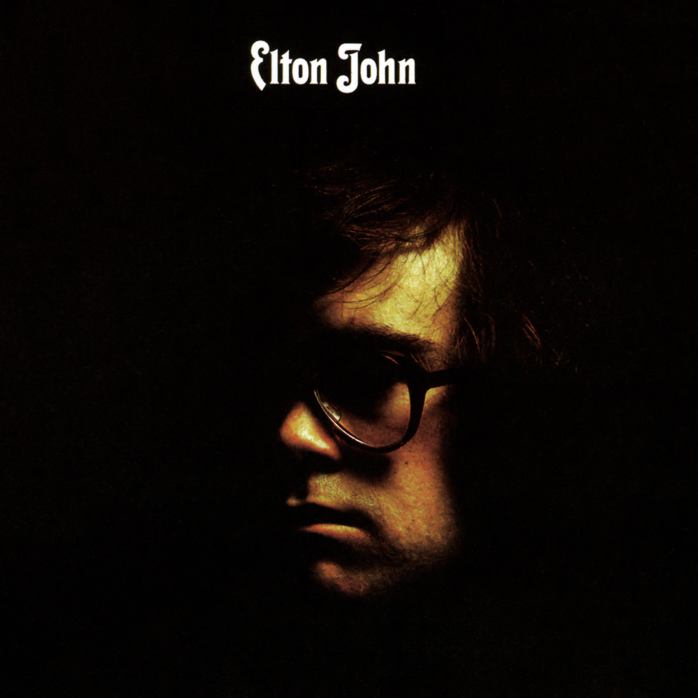

# Elton John

By **Elton John**

## Album Data

- **Catalog:** Beets
- **Format:** Digital, Album
- **Album:** Elton John
- **Artist:** Elton John
- **Albumartist:** Elton John
- **Genre:** Soft Rock
- **MusicBrainz Album Artist ID:** [b83bc61f-8451-4a5d-8b8e-7e9ed295e822](https://musicbrainz.org/artist/b83bc61f-8451-4a5d-8b8e-7e9ed295e822)
- **MusicBrainz Album ID:** [e814bd89-2648-3a6d-96c7-b38c761a96ac](https://musicbrainz.org/release/e814bd89-2648-3a6d-96c7-b38c761a96ac)
- **MusicBrainz Release Group ID:** [527eeafc-adbc-3c85-a048-0711acb4a932](https://musicbrainz.org/release-group/527eeafc-adbc-3c85-a048-0711acb4a932)
- **Year:** 1986
- **Catalog #:** MCAD-8022
- **Label:** MCA Records
- **Total Tracks:** 14

## Album Tracks

### Track 01 - Sixty Years On

- **Artist:** Elton John
- **Format:** MP3
- **Genre:** Soft Rock
- **Length:** 5:40
- **MusicBrainz Track ID:** [fefd7471-870c-4105-b2eb-3165e26ce2da](https://musicbrainz.org/recording/fefd7471-870c-4105-b2eb-3165e26ce2da)
- **Title:** Sixty Years On
- **Track:** 01
- **Year:** 1987

### Track 02 - I Need You to Turn To

- **Artist:** Elton John
- **Format:** MP3
- **Genre:** Soft Rock
- **Length:** 2:48
- **MusicBrainz Track ID:** [e98a7dee-63e3-475a-b7bc-dca547afe76e](https://musicbrainz.org/recording/e98a7dee-63e3-475a-b7bc-dca547afe76e)
- **Title:** I Need You to Turn To
- **Track:** 02
- **Year:** 1987

### Track 03 - The Greatest Discovery

- **Artist:** Elton John
- **Format:** MP3
- **Genre:** Soft Rock
- **Length:** 4:27
- **MusicBrainz Track ID:** [5fc2fa59-ffcc-4de4-9729-8bbc2c40cb74](https://musicbrainz.org/recording/5fc2fa59-ffcc-4de4-9729-8bbc2c40cb74)
- **Title:** The Greatest Discovery
- **Track:** 03
- **Year:** 1987

### Track 04 - Tonight

- **Artist:** Elton John
- **Format:** MP3
- **Genre:** Orchestral
- **Length:** 8:03
- **MusicBrainz Track ID:** [6d452102-0f41-46cb-9bbe-079632751a08](https://musicbrainz.org/recording/6d452102-0f41-46cb-9bbe-079632751a08)
- **Title:** Tonight
- **Track:** 04
- **Year:** 1987

### Track 05 - Sorry Seems to Be the Hardest Word

- **Artist:** Elton John
- **Format:** MP3
- **Genre:** Soft Rock
- **Length:** 3:50
- **MusicBrainz Track ID:** [9a81aa48-5ba1-4ebb-a049-ab13627cdcda](https://musicbrainz.org/recording/9a81aa48-5ba1-4ebb-a049-ab13627cdcda)
- **Title:** Sorry Seems to Be the Hardest Word
- **Track:** 05
- **Year:** 1987

### Track 06 - The King Must Die

- **Artist:** Elton John
- **Format:** MP3
- **Genre:** Rock
- **Length:** 5:30
- **MusicBrainz Track ID:** [82551109-3a53-443f-8364-edca48e5357d](https://musicbrainz.org/recording/82551109-3a53-443f-8364-edca48e5357d)
- **Title:** The King Must Die
- **Track:** 06
- **Year:** 1987

### Track 07 - Take Me to the Pilot

- **Artist:** Elton John
- **Format:** MP3
- **Genre:** Pop Rock
- **Length:** 4:19
- **MusicBrainz Track ID:** [7f857e3c-0a4c-4591-bfca-b3d176a402cd](https://musicbrainz.org/recording/7f857e3c-0a4c-4591-bfca-b3d176a402cd)
- **Title:** Take Me to the Pilot
- **Track:** 07
- **Year:** 1987

### Track 08 - Tiny Dancer

- **Artist:** Elton John
- **Format:** MP3
- **Genre:** Soft Rock
- **Length:** 6:26
- **MusicBrainz Track ID:** [d9675d59-b669-4cdb-85a4-ec139b6cc325](https://musicbrainz.org/recording/d9675d59-b669-4cdb-85a4-ec139b6cc325)
- **Title:** Tiny Dancer
- **Track:** 08
- **Year:** 1987

### Track 09 - Have Mercy on the Criminal

- **Artist:** Elton John
- **Format:** MP3
- **Genre:** Soft Rock
- **Length:** 6:08
- **MusicBrainz Track ID:** [d62dc8b5-ba29-4ba0-8fe4-b204805f11eb](https://musicbrainz.org/recording/d62dc8b5-ba29-4ba0-8fe4-b204805f11eb)
- **Title:** Have Mercy on the Criminal
- **Track:** 09
- **Year:** 1987

### Track 10 - Madman Across the Water

- **Artist:** Elton John
- **Format:** MP3
- **Genre:** Soft Rock
- **Length:** 6:38
- **MusicBrainz Track ID:** [14f8acad-00b1-4b90-b796-1b23617cae27](https://musicbrainz.org/recording/14f8acad-00b1-4b90-b796-1b23617cae27)
- **Title:** Madman Across the Water
- **Track:** 10
- **Year:** 1987

### Track 11 - Candle in the Wind

- **Artist:** Elton John
- **Format:** MP3
- **Genre:** Soft Rock
- **Length:** 3:59
- **MusicBrainz Track ID:** [fb981bb3-2b49-4024-8776-c51b640bc70b](https://musicbrainz.org/recording/fb981bb3-2b49-4024-8776-c51b640bc70b)
- **Title:** Candle in the Wind
- **Track:** 11
- **Year:** 1987

### Track 12 - Burn Down the Mission

- **Artist:** Elton John
- **Format:** MP3
- **Genre:** Soft Rock
- **Length:** 5:49
- **MusicBrainz Track ID:** [d6e8b72a-245d-49fd-bf48-91b88ac0bc05](https://musicbrainz.org/recording/d6e8b72a-245d-49fd-bf48-91b88ac0bc05)
- **Title:** Burn Down the Mission
- **Track:** 12
- **Year:** 1987

### Track 13 - Your Song

- **Artist:** Elton John
- **Format:** MP3
- **Genre:** Soft Rock
- **Length:** 4:04
- **MusicBrainz Track ID:** [f424734b-6969-4c63-89f5-b23f054dd58f](https://musicbrainz.org/recording/f424734b-6969-4c63-89f5-b23f054dd58f)
- **Title:** Your Song
- **Track:** 13
- **Year:** 1987

### Track 14 - Don’t Let the Sun Go Down on Me

- **Artist:** Elton John
- **Format:** MP3
- **Genre:** Rock
- **Length:** 6:06
- **MusicBrainz Track ID:** [b9ff1f24-3ea7-48a5-a6fb-99cadb41041e](https://musicbrainz.org/recording/b9ff1f24-3ea7-48a5-a6fb-99cadb41041e)
- **Title:** Don’t Let the Sun Go Down on Me
- **Track:** 14
- **Year:** 1987

## See also

- [Captain Fantastic and the Brown Dirt Cowboy](Captain_Fantastic_and_the_Brown_Dirt_Cowboy.md)
- [Elton John Live in Australia](Elton_John_Live_in_Australia.md)
- [Friends](Friends.md)
- [Goodbye Yellow Brick Road (40th Anniversary Celebration)](Goodbye_Yellow_Brick_Road_40th_Anniversary_Celebration.md)
- [Goodbye Yellow Brick Road](Goodbye_Yellow_Brick_Road.md)
- [Madman Across the Water](Madman_Across_the_Water.md)
- [Tumbleweed Connection](Tumbleweed_Connection.md)
- [Roon: Captain Fantastic And The Brown Dirt Cowboy](../../Roon/Elton_John/Captain_Fantastic_And_The_Brown_Dirt_Cowboy.md)
- [Roon: Elton John](../../Roon/Elton_John/Elton_John.md)
- [Roon: Goodbye Yellow Brick Road (40th Anniversary Celebration)](../../Roon/Elton_John/Goodbye_Yellow_Brick_Road_40th_Anniversary_Celebration.md)
- [Roon: Jewel Box](../../Roon/Elton_John/Jewel_Box.md)
- [Roon: Madman Across The Water](../../Roon/Elton_John/Madman_Across_The_Water.md)
- [Roon: Rare Masters](../../Roon/Elton_John/Rare_Masters.md)
- [Roon: Tumbleweed Connection (Deluxe Edition)](../../Roon/Elton_John/Tumbleweed_Connection_Deluxe_Edition.md)
- [Vinyl: Captain Fantastic And The Brown Dirt Cowboy](../../Vinyl/Elton_John/Captain_Fantastic_And_The_Brown_Dirt_Cowboy.md)
- [Vinyl: Don't Shoot Me I'm Only The Piano Player](../../Vinyl/Elton_John/Dont_Shoot_Me_Im_Only_The_Piano_Player.md)
- [Vinyl: ](../../Vinyl/Elton_John/Elton_John_index.md)
- [Vinyl: Elton John](../../Vinyl/Elton_John/Elton_John.md)
- [Vinyl: Goodbye Yellow Brick Road](../../Vinyl/Elton_John/Goodbye_Yellow_Brick_Road.md)
- [Vinyl: Madman Across The Water](../../Vinyl/Elton_John/Madman_Across_The_Water.md)
