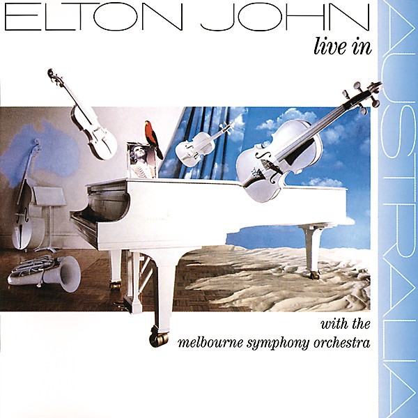

# Elton John Live in Australia

By **Elton John**

## Album Data

- **Catalog:** Beets
- **Format:** Digital, Album
- **Album:** Elton John Live in Australia
- **Artist:** Elton John
- **Albumartist:** Elton John
- **Genre:** Rock
- **MusicBrainz Album Artist ID:** [b83bc61f-8451-4a5d-8b8e-7e9ed295e822](https://musicbrainz.org/artist/b83bc61f-8451-4a5d-8b8e-7e9ed295e822)
- **MusicBrainz Album ID:** [e51929ce-1d6a-4c25-b418-d35c129996c6](https://musicbrainz.org/release/e51929ce-1d6a-4c25-b418-d35c129996c6)
- **MusicBrainz Release Group ID:** [01eae881-2e8d-393c-83bb-942944a4eae7](https://musicbrainz.org/release-group/01eae881-2e8d-393c-83bb-942944a4eae7)
- **Year:** 1987
- **Catalog #:** 821 747-2
- **Label:** Polydor
- **Total Tracks:** 17

## Album Tracks

### Track 01 - Funeral for a Friend / Love Lies Bleeding

- **Artist:** Elton John
- **Format:** ALAC
- **Genre:** Soft Rock
- **Length:** 11:07
- **MusicBrainz Track ID:** [db96638f-c1b3-414a-b1df-bd25fec812c0](https://musicbrainz.org/recording/db96638f-c1b3-414a-b1df-bd25fec812c0)
- **Title:** Funeral for a Friend / Love Lies Bleeding
- **Track:** 01
- **Year:** 1990

### Track 02 - Candle in the Wind

- **Artist:** Elton John
- **Format:** ALAC
- **Genre:** Soft Rock
- **Length:** 3:49
- **MusicBrainz Track ID:** [a57af2bd-9226-468e-8d86-1b2265fc4ef1](https://musicbrainz.org/recording/a57af2bd-9226-468e-8d86-1b2265fc4ef1)
- **Title:** Candle in the Wind
- **Track:** 02
- **Year:** 1990

### Track 03 - Bennie and the Jets

- **Artist:** Elton John
- **Format:** ALAC
- **Genre:** Soft Rock
- **Length:** 5:23
- **MusicBrainz Track ID:** [5df9640d-217a-4480-bdc8-8173d137dd54](https://musicbrainz.org/recording/5df9640d-217a-4480-bdc8-8173d137dd54)
- **Title:** Bennie and the Jets
- **Track:** 03
- **Year:** 1990

### Track 04 - Goodbye Yellow Brick Road

- **Artist:** Elton John
- **Format:** ALAC
- **Genre:** Soft Rock
- **Length:** 3:13
- **MusicBrainz Track ID:** [e492bc5b-469e-497b-903d-64a9713deee0](https://musicbrainz.org/recording/e492bc5b-469e-497b-903d-64a9713deee0)
- **Title:** Goodbye Yellow Brick Road
- **Track:** 04
- **Year:** 1990

### Track 05 - This Song Has No Title

- **Artist:** Elton John
- **Format:** ALAC
- **Genre:** Soft Rock
- **Length:** 2:23
- **MusicBrainz Track ID:** [22abe160-0342-49da-934a-97f963563717](https://musicbrainz.org/recording/22abe160-0342-49da-934a-97f963563717)
- **Title:** This Song Has No Title
- **Track:** 05
- **Year:** 1990

### Track 06 - Grey Seal

- **Artist:** Elton John
- **Format:** ALAC
- **Genre:** Soft Rock
- **Length:** 4:00
- **MusicBrainz Track ID:** [325eb5d5-970a-441d-9a9f-07b3f0327616](https://musicbrainz.org/recording/325eb5d5-970a-441d-9a9f-07b3f0327616)
- **Title:** Grey Seal
- **Track:** 06
- **Year:** 1990

### Track 07 - Jamaica Jerk-Off

- **Artist:** Elton John
- **Format:** ALAC
- **Genre:** Soft Rock
- **Length:** 3:38
- **MusicBrainz Track ID:** [f5a9f313-121d-42fe-a1f3-e244591bfb5d](https://musicbrainz.org/recording/f5a9f313-121d-42fe-a1f3-e244591bfb5d)
- **Title:** Jamaica Jerk-Off
- **Track:** 07
- **Year:** 1990

### Track 08 - I've Seen That Movie Too

- **Artist:** Elton John
- **Format:** ALAC
- **Genre:** Soft Rock
- **Length:** 6:00
- **MusicBrainz Track ID:** [f82a6021-a2ab-4fab-be8e-2f57851c7d8d](https://musicbrainz.org/recording/f82a6021-a2ab-4fab-be8e-2f57851c7d8d)
- **Title:** I've Seen That Movie Too
- **Track:** 08
- **Year:** 1990

### Track 09 - Sweet Painted Lady

- **Artist:** Elton John
- **Format:** ALAC
- **Genre:** Soft Rock
- **Length:** 3:54
- **MusicBrainz Track ID:** [a2f5a915-eb71-4b6e-aecb-a43347315058](https://musicbrainz.org/recording/a2f5a915-eb71-4b6e-aecb-a43347315058)
- **Title:** Sweet Painted Lady
- **Track:** 09
- **Year:** 1990

### Track 10 - The Ballad of Danny Bailey (1909-34)

- **Artist:** Elton John
- **Format:** ALAC
- **Genre:** Soft Rock
- **Length:** 4:23
- **MusicBrainz Track ID:** [7662d8a7-d00a-42aa-802b-2c2877bc0632](https://musicbrainz.org/recording/7662d8a7-d00a-42aa-802b-2c2877bc0632)
- **Title:** The Ballad of Danny Bailey (1909-34)
- **Track:** 10
- **Year:** 1990

### Track 11 - Dirty Little Girl

- **Artist:** Elton John
- **Format:** ALAC
- **Genre:** Soft Rock
- **Length:** 5:01
- **MusicBrainz Track ID:** [93389136-4657-44c5-829d-ce2e231a21e9](https://musicbrainz.org/recording/93389136-4657-44c5-829d-ce2e231a21e9)
- **Title:** Dirty Little Girl
- **Track:** 11
- **Year:** 1990

### Track 12 - All the Girls Love Alice

- **Artist:** Elton John
- **Format:** ALAC
- **Genre:** Soft Rock
- **Length:** 5:09
- **MusicBrainz Track ID:** [75cc3191-0af1-4690-a53c-5b4fd8f49e5a](https://musicbrainz.org/recording/75cc3191-0af1-4690-a53c-5b4fd8f49e5a)
- **Title:** All the Girls Love Alice
- **Track:** 12
- **Year:** 1990

### Track 13 - Your Sister Can't Twist (but She Can Rock 'n Roll)

- **Artist:** Elton John
- **Format:** ALAC
- **Genre:** Soft Rock
- **Length:** 2:41
- **MusicBrainz Track ID:** [87796b4c-ca10-47bc-a608-299401674653](https://musicbrainz.org/recording/87796b4c-ca10-47bc-a608-299401674653)
- **Title:** Your Sister Can't Twist (but She Can Rock 'n Roll)
- **Track:** 13
- **Year:** 1990

### Track 14 - Saturday Night's Alright for Fighting

- **Artist:** Elton John
- **Format:** ALAC
- **Genre:** Rock And Roll
- **Length:** 4:55
- **MusicBrainz Track ID:** [f8f27c10-47d7-40dc-a0a1-49eaba96d8ca](https://musicbrainz.org/recording/f8f27c10-47d7-40dc-a0a1-49eaba96d8ca)
- **Title:** Saturday Night's Alright for Fighting
- **Track:** 14
- **Year:** 1990

### Track 15 - Roy Rogers

- **Artist:** Elton John
- **Format:** ALAC
- **Genre:** Soft Rock
- **Length:** 4:07
- **MusicBrainz Track ID:** [ba687861-c45a-4eb3-995e-1dd0bb51215d](https://musicbrainz.org/recording/ba687861-c45a-4eb3-995e-1dd0bb51215d)
- **Title:** Roy Rogers
- **Track:** 15
- **Year:** 1990

### Track 16 - Social Disease

- **Artist:** Elton John
- **Format:** ALAC
- **Genre:** Soft Rock
- **Length:** 3:42
- **MusicBrainz Track ID:** [082f5909-5a8a-4115-bb9d-2ebf66958cc1](https://musicbrainz.org/recording/082f5909-5a8a-4115-bb9d-2ebf66958cc1)
- **Title:** Social Disease
- **Track:** 16
- **Year:** 1990

### Track 17 - Harmony

- **Artist:** Elton John
- **Format:** ALAC
- **Genre:** Soul
- **Length:** 2:46
- **MusicBrainz Track ID:** [b0a5811c-c53a-4253-be28-716a8398db4e](https://musicbrainz.org/recording/b0a5811c-c53a-4253-be28-716a8398db4e)
- **Title:** Harmony
- **Track:** 17
- **Year:** 1990

## See also

- [Captain Fantastic and the Brown Dirt Cowboy](Captain_Fantastic_and_the_Brown_Dirt_Cowboy.md)
- [Elton John](Elton_John.md)
- [Friends](Friends.md)
- [Goodbye Yellow Brick Road (40th Anniversary Celebration)](Goodbye_Yellow_Brick_Road_40th_Anniversary_Celebration.md)
- [Goodbye Yellow Brick Road](Goodbye_Yellow_Brick_Road.md)
- [Madman Across the Water](Madman_Across_the_Water.md)
- [Tumbleweed Connection](Tumbleweed_Connection.md)
- [Roon: Captain Fantastic And The Brown Dirt Cowboy](../../Roon/Elton_John/Captain_Fantastic_And_The_Brown_Dirt_Cowboy.md)
- [Roon: Elton John](../../Roon/Elton_John/Elton_John.md)
- [Roon: Goodbye Yellow Brick Road (40th Anniversary Celebration)](../../Roon/Elton_John/Goodbye_Yellow_Brick_Road_40th_Anniversary_Celebration.md)
- [Roon: Jewel Box](../../Roon/Elton_John/Jewel_Box.md)
- [Roon: Madman Across The Water](../../Roon/Elton_John/Madman_Across_The_Water.md)
- [Roon: Rare Masters](../../Roon/Elton_John/Rare_Masters.md)
- [Roon: Tumbleweed Connection (Deluxe Edition)](../../Roon/Elton_John/Tumbleweed_Connection_Deluxe_Edition.md)
- [Vinyl: Captain Fantastic And The Brown Dirt Cowboy](../../Vinyl/Elton_John/Captain_Fantastic_And_The_Brown_Dirt_Cowboy.md)
- [Vinyl: Don't Shoot Me I'm Only The Piano Player](../../Vinyl/Elton_John/Dont_Shoot_Me_Im_Only_The_Piano_Player.md)
- [Vinyl: ](../../Vinyl/Elton_John/Elton_John_index.md)
- [Vinyl: Elton John](../../Vinyl/Elton_John/Elton_John.md)
- [Vinyl: Goodbye Yellow Brick Road](../../Vinyl/Elton_John/Goodbye_Yellow_Brick_Road.md)
- [Vinyl: Madman Across The Water](../../Vinyl/Elton_John/Madman_Across_The_Water.md)
