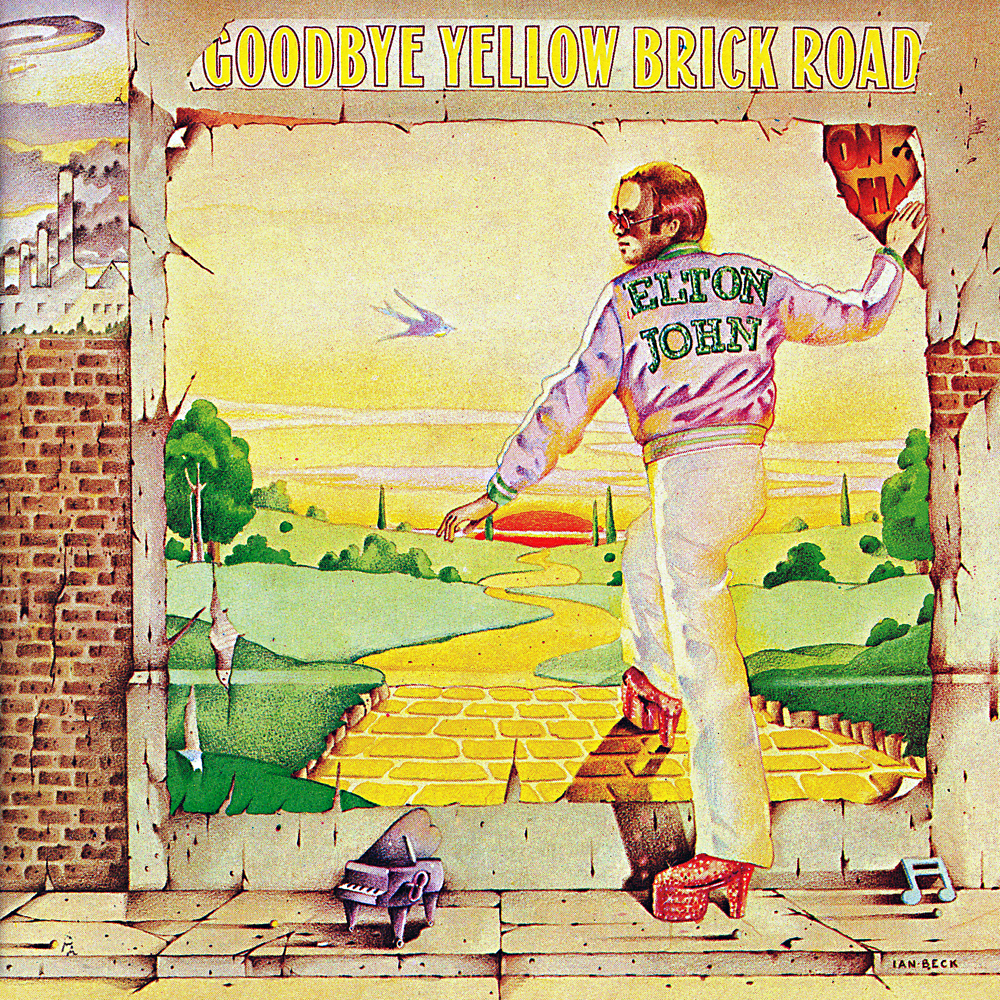

# Goodbye Yellow Brick Road

By **Elton John**

## Album Data

- **Catalog:** Beets
- **Format:** Digital, Album
- **Album:** Goodbye Yellow Brick Road
- **Artist:** Elton John
- **Albumartist:** Elton John
- **Genre:** Pop Rock
- **MusicBrainz Album Artist ID:** [b83bc61f-8451-4a5d-8b8e-7e9ed295e822](https://musicbrainz.org/artist/b83bc61f-8451-4a5d-8b8e-7e9ed295e822)
- **MusicBrainz Album ID:** [154fc613-1555-306f-934e-e07f8e38f107](https://musicbrainz.org/release/154fc613-1555-306f-934e-e07f8e38f107)
- **MusicBrainz Release Group ID:** [80df0f1b-4ce7-348a-aa1b-0d31ebff111a](https://musicbrainz.org/release-group/80df0f1b-4ce7-348a-aa1b-0d31ebff111a)
- **Year:** 1990
- **Catalog #:** 314-528 161-2
- **Label:** The Rocket Record Company
- **Total Tracks:** 09

## Album Tracks

### Track 01 - Tiny Dancer

- **Artist:** Elton John
- **Format:** MP3
- **Genre:** Soft Rock
- **Length:** 6:17
- **MusicBrainz Track ID:** [d63bf39f-ec30-4f9f-b5a1-1397756016a3](https://musicbrainz.org/recording/d63bf39f-ec30-4f9f-b5a1-1397756016a3)
- **Title:** Tiny Dancer
- **Track:** 01
- **Year:** 1996

### Track 02 - Levon

- **Artist:** Elton John
- **Format:** MP3
- **Genre:** Soft Rock
- **Length:** 5:22
- **MusicBrainz Track ID:** [8a8d37a9-47c2-4b76-988e-85a26881b230](https://musicbrainz.org/recording/8a8d37a9-47c2-4b76-988e-85a26881b230)
- **Title:** Levon
- **Track:** 02
- **Year:** 1996

### Track 03 - Razor Face

- **Artist:** Elton John
- **Format:** MP3
- **Genre:** Soft Rock
- **Length:** 4:42
- **MusicBrainz Track ID:** [4044d2ff-cf13-426c-91bb-49144646b302](https://musicbrainz.org/recording/4044d2ff-cf13-426c-91bb-49144646b302)
- **Title:** Razor Face
- **Track:** 03
- **Year:** 1996

### Track 04 - Madman Across the Water

- **Artist:** Elton John
- **Format:** MP3
- **Genre:** Soft Rock
- **Length:** 5:57
- **MusicBrainz Track ID:** [738121d7-2ecf-4848-aee9-2f16d3d65dd5](https://musicbrainz.org/recording/738121d7-2ecf-4848-aee9-2f16d3d65dd5)
- **Title:** Madman Across the Water
- **Track:** 04
- **Year:** 1996

### Track 05 - Indian Sunset

- **Artist:** Elton John
- **Format:** MP3
- **Genre:** Soft Rock
- **Length:** 6:46
- **MusicBrainz Track ID:** [907833c3-97f4-49ec-9cac-dd50d566f51c](https://musicbrainz.org/recording/907833c3-97f4-49ec-9cac-dd50d566f51c)
- **Title:** Indian Sunset
- **Track:** 05
- **Year:** 1996

### Track 06 - Holiday Inn

- **Artist:** Elton John
- **Format:** MP3
- **Genre:** Soft Rock
- **Length:** 4:16
- **MusicBrainz Track ID:** [1949e6c7-5966-4845-9c11-93618993b055](https://musicbrainz.org/recording/1949e6c7-5966-4845-9c11-93618993b055)
- **Title:** Holiday Inn
- **Track:** 06
- **Year:** 1996

### Track 07 - Rotten Peaches

- **Artist:** Elton John
- **Format:** MP3
- **Genre:** Soft Rock
- **Length:** 4:58
- **MusicBrainz Track ID:** [47f19a29-1259-4258-8582-b54d973ead68](https://musicbrainz.org/recording/47f19a29-1259-4258-8582-b54d973ead68)
- **Title:** Rotten Peaches
- **Track:** 07
- **Year:** 1996

### Track 08 - All the Nasties

- **Artist:** Elton John
- **Format:** MP3
- **Genre:** Soft Rock
- **Length:** 5:09
- **MusicBrainz Track ID:** [f0d63ac9-026b-4817-b170-880eefb6bf79](https://musicbrainz.org/recording/f0d63ac9-026b-4817-b170-880eefb6bf79)
- **Title:** All the Nasties
- **Track:** 08
- **Year:** 1996

### Track 09 - Goodbye

- **Artist:** Elton John
- **Format:** MP3
- **Genre:** Soft Rock
- **Length:** 1:48
- **MusicBrainz Track ID:** [1a32ca2f-1e6f-424f-8876-cc5900e1b569](https://musicbrainz.org/recording/1a32ca2f-1e6f-424f-8876-cc5900e1b569)
- **Title:** Goodbye
- **Track:** 09
- **Year:** 1996

## See also

- [Captain Fantastic and the Brown Dirt Cowboy](Captain_Fantastic_and_the_Brown_Dirt_Cowboy.md)
- [Elton John Live in Australia](Elton_John_Live_in_Australia.md)
- [Elton John](Elton_John.md)
- [Friends](Friends.md)
- [Goodbye Yellow Brick Road (40th Anniversary Celebration)](Goodbye_Yellow_Brick_Road_40th_Anniversary_Celebration.md)
- [Madman Across the Water](Madman_Across_the_Water.md)
- [Tumbleweed Connection](Tumbleweed_Connection.md)
- [Roon: Captain Fantastic And The Brown Dirt Cowboy](../../Roon/Elton_John/Captain_Fantastic_And_The_Brown_Dirt_Cowboy.md)
- [Roon: Elton John](../../Roon/Elton_John/Elton_John.md)
- [Roon: Goodbye Yellow Brick Road (40th Anniversary Celebration)](../../Roon/Elton_John/Goodbye_Yellow_Brick_Road_40th_Anniversary_Celebration.md)
- [Roon: Jewel Box](../../Roon/Elton_John/Jewel_Box.md)
- [Roon: Madman Across The Water](../../Roon/Elton_John/Madman_Across_The_Water.md)
- [Roon: Rare Masters](../../Roon/Elton_John/Rare_Masters.md)
- [Roon: Tumbleweed Connection (Deluxe Edition)](../../Roon/Elton_John/Tumbleweed_Connection_Deluxe_Edition.md)
- [Vinyl: Captain Fantastic And The Brown Dirt Cowboy](../../Vinyl/Elton_John/Captain_Fantastic_And_The_Brown_Dirt_Cowboy.md)
- [Vinyl: Don't Shoot Me I'm Only The Piano Player](../../Vinyl/Elton_John/Dont_Shoot_Me_Im_Only_The_Piano_Player.md)
- [Vinyl: ](../../Vinyl/Elton_John/Elton_John_index.md)
- [Vinyl: Elton John](../../Vinyl/Elton_John/Elton_John.md)
- [Vinyl: Goodbye Yellow Brick Road](../../Vinyl/Elton_John/Goodbye_Yellow_Brick_Road.md)
- [Vinyl: Madman Across The Water](../../Vinyl/Elton_John/Madman_Across_The_Water.md)
