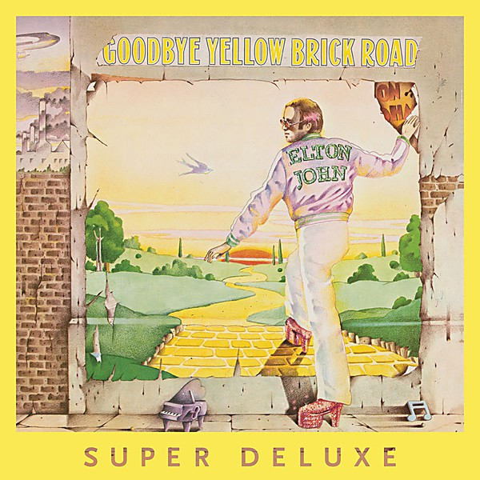

# Goodbye Yellow Brick Road (40th Anniversary Celebration)

By **Elton John**

## Album Data

- **Catalog:** Beets
- **Format:** Digital, Album
- **Album:** Goodbye Yellow Brick Road (40th Anniversary Celebration)
- **Artist:** Elton John
- **Albumartist:** Elton John
- **Genre:** Soft Rock
- **MusicBrainz Album Artist ID:** 
- **MusicBrainz Album ID:** 
- **MusicBrainz Release Group ID:** 
- **Year:** 2014
- **Catalog #:** HD00731452816023
- **Label:** Def Jam Recordings
- **Total Tracks:** 13

## Album Tracks

### Track 01 - Captain Fantastic and the Brown Dirt Cowboy

- **Artist:** Elton John
- **Format:** ALAC
- **Genre:** Soft Rock
- **Length:** 5:46
- **MusicBrainz Track ID:** [efd78ccb-8244-4840-8055-3a2a85ce2828](https://musicbrainz.org/recording/efd78ccb-8244-4840-8055-3a2a85ce2828)
- **Title:** Captain Fantastic and the Brown Dirt Cowboy
- **Track:** 01
- **Year:** 1996

### Track 02 - Tower of Babel

- **Artist:** Elton John
- **Format:** ALAC
- **Genre:** Rock
- **Length:** 4:28
- **MusicBrainz Track ID:** [01abd2b4-126d-4006-948e-28bebb970570](https://musicbrainz.org/recording/01abd2b4-126d-4006-948e-28bebb970570)
- **Title:** Tower of Babel
- **Track:** 02
- **Year:** 1996

### Track 03 - Bitter Fingers

- **Artist:** Elton John
- **Format:** ALAC
- **Genre:** Soft Rock
- **Length:** 4:33
- **MusicBrainz Track ID:** [92329bb3-3212-48f7-a9f5-571fec79843a](https://musicbrainz.org/recording/92329bb3-3212-48f7-a9f5-571fec79843a)
- **Title:** Bitter Fingers
- **Track:** 03
- **Year:** 1996

### Track 04 - Tell Me When the Whistle Blows

- **Artist:** Elton John
- **Format:** ALAC
- **Genre:** Uk Garage
- **Length:** 4:20
- **MusicBrainz Track ID:** [d0a54c2a-03bf-4563-bbf9-c3fbe0661300](https://musicbrainz.org/recording/d0a54c2a-03bf-4563-bbf9-c3fbe0661300)
- **Title:** Tell Me When the Whistle Blows
- **Track:** 04
- **Year:** 1996

### Track 05 - Someone Saved My Life Tonight

- **Artist:** Elton John
- **Format:** ALAC
- **Genre:** Rock
- **Length:** 6:44
- **MusicBrainz Track ID:** [5dcb4915-e9e8-4c11-9ee5-4e2388d7a041](https://musicbrainz.org/recording/5dcb4915-e9e8-4c11-9ee5-4e2388d7a041)
- **Title:** Someone Saved My Life Tonight
- **Track:** 05
- **Year:** 1996

### Track 06 - (Gotta Get a) Meal Ticket

- **Artist:** Elton John
- **Format:** ALAC
- **Genre:** Rock
- **Length:** 4:01
- **MusicBrainz Track ID:** [e6febf73-c4e7-4469-b919-abebce1de0e0](https://musicbrainz.org/recording/e6febf73-c4e7-4469-b919-abebce1de0e0)
- **Title:** (Gotta Get a) Meal Ticket
- **Track:** 06
- **Year:** 1996

### Track 07 - Better Off Dead

- **Artist:** Elton John
- **Format:** ALAC
- **Genre:** Progressive Rock
- **Length:** 2:37
- **MusicBrainz Track ID:** [3cb4f442-04f5-46ac-9fbf-5a6fcb8b50fe](https://musicbrainz.org/recording/3cb4f442-04f5-46ac-9fbf-5a6fcb8b50fe)
- **Title:** Better Off Dead
- **Track:** 07
- **Year:** 1996

### Track 08 - Writing

- **Artist:** Elton John
- **Format:** ALAC
- **Genre:** Pop Rock
- **Length:** 3:40
- **MusicBrainz Track ID:** [99be42d7-8af5-4440-a499-2607fb66315e](https://musicbrainz.org/recording/99be42d7-8af5-4440-a499-2607fb66315e)
- **Title:** Writing
- **Track:** 08
- **Year:** 1996

### Track 09 - We All Fall in Love Sometimes

- **Artist:** Elton John
- **Format:** ALAC
- **Genre:** Rock
- **Length:** 4:12
- **MusicBrainz Track ID:** [ffcc0803-e99b-4078-ad15-231624dfa9bd](https://musicbrainz.org/recording/ffcc0803-e99b-4078-ad15-231624dfa9bd)
- **Title:** We All Fall in Love Sometimes
- **Track:** 09
- **Year:** 1996

### Track 10 - Curtains

- **Artist:** Elton John
- **Format:** ALAC
- **Genre:** Soft Rock
- **Length:** 6:34
- **MusicBrainz Track ID:** [5682a14c-b3f8-4b49-b926-1b7780e03b91](https://musicbrainz.org/recording/5682a14c-b3f8-4b49-b926-1b7780e03b91)
- **Title:** Curtains
- **Track:** 10
- **Year:** 1996

### Track 11 - Lucy in the Sky With Diamonds

- **Artist:** Elton John
- **Format:** ALAC
- **Genre:** Soft Rock
- **Length:** 6:17
- **MusicBrainz Track ID:** [1c5ba2f2-8574-49d9-8193-7ac9ee1cba63](https://musicbrainz.org/recording/1c5ba2f2-8574-49d9-8193-7ac9ee1cba63)
- **Title:** Lucy in the Sky With Diamonds
- **Track:** 11
- **Year:** 1996

### Track 12 - One Day at a Time

- **Artist:** Elton John
- **Format:** ALAC
- **Genre:** Pop
- **Length:** 3:49
- **MusicBrainz Track ID:** [9e2f5aba-2ba3-4bb6-a89f-57485b86d7f1](https://musicbrainz.org/recording/9e2f5aba-2ba3-4bb6-a89f-57485b86d7f1)
- **Title:** One Day at a Time
- **Track:** 12
- **Year:** 1996

### Track 13 - Philadelphia Freedom

- **Artist:** Elton John
- **Format:** ALAC
- **Genre:** Rock
- **Length:** 5:24
- **MusicBrainz Track ID:** [f69fb6a4-d965-4d6c-b5b1-3f1f90f74820](https://musicbrainz.org/recording/f69fb6a4-d965-4d6c-b5b1-3f1f90f74820)
- **Title:** Philadelphia Freedom
- **Track:** 13
- **Year:** 1996

## See also

- [Captain Fantastic and the Brown Dirt Cowboy](Captain_Fantastic_and_the_Brown_Dirt_Cowboy.md)
- [Elton John Live in Australia](Elton_John_Live_in_Australia.md)
- [Elton John](Elton_John.md)
- [Friends](Friends.md)
- [Goodbye Yellow Brick Road](Goodbye_Yellow_Brick_Road.md)
- [Madman Across the Water](Madman_Across_the_Water.md)
- [Tumbleweed Connection](Tumbleweed_Connection.md)
- [Roon: Captain Fantastic And The Brown Dirt Cowboy](../../Roon/Elton_John/Captain_Fantastic_And_The_Brown_Dirt_Cowboy.md)
- [Roon: Elton John](../../Roon/Elton_John/Elton_John.md)
- [Roon: Goodbye Yellow Brick Road (40th Anniversary Celebration)](../../Roon/Elton_John/Goodbye_Yellow_Brick_Road_40th_Anniversary_Celebration.md)
- [Roon: Jewel Box](../../Roon/Elton_John/Jewel_Box.md)
- [Roon: Madman Across The Water](../../Roon/Elton_John/Madman_Across_The_Water.md)
- [Roon: Rare Masters](../../Roon/Elton_John/Rare_Masters.md)
- [Roon: Tumbleweed Connection (Deluxe Edition)](../../Roon/Elton_John/Tumbleweed_Connection_Deluxe_Edition.md)
- [Vinyl: Captain Fantastic And The Brown Dirt Cowboy](../../Vinyl/Elton_John/Captain_Fantastic_And_The_Brown_Dirt_Cowboy.md)
- [Vinyl: Don't Shoot Me I'm Only The Piano Player](../../Vinyl/Elton_John/Dont_Shoot_Me_Im_Only_The_Piano_Player.md)
- [Vinyl: ](../../Vinyl/Elton_John/Elton_John_index.md)
- [Vinyl: Elton John](../../Vinyl/Elton_John/Elton_John.md)
- [Vinyl: Goodbye Yellow Brick Road](../../Vinyl/Elton_John/Goodbye_Yellow_Brick_Road.md)
- [Vinyl: Madman Across The Water](../../Vinyl/Elton_John/Madman_Across_The_Water.md)
