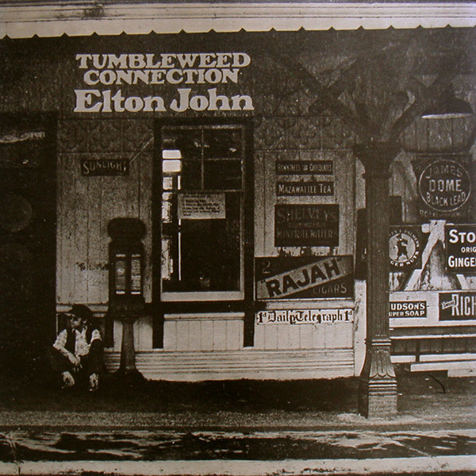

# Tumbleweed Connection

By **Elton John**

## Album Data

- **Catalog:** Beets
- **Format:** Digital, Album
- **Album:** Tumbleweed Connection
- **Artist:** Elton John
- **Albumartist:** Elton John
- **Genre:** Soft Rock
- **MusicBrainz Album Artist ID:** [b83bc61f-8451-4a5d-8b8e-7e9ed295e822](https://musicbrainz.org/artist/b83bc61f-8451-4a5d-8b8e-7e9ed295e822)
- **MusicBrainz Album ID:** [a74d72d6-dba1-42d8-8740-673efd873835](https://musicbrainz.org/release/a74d72d6-dba1-42d8-8740-673efd873835)
- **MusicBrainz Release Group ID:** [4fed2c09-60cd-36ca-9db1-c9c016bb1f0b](https://musicbrainz.org/release-group/4fed2c09-60cd-36ca-9db1-c9c016bb1f0b)
- **Year:** 1991
- **Catalog #:** UDCD 543
- **Label:** Mobile Fidelity Sound Lab
- **Total Tracks:** 10

## Album Tracks

### Track 01 - Ballad of a Well‐Known Gun

- **Artist:** Elton John
- **Format:** ALAC
- **Genre:** Soft Rock
- **Length:** 4:57
- **MusicBrainz Track ID:** [d2bd1d9f-a8d7-49cf-9761-268f3afa2679](https://musicbrainz.org/recording/d2bd1d9f-a8d7-49cf-9761-268f3afa2679)
- **Title:** Ballad of a Well‐Known Gun
- **Track:** 01
- **Year:** 1991

### Track 02 - Come Down in Time

- **Artist:** Elton John
- **Format:** ALAC
- **Genre:** Soft Rock
- **Length:** 3:25
- **MusicBrainz Track ID:** [ac493959-9bcc-4b0d-8aed-7b1246267fcf](https://musicbrainz.org/recording/ac493959-9bcc-4b0d-8aed-7b1246267fcf)
- **Title:** Come Down in Time
- **Track:** 02
- **Year:** 1991

### Track 03 - Country Comfort

- **Artist:** Elton John
- **Format:** ALAC
- **Genre:** Soft Rock
- **Length:** 5:07
- **MusicBrainz Track ID:** [f04ca3dc-1c25-4eca-84d7-052babb825d7](https://musicbrainz.org/recording/f04ca3dc-1c25-4eca-84d7-052babb825d7)
- **Title:** Country Comfort
- **Track:** 03
- **Year:** 1991

### Track 04 - Son of Your Father

- **Artist:** Elton John
- **Format:** ALAC
- **Genre:** Soft Rock
- **Length:** 3:46
- **MusicBrainz Track ID:** [cafbdb83-1f78-48b1-8179-89f6e5ab586d](https://musicbrainz.org/recording/cafbdb83-1f78-48b1-8179-89f6e5ab586d)
- **Title:** Son of Your Father
- **Track:** 04
- **Year:** 1991

### Track 05 - My Father’s Gun

- **Artist:** Elton John
- **Format:** ALAC
- **Genre:** Soft Rock
- **Length:** 6:18
- **MusicBrainz Track ID:** [34d3d507-4e92-4e08-a0b6-df921b5e8b5e](https://musicbrainz.org/recording/34d3d507-4e92-4e08-a0b6-df921b5e8b5e)
- **Title:** My Father’s Gun
- **Track:** 05
- **Year:** 1991

### Track 06 - Where to Now St. Peter?

- **Artist:** Elton John
- **Format:** ALAC
- **Genre:** Britpop
- **Length:** 4:11
- **MusicBrainz Track ID:** [b1904cfc-3124-4f86-b729-5f0fa1e6a0e5](https://musicbrainz.org/recording/b1904cfc-3124-4f86-b729-5f0fa1e6a0e5)
- **Title:** Where to Now St. Peter?
- **Track:** 06
- **Year:** 1991

### Track 07 - Love Song

- **Artist:** Elton John
- **Format:** ALAC
- **Genre:** Soft Rock
- **Length:** 3:40
- **MusicBrainz Track ID:** [1b44891b-776c-43b9-9599-89c6d5bcf424](https://musicbrainz.org/recording/1b44891b-776c-43b9-9599-89c6d5bcf424)
- **Title:** Love Song
- **Track:** 07
- **Year:** 1991

### Track 08 - Amoreena

- **Artist:** Elton John
- **Format:** ALAC
- **Genre:** Britpop
- **Length:** 4:58
- **MusicBrainz Track ID:** [a68b3fca-94d6-4a39-9840-61600c620734](https://musicbrainz.org/recording/a68b3fca-94d6-4a39-9840-61600c620734)
- **Title:** Amoreena
- **Track:** 08
- **Year:** 1991

### Track 09 - Talking Old Soldiers

- **Artist:** Elton John
- **Format:** ALAC
- **Genre:** Soft Rock
- **Length:** 4:07
- **MusicBrainz Track ID:** [84811346-f4a8-446e-87b3-9cd8934a0a84](https://musicbrainz.org/recording/84811346-f4a8-446e-87b3-9cd8934a0a84)
- **Title:** Talking Old Soldiers
- **Track:** 09
- **Year:** 1991

### Track 10 - Burn Down the Mission

- **Artist:** Elton John
- **Format:** ALAC
- **Genre:** Soft Rock
- **Length:** 6:20
- **MusicBrainz Track ID:** [2bfb9fb2-9f66-423b-afbe-860fb2cf0728](https://musicbrainz.org/recording/2bfb9fb2-9f66-423b-afbe-860fb2cf0728)
- **Title:** Burn Down the Mission
- **Track:** 10
- **Year:** 1991

## See also

- [Captain Fantastic and the Brown Dirt Cowboy](Captain_Fantastic_and_the_Brown_Dirt_Cowboy.md)
- [Elton John Live in Australia](Elton_John_Live_in_Australia.md)
- [Elton John](Elton_John.md)
- [Friends](Friends.md)
- [Goodbye Yellow Brick Road (40th Anniversary Celebration)](Goodbye_Yellow_Brick_Road_40th_Anniversary_Celebration.md)
- [Goodbye Yellow Brick Road](Goodbye_Yellow_Brick_Road.md)
- [Madman Across the Water](Madman_Across_the_Water.md)
- [Roon: Captain Fantastic And The Brown Dirt Cowboy](../../Roon/Elton_John/Captain_Fantastic_And_The_Brown_Dirt_Cowboy.md)
- [Roon: Elton John](../../Roon/Elton_John/Elton_John.md)
- [Roon: Goodbye Yellow Brick Road (40th Anniversary Celebration)](../../Roon/Elton_John/Goodbye_Yellow_Brick_Road_40th_Anniversary_Celebration.md)
- [Roon: Jewel Box](../../Roon/Elton_John/Jewel_Box.md)
- [Roon: Madman Across The Water](../../Roon/Elton_John/Madman_Across_The_Water.md)
- [Roon: Rare Masters](../../Roon/Elton_John/Rare_Masters.md)
- [Roon: Tumbleweed Connection (Deluxe Edition)](../../Roon/Elton_John/Tumbleweed_Connection_Deluxe_Edition.md)
- [Vinyl: Captain Fantastic And The Brown Dirt Cowboy](../../Vinyl/Elton_John/Captain_Fantastic_And_The_Brown_Dirt_Cowboy.md)
- [Vinyl: Don't Shoot Me I'm Only The Piano Player](../../Vinyl/Elton_John/Dont_Shoot_Me_Im_Only_The_Piano_Player.md)
- [Vinyl: ](../../Vinyl/Elton_John/Elton_John_index.md)
- [Vinyl: Elton John](../../Vinyl/Elton_John/Elton_John.md)
- [Vinyl: Goodbye Yellow Brick Road](../../Vinyl/Elton_John/Goodbye_Yellow_Brick_Road.md)
- [Vinyl: Madman Across The Water](../../Vinyl/Elton_John/Madman_Across_The_Water.md)
