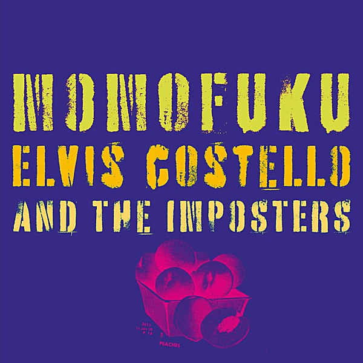

# Momofuku

By **Elvis Costello**

## Album Data

- **Catalog:** Beets
- **Format:** Digital, Album
- **Album:** Momofuku
- **Artist:** Elvis Costello
- **Albumartist:** Elvis Costello
- **Genre:** New Wave
- **MusicBrainz Album Artist ID:** 
- **MusicBrainz Album ID:** 
- **MusicBrainz Release Group ID:** 
- **Year:** 2008
- **Catalog #:** 
- **Label:** 
- **Total Tracks:** 12

## Album Tracks

### Track 01 - No Hiding Place

- **Artist:** Elvis Costello
- **Format:** MP3
- **Genre:** New Wave
- **Length:** 3:59
- **MusicBrainz Track ID:** 
- **Title:** No Hiding Place
- **Track:** 01
- **Year:** 2008

### Track 02 - American Gangster Time

- **Artist:** Elvis Costello
- **Format:** MP3
- **Genre:** New Wave
- **Length:** 3:45
- **MusicBrainz Track ID:** 
- **Title:** American Gangster Time
- **Track:** 02
- **Year:** 2008

### Track 03 - Turpentine

- **Artist:** Elvis Costello
- **Format:** MP3
- **Genre:** New Wave
- **Length:** 5:40
- **MusicBrainz Track ID:** 
- **Title:** Turpentine
- **Track:** 03
- **Year:** 2008

### Track 04 - Harry Worth

- **Artist:** Elvis Costello
- **Format:** MP3
- **Genre:** Rock And Roll
- **Length:** 4:28
- **MusicBrainz Track ID:** 
- **Title:** Harry Worth
- **Track:** 04
- **Year:** 2008

### Track 05 - Drum And Bone

- **Artist:** Elvis Costello
- **Format:** MP3
- **Genre:** New Wave
- **Length:** 2:34
- **MusicBrainz Track ID:** 
- **Title:** Drum And Bone
- **Track:** 05
- **Year:** 2008

### Track 06 - Flutter And Wow

- **Artist:** Elvis Costello
- **Format:** MP3
- **Genre:** New Wave
- **Length:** 4:18
- **MusicBrainz Track ID:** 
- **Title:** Flutter And Wow
- **Track:** 06
- **Year:** 2008

### Track 07 - Stella Hurt

- **Artist:** Elvis Costello
- **Format:** MP3
- **Genre:** New Wave
- **Length:** 4:46
- **MusicBrainz Track ID:** 
- **Title:** Stella Hurt
- **Track:** 07
- **Year:** 2008

### Track 08 - Mr. Feathers

- **Artist:** Elvis Costello
- **Format:** MP3
- **Genre:** New Wave
- **Length:** 2:45
- **MusicBrainz Track ID:** 
- **Title:** Mr. Feathers
- **Track:** 08
- **Year:** 2008

### Track 09 - My Three Sons

- **Artist:** Elvis Costello
- **Format:** MP3
- **Genre:** New Wave
- **Length:** 3:05
- **MusicBrainz Track ID:** 
- **Title:** My Three Sons
- **Track:** 09
- **Year:** 2008

### Track 10 - Song With Rose

- **Artist:** Elvis Costello
- **Format:** MP3
- **Genre:** New Wave
- **Length:** 3:02
- **MusicBrainz Track ID:** 
- **Title:** Song With Rose
- **Track:** 10
- **Year:** 2008

### Track 11 - Pardon Me Madam, My Name Is Eve

- **Artist:** Elvis Costello
- **Format:** MP3
- **Genre:** New Wave
- **Length:** 3:53
- **MusicBrainz Track ID:** 
- **Title:** Pardon Me Madam, My Name Is Eve
- **Track:** 11
- **Year:** 2008

### Track 12 - Go Away

- **Artist:** Elvis Costello
- **Format:** MP3
- **Genre:** New Wave
- **Length:** 4:55
- **MusicBrainz Track ID:** 
- **Title:** Go Away
- **Track:** 12
- **Year:** 2008

## See also

- [Secret, Profane & Sugarcane](Secret__Profane_and_Sugarcane.md)
- [When I Was Cruel](When_I_Was_Cruel.md)
- [Roon: Armed Forces (Remastered 2020)](../../Roon/Elvis_Costello/Armed_Forces_Remastered_2020.md)
- [Roon: Blood And Chocolate](../../Roon/Elvis_Costello/Blood_And_Chocolate.md)
- [Roon: Costello](../../Roon/Elvis_Costello/Costello-_My_Flame_Burns_Blue.md)
- [Roon: Imperial Bedroom](../../Roon/Elvis_Costello/Imperial_Bedroom.md)
- [Roon: King Of America](../../Roon/Elvis_Costello/King_Of_America.md)
- [Roon: Momofuku (Album Version)](../../Roon/Elvis_Costello/Momofuku_Album_Version.md)
- [Roon: My Aim Is True](../../Roon/Elvis_Costello/My_Aim_Is_True.md)
- [Roon: Painted From Memory](../../Roon/Elvis_Costello/Painted_From_Memory.md)
- [Roon: Secret, Profane and Sugarcane (Album Version)](../../Roon/Elvis_Costello/Secret__Profane_and_Sugarcane_Album_Version.md)
- [Roon: Spanish Model](../../Roon/Elvis_Costello/Spanish_Model.md)
- [Roon: This Year's Model](../../Roon/Elvis_Costello/This_Years_Model.md)
- [Roon: Trust](../../Roon/Elvis_Costello/Trust.md)
- [Vinyl: ](../../Vinyl/Elvis_Costello/Elvis_Costello.md)
- [Vinyl: Taking Liberties](../../Vinyl/Elvis_Costello/Taking_Liberties.md)
