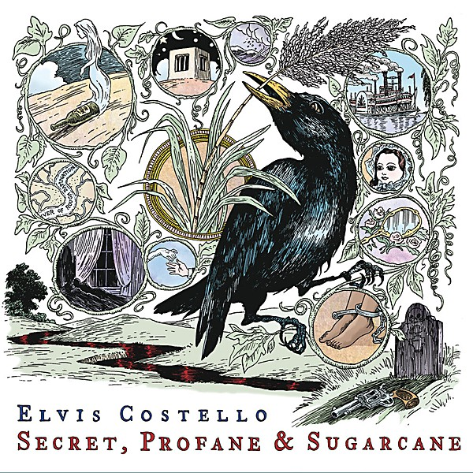

# Secret, Profane & Sugarcane

By **Elvis Costello**

## Album Data

- **Catalog:** Beets
- **Format:** Digital, Album
- **Album:** Secret, Profane & Sugarcane
- **Artist:** Elvis Costello
- **Albumartist:** Elvis Costello
- **Genre:** New Wave
- **MusicBrainz Album Artist ID:** [8a338e06-d182-46f2-bd16-30a09bc840ba](https://musicbrainz.org/artist/8a338e06-d182-46f2-bd16-30a09bc840ba)
- **MusicBrainz Album ID:** [0f76617f-327b-4ea6-8531-dbf95fb422b3](https://musicbrainz.org/release/0f76617f-327b-4ea6-8531-dbf95fb422b3)
- **MusicBrainz Release Group ID:** [b1b6052d-ff2b-449a-83d8-a2f718030f1b](https://musicbrainz.org/release-group/b1b6052d-ff2b-449a-83d8-a2f718030f1b)
- **Year:** 2009
- **Catalog #:** 
- **Label:** The Island Def Jam Music Group
- **Total Tracks:** 15

## Album Tracks

### Track 01 - 45

- **Artist:** Elvis Costello
- **Format:** MP3
- **Genre:** Rock And Roll
- **Length:** 3:33
- **MusicBrainz Track ID:** [22151309-ed5d-46ca-899a-1a2fbe6de09f](https://musicbrainz.org/recording/22151309-ed5d-46ca-899a-1a2fbe6de09f)
- **Title:** 45
- **Track:** 01
- **Year:** 2002

### Track 02 - Spooky Girlfriend

- **Artist:** Elvis Costello
- **Format:** MP3
- **Genre:** Rock
- **Length:** 4:22
- **MusicBrainz Track ID:** [66097e52-e1ac-4929-a23e-2345fb4c2fd1](https://musicbrainz.org/recording/66097e52-e1ac-4929-a23e-2345fb4c2fd1)
- **Title:** Spooky Girlfriend
- **Track:** 02
- **Year:** 2002

### Track 03 - Tear Off Your Own Head (It's a Doll Revolution)

- **Artist:** Elvis Costello
- **Format:** MP3
- **Genre:** Alternative Rock
- **Length:** 3:31
- **MusicBrainz Track ID:** [f6d813db-36f1-4b4e-9a86-4a8bc0a15d3b](https://musicbrainz.org/recording/f6d813db-36f1-4b4e-9a86-4a8bc0a15d3b)
- **Title:** Tear Off Your Own Head (It's a Doll Revolution)
- **Track:** 03
- **Year:** 2002

### Track 04 - When I Was Cruel No. 2

- **Artist:** Elvis Costello
- **Format:** MP3
- **Genre:** Post-Punk
- **Length:** 7:06
- **MusicBrainz Track ID:** [d0045138-f645-41eb-b27a-2b217f5ea602](https://musicbrainz.org/recording/d0045138-f645-41eb-b27a-2b217f5ea602)
- **Title:** When I Was Cruel No. 2
- **Track:** 04
- **Year:** 2002

### Track 05 - Soul for Hire

- **Artist:** Elvis Costello
- **Format:** MP3
- **Genre:** Rock
- **Length:** 3:55
- **MusicBrainz Track ID:** [7aa3bbb9-a6ac-45c7-bece-38f32d747201](https://musicbrainz.org/recording/7aa3bbb9-a6ac-45c7-bece-38f32d747201)
- **Title:** Soul for Hire
- **Track:** 05
- **Year:** 2002

### Track 06 - 15 Petals

- **Artist:** Elvis Costello
- **Format:** MP3
- **Genre:** Rock
- **Length:** 4:01
- **MusicBrainz Track ID:** [8d5ade03-23ab-491e-8ac2-8e72bbbc798a](https://musicbrainz.org/recording/8d5ade03-23ab-491e-8ac2-8e72bbbc798a)
- **Title:** 15 Petals
- **Track:** 06
- **Year:** 2002

### Track 07 - Tart

- **Artist:** Elvis Costello
- **Format:** MP3
- **Genre:** Rock
- **Length:** 4:03
- **MusicBrainz Track ID:** [b8f07985-b682-40ba-83a9-4f046a4aed43](https://musicbrainz.org/recording/b8f07985-b682-40ba-83a9-4f046a4aed43)
- **Title:** Tart
- **Track:** 07
- **Year:** 2002

### Track 08 - Dust 2...

- **Artist:** Elvis Costello
- **Format:** MP3
- **Genre:** Rock
- **Length:** 3:21
- **MusicBrainz Track ID:** [c87b5805-70d5-4d43-8b8e-4d0a435a726b](https://musicbrainz.org/recording/c87b5805-70d5-4d43-8b8e-4d0a435a726b)
- **Title:** Dust 2...
- **Track:** 08
- **Year:** 2002

### Track 09 - Dissolve

- **Artist:** Elvis Costello
- **Format:** MP3
- **Genre:** Rock
- **Length:** 2:22
- **MusicBrainz Track ID:** [19da5637-dc77-4c12-8518-80f8196435c7](https://musicbrainz.org/recording/19da5637-dc77-4c12-8518-80f8196435c7)
- **Title:** Dissolve
- **Track:** 09
- **Year:** 2002

### Track 10 - Alibi

- **Artist:** Elvis Costello
- **Format:** MP3
- **Genre:** Rock
- **Length:** 6:42
- **MusicBrainz Track ID:** [6e11cf7f-bf69-45d3-8924-346dfa64f43e](https://musicbrainz.org/recording/6e11cf7f-bf69-45d3-8924-346dfa64f43e)
- **Title:** Alibi
- **Track:** 10
- **Year:** 2002

### Track 11 - ...Dust

- **Artist:** Elvis Costello
- **Format:** MP3
- **Genre:** New Wave
- **Length:** 3:03
- **MusicBrainz Track ID:** [562204dc-ef37-4a37-afe8-5b0241c6b95f](https://musicbrainz.org/recording/562204dc-ef37-4a37-afe8-5b0241c6b95f)
- **Title:** ...Dust
- **Track:** 11
- **Year:** 2002

### Track 12 - Daddy Can I Turn This?

- **Artist:** Elvis Costello
- **Format:** MP3
- **Genre:** Rock
- **Length:** 3:41
- **MusicBrainz Track ID:** [c083b22f-d75e-4280-89ce-dac3653904ca](https://musicbrainz.org/recording/c083b22f-d75e-4280-89ce-dac3653904ca)
- **Title:** Daddy Can I Turn This?
- **Track:** 12
- **Year:** 2002

### Track 13 - My Little Blue Window

- **Artist:** Elvis Costello
- **Format:** MP3
- **Genre:** Rock
- **Length:** 3:10
- **MusicBrainz Track ID:** [98219557-e281-4991-8749-8e3c92da5de2](https://musicbrainz.org/recording/98219557-e281-4991-8749-8e3c92da5de2)
- **Title:** My Little Blue Window
- **Track:** 13
- **Year:** 2002

### Track 14 - Episode of Blonde

- **Artist:** Elvis Costello
- **Format:** MP3
- **Genre:** Rock
- **Length:** 5:03
- **MusicBrainz Track ID:** [9403a7b6-87fa-434e-be9e-227f72a9de4c](https://musicbrainz.org/recording/9403a7b6-87fa-434e-be9e-227f72a9de4c)
- **Title:** Episode of Blonde
- **Track:** 14
- **Year:** 2002

### Track 15 - Radio Silence

- **Artist:** Elvis Costello
- **Format:** MP3
- **Genre:** Indie Rock
- **Length:** 4:58
- **MusicBrainz Track ID:** [45ce1f66-a7c5-471b-b297-a8e05075460e](https://musicbrainz.org/recording/45ce1f66-a7c5-471b-b297-a8e05075460e)
- **Title:** Radio Silence
- **Track:** 15
- **Year:** 2002

## See also

- [Momofuku](Momofuku.md)
- [When I Was Cruel](When_I_Was_Cruel.md)
- [Roon: Armed Forces (Remastered 2020)](../../Roon/Elvis_Costello/Armed_Forces_Remastered_2020.md)
- [Roon: Blood And Chocolate](../../Roon/Elvis_Costello/Blood_And_Chocolate.md)
- [Roon: Costello](../../Roon/Elvis_Costello/Costello-_My_Flame_Burns_Blue.md)
- [Roon: Imperial Bedroom](../../Roon/Elvis_Costello/Imperial_Bedroom.md)
- [Roon: King Of America](../../Roon/Elvis_Costello/King_Of_America.md)
- [Roon: Momofuku (Album Version)](../../Roon/Elvis_Costello/Momofuku_Album_Version.md)
- [Roon: My Aim Is True](../../Roon/Elvis_Costello/My_Aim_Is_True.md)
- [Roon: Painted From Memory](../../Roon/Elvis_Costello/Painted_From_Memory.md)
- [Roon: Secret, Profane and Sugarcane (Album Version)](../../Roon/Elvis_Costello/Secret__Profane_and_Sugarcane_Album_Version.md)
- [Roon: Spanish Model](../../Roon/Elvis_Costello/Spanish_Model.md)
- [Roon: This Year's Model](../../Roon/Elvis_Costello/This_Years_Model.md)
- [Roon: Trust](../../Roon/Elvis_Costello/Trust.md)
- [Vinyl: ](../../Vinyl/Elvis_Costello/Elvis_Costello.md)
- [Vinyl: Taking Liberties](../../Vinyl/Elvis_Costello/Taking_Liberties.md)
