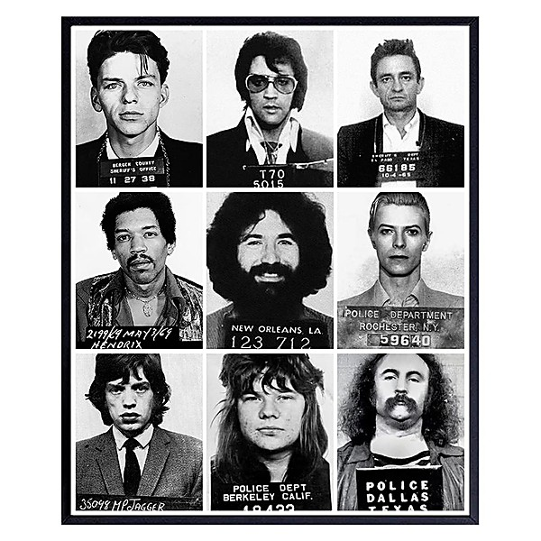

# 50,000,000 Elvis Fans Can’t Be Wrong

By **Elvis Costello & The Attractions**

## Album Data

- **Catalog:** Beets
- **Format:** Digital, Album
- **Album:** 50,000,000 Elvis Fans Can’t Be Wrong
- **Artist:** Elvis Costello & The Attractions
- **Albumartist:** Elvis Costello & The Attractions
- **Genre:** New Wave
- **MusicBrainz Album Artist ID:** [0ffb6573-a98e-412e-aa01-0a580e9d8b06](https://musicbrainz.org/artist/0ffb6573-a98e-412e-aa01-0a580e9d8b06)
- **MusicBrainz Album ID:** [de9214dd-ddd2-4b48-9a18-cd8a8a184a9d](https://musicbrainz.org/release/de9214dd-ddd2-4b48-9a18-cd8a8a184a9d)
- **MusicBrainz Release Group ID:** [99a86872-cdaa-39bc-8d80-88cb026f3d66](https://musicbrainz.org/release-group/99a86872-cdaa-39bc-8d80-88cb026f3d66)
- **Year:** 1977
- **Catalog #:** CK 40518
- **Label:** Columbia
- **Total Tracks:** 11

## Album Tracks

### Track 01 - Uncomplicated

- **Artist:** Elvis Costello & The Attractions
- **Format:** ALAC
- **Genre:** Glam Rock
- **Length:** 3:26
- **MusicBrainz Track ID:** [a280a6a1-17cc-44f6-8f03-d2815e05c6dc](https://musicbrainz.org/recording/a280a6a1-17cc-44f6-8f03-d2815e05c6dc)
- **Title:** Uncomplicated
- **Track:** 01
- **Year:** 1986

### Track 02 - I Hope You’re Happy Now

- **Artist:** Elvis Costello & The Attractions
- **Format:** ALAC
- **Genre:** Pop Rock
- **Length:** 3:07
- **MusicBrainz Track ID:** [09b778d9-7153-4a9e-aa9e-a0e3f7bbd474](https://musicbrainz.org/recording/09b778d9-7153-4a9e-aa9e-a0e3f7bbd474)
- **Title:** I Hope You’re Happy Now
- **Track:** 02
- **Year:** 1986

### Track 03 - Tokyo Storm Warning

- **Artist:** Elvis Costello & The Attractions
- **Format:** ALAC
- **Genre:** New Wave
- **Length:** 6:24
- **MusicBrainz Track ID:** [c1556397-acfc-4239-87fa-6393832536ea](https://musicbrainz.org/recording/c1556397-acfc-4239-87fa-6393832536ea)
- **Title:** Tokyo Storm Warning
- **Track:** 03
- **Year:** 1986

### Track 04 - Home Is Anywhere You Hang Your Head

- **Artist:** Elvis Costello & The Attractions
- **Format:** ALAC
- **Genre:** Glam Rock
- **Length:** 5:04
- **MusicBrainz Track ID:** [5c3c13f5-0f96-43cd-8205-cc7759e6b1c5](https://musicbrainz.org/recording/5c3c13f5-0f96-43cd-8205-cc7759e6b1c5)
- **Title:** Home Is Anywhere You Hang Your Head
- **Track:** 04
- **Year:** 1986

### Track 05 - I Want You

- **Artist:** Elvis Costello & The Attractions
- **Format:** ALAC
- **Genre:** New Wave
- **Length:** 6:42
- **MusicBrainz Track ID:** [8fe84f1a-8ab4-4aa2-a672-3c53cb0e67ff](https://musicbrainz.org/recording/8fe84f1a-8ab4-4aa2-a672-3c53cb0e67ff)
- **Title:** I Want You
- **Track:** 05
- **Year:** 1986

### Track 06 - Honey, Are You Straight or Are You Blind?

- **Artist:** Elvis Costello & The Attractions
- **Format:** ALAC
- **Genre:** New Wave
- **Length:** 2:08
- **MusicBrainz Track ID:** [73520ab0-9512-49a7-a159-2c186587fade](https://musicbrainz.org/recording/73520ab0-9512-49a7-a159-2c186587fade)
- **Title:** Honey, Are You Straight or Are You Blind?
- **Track:** 06
- **Year:** 1986

### Track 07 - Blue Chair

- **Artist:** Elvis Costello & The Attractions
- **Format:** ALAC
- **Genre:** New Wave
- **Length:** 3:41
- **MusicBrainz Track ID:** [99ff4653-0bde-4038-b638-dca8ccf20553](https://musicbrainz.org/recording/99ff4653-0bde-4038-b638-dca8ccf20553)
- **Title:** Blue Chair
- **Track:** 07
- **Year:** 1986

### Track 08 - Battered Old Bird

- **Artist:** Elvis Costello & The Attractions
- **Format:** ALAC
- **Genre:** Soft Rock
- **Length:** 5:51
- **MusicBrainz Track ID:** [065fa112-bd61-4981-9a8f-4aa7570baf1b](https://musicbrainz.org/recording/065fa112-bd61-4981-9a8f-4aa7570baf1b)
- **Title:** Battered Old Bird
- **Track:** 08
- **Year:** 1986

### Track 09 - Crimes of Paris

- **Artist:** Elvis Costello & The Attractions
- **Format:** ALAC
- **Genre:** New Wave
- **Length:** 4:20
- **MusicBrainz Track ID:** [0236d23b-f427-4096-9487-bed63c753746](https://musicbrainz.org/recording/0236d23b-f427-4096-9487-bed63c753746)
- **Title:** Crimes of Paris
- **Track:** 09
- **Year:** 1986

### Track 10 - Poor Napoleon

- **Artist:** Elvis Costello & The Attractions
- **Format:** ALAC
- **Genre:** Rock
- **Length:** 3:23
- **MusicBrainz Track ID:** [d1ae02d5-dc52-4e80-b223-297a9ed9dad0](https://musicbrainz.org/recording/d1ae02d5-dc52-4e80-b223-297a9ed9dad0)
- **Title:** Poor Napoleon
- **Track:** 10
- **Year:** 1986

### Track 11 - Next Time Round

- **Artist:** Elvis Costello & The Attractions
- **Format:** ALAC
- **Genre:** Rock
- **Length:** 3:35
- **MusicBrainz Track ID:** [1f85eda8-7ac7-4feb-bcaf-4ed332aa9314](https://musicbrainz.org/recording/1f85eda8-7ac7-4feb-bcaf-4ed332aa9314)
- **Title:** Next Time Round
- **Track:** 11
- **Year:** 1986

## See also

- [Blood & Chocolate](Blood_and_Chocolate.md)
- [Momofuku](Momofuku.md)
- [Roon: Armed Forces (Remastered 2020)](../../Roon/Elvis_Costello_and_The_Attractions/Armed_Forces_Remastered_2020.md)
- [Roon: Blood And Chocolate](../../Roon/Elvis_Costello_and_The_Attractions/Blood_And_Chocolate.md)
- [Roon: Imperial Bedroom](../../Roon/Elvis_Costello_and_The_Attractions/Imperial_Bedroom.md)
- [Roon: Spanish Model](../../Roon/Elvis_Costello_and_The_Attractions/Spanish_Model.md)
- [Roon: This Year's Model](../../Roon/Elvis_Costello_and_The_Attractions/This_Years_Model.md)
- [Roon: Trust](../../Roon/Elvis_Costello_and_The_Attractions/Trust.md)
- [Vinyl: Accidents Will Happen / Alison](../../Vinyl/Elvis_Costello_and_The_Attractions/Accidents_Will_Happen_-_Alison.md)
- [Vinyl: ](../../Vinyl/Elvis_Costello_and_The_Attractions/Elvis_Costello_and_The_Attractions.md)
- [Vinyl: Trust](../../Vinyl/Elvis_Costello_and_The_Attractions/Trust.md)
