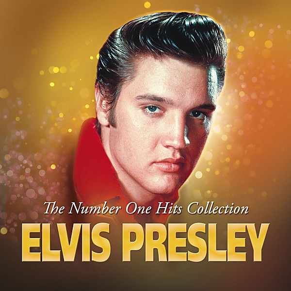

# The Number One Hits

By **Elvis Presley**

## Album Data

- **Catalog:** Beets
- **Format:** Digital, Album
- **Album:** The Number One Hits
- **Artist:** Elvis Presley
- **Albumartist:** Elvis Presley
- **Genre:** Rockabilly
- **MusicBrainz Album Artist ID:** 
- **MusicBrainz Album ID:** 
- **MusicBrainz Release Group ID:** 
- **Year:** 1987
- **Catalog #:** 
- **Label:** RCA
- **Total Tracks:** 00

## Album Tracks

### Track 01 - Heartbreak Hotel

- **Artist:** Elvis Presley
- **Format:** MP3
- **Genre:** Rockabilly
- **Length:** 2:05
- **MusicBrainz Track ID:** 
- **Title:** Heartbreak Hotel
- **Track:** 01
- **Year:** 1987

### Track 02 - I Want You, I Need You, I Love You

- **Artist:** Elvis Presley
- **Format:** MP3
- **Genre:** Rockabilly
- **Length:** 2:37
- **MusicBrainz Track ID:** 
- **Title:** I Want You, I Need You, I Love You
- **Track:** 02
- **Year:** 1987

### Track 03 - Hound Dog

- **Artist:** Elvis Presley
- **Format:** MP3
- **Genre:** Rockabilly
- **Length:** 2:15
- **MusicBrainz Track ID:** 
- **Title:** Hound Dog
- **Track:** 03
- **Year:** 1987

### Track 04 - Don't Be Cruel

- **Artist:** Elvis Presley
- **Format:** MP3
- **Genre:** Rockabilly
- **Length:** 2:02
- **MusicBrainz Track ID:** 
- **Title:** Don't Be Cruel
- **Track:** 04
- **Year:** 1987

### Track 05 - Love Me Tender

- **Artist:** Elvis Presley
- **Format:** MP3
- **Genre:** Rock And Roll
- **Length:** 2:45
- **MusicBrainz Track ID:** 
- **Title:** Love Me Tender
- **Track:** 05
- **Year:** 1987

### Track 06 - Love Me

- **Artist:** Elvis Presley
- **Format:** MP3
- **Genre:** Rockabilly
- **Length:** 2:42
- **MusicBrainz Track ID:** 
- **Title:** Love Me
- **Track:** 06
- **Year:** 1987

### Track 07 - Too Much

- **Artist:** Elvis Presley
- **Format:** MP3
- **Genre:** Rock And Roll
- **Length:** 2:31
- **MusicBrainz Track ID:** 
- **Title:** Too Much
- **Track:** 07
- **Year:** 1987

### Track 08 - All Shook Up

- **Artist:** Elvis Presley
- **Format:** MP3
- **Genre:** Rockabilly
- **Length:** 1:57
- **MusicBrainz Track ID:** 
- **Title:** All Shook Up
- **Track:** 08
- **Year:** 1987

### Track 09 - (Let Me Be Your) Teddy Bear

- **Artist:** Elvis Presley
- **Format:** MP3
- **Genre:** Rockabilly
- **Length:** 1:48
- **MusicBrainz Track ID:** 
- **Title:** (Let Me Be Your) Teddy Bear
- **Track:** 09
- **Year:** 1987

### Track 10 - Jailhouse Rock

- **Artist:** Elvis Presley
- **Format:** MP3
- **Genre:** Rockabilly
- **Length:** 2:28
- **MusicBrainz Track ID:** 
- **Title:** Jailhouse Rock
- **Track:** 10
- **Year:** 1987

### Track 11 - Don't

- **Artist:** Elvis Presley
- **Format:** MP3
- **Genre:** Rockabilly
- **Length:** 2:49
- **MusicBrainz Track ID:** 
- **Title:** Don't
- **Track:** 11
- **Year:** 1987

### Track 12 - I Beg of You

- **Artist:** Elvis Presley
- **Format:** MP3
- **Genre:** Rockabilly
- **Length:** 1:53
- **MusicBrainz Track ID:** 
- **Title:** I Beg of You
- **Track:** 12
- **Year:** 1987

### Track 13 - Wear My Ring Around Your Neck

- **Artist:** Elvis Presley
- **Format:** MP3
- **Genre:** Rockabilly
- **Length:** 2:13
- **MusicBrainz Track ID:** 
- **Title:** Wear My Ring Around Your Neck
- **Track:** 13
- **Year:** 1987

### Track 14 - Hard Headed Woman

- **Artist:** Elvis Presley
- **Format:** MP3
- **Genre:** Rockabilly
- **Length:** 1:52
- **MusicBrainz Track ID:** 
- **Title:** Hard Headed Woman
- **Track:** 14
- **Year:** 1987

### Track 15 - One Night

- **Artist:** Elvis Presley
- **Format:** MP3
- **Genre:** Rockabilly
- **Length:** 2:31
- **MusicBrainz Track ID:** 
- **Title:** One Night
- **Track:** 15
- **Year:** 1987

### Track 16 - I Got Stung

- **Artist:** Elvis Presley
- **Format:** MP3
- **Genre:** Rockabilly
- **Length:** 1:48
- **MusicBrainz Track ID:** 
- **Title:** I Got Stung
- **Track:** 16
- **Year:** 1987

### Track 17 - (Now and Then There's) A Fool Such as I

- **Artist:** Elvis Presley
- **Format:** MP3
- **Genre:** Rockabilly
- **Length:** 2:29
- **MusicBrainz Track ID:** 
- **Title:** (Now and Then There's) A Fool Such as I
- **Track:** 17
- **Year:** 1987

### Track 18 - I Need Your Love Tonight

- **Artist:** Elvis Presley
- **Format:** MP3
- **Genre:** Rockabilly
- **Length:** 2:02
- **MusicBrainz Track ID:** 
- **Title:** I Need Your Love Tonight
- **Track:** 18
- **Year:** 1987

### Track 19 - A Big Hunk O' Love

- **Artist:** Elvis Presley
- **Format:** MP3
- **Genre:** Rock And Roll
- **Length:** 2:07
- **MusicBrainz Track ID:** 
- **Title:** A Big Hunk O' Love
- **Track:** 19
- **Year:** 1987

## See also

- [The Top Ten Hits Disc 1](The_Top_Ten_Hits_Disc_1.md)
- [The Top Ten Hits Disc 2](The_Top_Ten_Hits_Disc_2.md)
- [Unknown Album](Unknown_Album.md)
- [Vinyl: Blue Christmas](../../Vinyl/Elvis_Presley/Blue_Christmas.md)
- [Vinyl: ](../../Vinyl/Elvis_Presley/Elvis_Presley.md)
