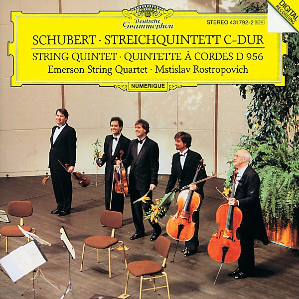

# Schubert

By **Emerson String Quartet, Mstislav Rostropovich**

## Album Data

- **Catalog:** Beets
- **Format:** Digital, Album
- **Album:** Schubert
- **Artist:** Emerson String Quartet, Mstislav Rostropovich
- **Albumartist:** Emerson String Quartet, Mstislav Rostropovich
- **Genre:** String Quartet
- **MusicBrainz Album Artist ID:** 
- **MusicBrainz Album ID:** 
- **MusicBrainz Release Group ID:** 
- **Year:** 2010
- **Catalog #:** 
- **Label:** Deutsche Grammophon (DG)
- **Total Tracks:** 04

## Album Tracks

### Track 01 - String Quintet in C, D.956 - 1. Allegro ma non troppo

- **Artist:** Emerson String Quartet & Mstislav Rostropovich
- **Format:** MP3
- **Genre:** String Quartet
- **Length:** 19:18
- **MusicBrainz Track ID:** 
- **Title:** String Quintet in C, D.956 - 1. Allegro ma non troppo
- **Track:** 01
- **Year:** 2010

### Track 04 - String Quintet in C, D.956 - 4. Allegretto

- **Artist:** Emerson String Quartet & Mstislav Rostropovich
- **Format:** MP3
- **Genre:** String Quartet
- **Length:** 9:23
- **MusicBrainz Track ID:** 
- **Title:** String Quintet in C, D.956 - 4. Allegretto
- **Track:** 04
- **Year:** 2010

### Track 02 - String Quintet in C, D.956 - 2. Adagio

- **Artist:** Mstislav Rostropovich & Emerson String Quartet
- **Format:** MP3
- **Genre:** String Quartet
- **Length:** 14:50
- **MusicBrainz Track ID:** 
- **Title:** String Quintet in C, D.956 - 2. Adagio
- **Track:** 02
- **Year:** 2010

### Track 03 - String Quintet in C, D.956 - 3. Scherzo (Presto) - Trio (Andante sostenuto)

- **Artist:** Mstislav Rostropovich & Emerson String Quartet
- **Format:** MP3
- **Genre:** String Quartet
- **Length:** 10:02
- **MusicBrainz Track ID:** 
- **Title:** String Quintet in C, D.956 - 3. Scherzo (Presto) - Trio (Andante sostenuto)
- **Track:** 03
- **Year:** 2010

