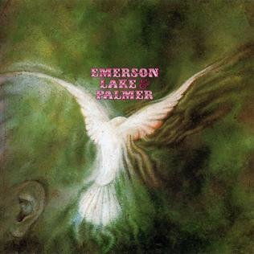

# Emerson, Lake & Palmer

By **Emerson, Lake & Palmer**

## Album Data

- **Catalog:** Beets
- **Format:** Digital, Album
- **Album:** Emerson, Lake & Palmer
- **Artist:** Emerson, Lake & Palmer
- **Albumartist:** Emerson, Lake & Palmer
- **Genre:** Progressive Rock
- **MusicBrainz Album Artist ID:** [ad996aef-cc1c-42ac-af5c-619c370f4b8a](https://musicbrainz.org/artist/ad996aef-cc1c-42ac-af5c-619c370f4b8a)
- **MusicBrainz Album ID:** [b7ec1099-403c-3357-9a6c-fd10865645d1](https://musicbrainz.org/release/b7ec1099-403c-3357-9a6c-fd10865645d1)
- **MusicBrainz Release Group ID:** [86e88318-dd1e-36e9-bb62-c5d0b8a8b4e5](https://musicbrainz.org/release-group/86e88318-dd1e-36e9-bb62-c5d0b8a8b4e5)
- **Year:** 2007
- **Catalog #:** 
- **Label:** 
- **Total Tracks:** 12

## Album Tracks

### Track 01 - The Barbarian

- **Artist:** Emerson, Lake & Palmer
- **Format:** ALAC
- **Genre:** Progressive Rock
- **Length:** 4:32
- **MusicBrainz Track ID:** 
- **Title:** The Barbarian
- **Track:** 01
- **Year:** 2012

### Track 02 - Take A Pebble

- **Artist:** Emerson, Lake & Palmer
- **Format:** ALAC
- **Genre:** Progressive Rock
- **Length:** 12:36
- **MusicBrainz Track ID:** 
- **Title:** Take A Pebble
- **Track:** 02
- **Year:** 2012

### Track 03 - Knife-Edge

- **Artist:** Emerson, Lake & Palmer
- **Format:** ALAC
- **Genre:** Progressive Rock
- **Length:** 5:38
- **MusicBrainz Track ID:** 
- **Title:** Knife-Edge
- **Track:** 03
- **Year:** 2012

### Track 04 - Promenade

- **Artist:** Emerson, Lake & Palmer
- **Format:** ALAC
- **Genre:** Progressive Rock
- **Length:** 1:29
- **MusicBrainz Track ID:** 
- **Title:** Promenade
- **Track:** 04
- **Year:** 2012

### Track 05 - The Three Fates

- **Artist:** Emerson, Lake & Palmer
- **Format:** ALAC
- **Genre:** Progressive Rock
- **Length:** 3:11
- **MusicBrainz Track ID:** 
- **Title:** The Three Fates
- **Track:** 05
- **Year:** 2012

### Track 06 - Rave Up

- **Artist:** Emerson, Lake & Palmer
- **Format:** ALAC
- **Genre:** Progressive Rock
- **Length:** 5:02
- **MusicBrainz Track ID:** 
- **Title:** Rave Up
- **Track:** 06
- **Year:** 2012

### Track 07 - Drum Solo

- **Artist:** Emerson, Lake & Palmer
- **Format:** ALAC
- **Genre:** Progressive Rock
- **Length:** 3:02
- **MusicBrainz Track ID:** 
- **Title:** Drum Solo
- **Track:** 07
- **Year:** 2012

### Track 08 - Lucky Man

- **Artist:** Emerson, Lake & Palmer
- **Format:** ALAC
- **Genre:** Progressive Rock
- **Length:** 4:39
- **MusicBrainz Track ID:** 
- **Title:** Lucky Man
- **Track:** 08
- **Year:** 2012

### Track 09 - Take A Pebble

- **Artist:** Emerson, Lake & Palmer
- **Format:** ALAC
- **Genre:** Progressive Rock
- **Length:** 3:40
- **MusicBrainz Track ID:** 
- **Title:** Take A Pebble
- **Track:** 09
- **Year:** 2012

### Track 10 - Knife-Edge

- **Artist:** Emerson, Lake & Palmer
- **Format:** ALAC
- **Genre:** Progressive Rock
- **Length:** 4:19
- **MusicBrainz Track ID:** 
- **Title:** Knife-Edge
- **Track:** 10
- **Year:** 2012

### Track 11 - Lucky Man

- **Artist:** Emerson, Lake & Palmer
- **Format:** ALAC
- **Genre:** Progressive Rock
- **Length:** 3:02
- **MusicBrainz Track ID:** 
- **Title:** Lucky Man
- **Track:** 11
- **Year:** 2012

### Track 12 - Lucky Man

- **Artist:** Emerson, Lake & Palmer
- **Format:** ALAC
- **Genre:** Progressive Rock
- **Length:** 4:41
- **MusicBrainz Track ID:** 
- **Title:** Lucky Man
- **Track:** 12
- **Year:** 2012

## See also

- [Emerson, Lake & Palmer [2012 Stereo Mixes]](Emerson__Lake_and_Palmer_[2012_Stereo_Mixes].md)
- [Tarkus](Tarkus.md)
- [Tarkus [The Alternate Tarkus - 2012 Stereo Mixes - Steve Wilson - 2013]](Tarkus_[The_Alternate_Tarkus_-_2012_Stereo_Mixes_-_Steve_Wilson_-_2013].md)
- [The Atlantic Years](The_Atlantic_Years.md)
- [Trilogy Deluxe Edition (5.1 Remix)](Trilogy_Deluxe_Edition_51_Remix.md)
- [Trilogy Deluxe Edition (New Stereo Trilogy)](Trilogy_Deluxe_Edition_New_Stereo_Trilogy.md)
- [Trilogy Deluxe Edition (Original Trilogy)](Trilogy_Deluxe_Edition_Original_Trilogy.md)
- [CD: "Emerson, Lake & Palmer (2012 Deluxe Ed Ition) (Disc 1)"](../../CD/Emerson__Lake_and_Palmer/Emerson__Lake_and_Palmer_2012_Deluxe_Ed_Ition_Disc_1.md)
- [CD: "Emerson, Lake & Palmer (Deluxe Edition)"](../../CD/Emerson__Lake_and_Palmer/Emerson__Lake_and_Palmer_Deluxe_Edition.md)
- [CD: ](../../CD/Emerson__Lake_and_Palmer/Emerson__Lake_and_Palmer.md)
- [CD: Tarkus (Deluxe Edition) (Disc 1)](../../CD/Emerson__Lake_and_Palmer/Tarkus_Deluxe_Edition_Disc_1.md)
- [CD: Tarkus (Deluxe Edition) (Disc 2)](../../CD/Emerson__Lake_and_Palmer/Tarkus_Deluxe_Edition_Disc_2.md)
- [CD: Trilogy (2cd & Dvd-Audio) (Disc 2)](../../CD/Emerson__Lake_and_Palmer/Trilogy_2cd_and_Dvd-Audio_Disc_2.md)
- [CD: Trilogy (Disc 1)](../../CD/Emerson__Lake_and_Palmer/Trilogy_Disc_1.md)
- [Roon: Brain Salad Surgery (2014 - Remaster)](../../Roon/Emerson__Lake_and_Palmer/Brain_Salad_Surgery_2014_-_Remaster.md)
- [Roon: Emerson, Lake & Palmer](../../Roon/Emerson__Lake_and_Palmer/Emerson__Lake_and_Palmer.md)
- [Roon: Pictures At An Exhibition (Live)](../../Roon/Emerson__Lake_and_Palmer/Pictures_At_An_Exhibition_Live.md)
- [Roon: Tarkus](../../Roon/Emerson__Lake_and_Palmer/Tarkus.md)
- [Roon: Trilogy (2015 - Remaster)](../../Roon/Emerson__Lake_and_Palmer/Trilogy_2015_-_Remaster.md)
- [Vinyl: Brain Salad Surgery](../../Vinyl/Emerson__Lake_and_Palmer/Brain_Salad_Surgery.md)
- [Vinyl: ](../../Vinyl/Emerson__Lake_and_Palmer/Emerson__Lake_and_Palmer_index.md)
- [Vinyl: "Emerson, Lake & Palmer"](../../Vinyl/Emerson__Lake_and_Palmer/Emerson__Lake_and_Palmer.md)
- [Vinyl: Trilogy](../../Vinyl/Emerson__Lake_and_Palmer/Trilogy.md)
