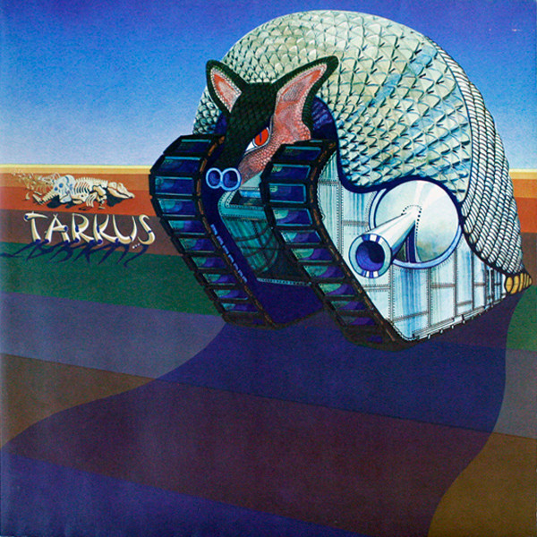

# Tarkus

By **Emerson, Lake & Palmer**

## Album Data

- **Catalog:** Beets
- **Format:** Digital, Album
- **Album:** Tarkus
- **Artist:** Emerson, Lake & Palmer
- **Albumartist:** Emerson, Lake & Palmer
- **Genre:** Progressive Rock
- **MusicBrainz Album Artist ID:** 
- **MusicBrainz Album ID:** 
- **MusicBrainz Release Group ID:** 
- **Year:** 2012
- **Catalog #:** 
- **Label:** 
- **Total Tracks:** 09

## Album Tracks

### Track 01 - Tarkus

- **Artist:** Emerson, Lake & Palmer
- **Format:** ALAC
- **Genre:** Progressive Rock
- **Length:** 20:45
- **MusicBrainz Track ID:** 
- **Title:** Tarkus
- **Track:** 01
- **Year:** 2012

### Track 02 - Jeremy Bender

- **Artist:** Emerson, Lake & Palmer
- **Format:** ALAC
- **Genre:** Progressive Rock
- **Length:** 1:56
- **MusicBrainz Track ID:** 
- **Title:** Jeremy Bender
- **Track:** 02
- **Year:** 2012

### Track 03 - Bitches Crystal

- **Artist:** Emerson, Lake & Palmer
- **Format:** ALAC
- **Genre:** Progressive Rock
- **Length:** 3:59
- **MusicBrainz Track ID:** 
- **Title:** Bitches Crystal
- **Track:** 03
- **Year:** 2012

### Track 04 - The Only Way (Hymn)

- **Artist:** Emerson, Lake & Palmer
- **Format:** ALAC
- **Genre:** Progressive Rock
- **Length:** 3:47
- **MusicBrainz Track ID:** 
- **Title:** The Only Way (Hymn)
- **Track:** 04
- **Year:** 2012

### Track 05 - Infinite Space (Conclusion)

- **Artist:** Emerson, Lake & Palmer
- **Format:** ALAC
- **Genre:** Progressive Rock
- **Length:** 3:22
- **MusicBrainz Track ID:** 
- **Title:** Infinite Space (Conclusion)
- **Track:** 05
- **Year:** 2012

### Track 06 - A Time And A Place

- **Artist:** Emerson, Lake & Palmer
- **Format:** ALAC
- **Genre:** Progressive Rock
- **Length:** 3:02
- **MusicBrainz Track ID:** 
- **Title:** A Time And A Place
- **Track:** 06
- **Year:** 2012

### Track 07 - Are You Ready Eddy?

- **Artist:** Emerson, Lake & Palmer
- **Format:** ALAC
- **Genre:** Rock And Roll
- **Length:** 2:12
- **MusicBrainz Track ID:** 
- **Title:** Are You Ready Eddy?
- **Track:** 07
- **Year:** 2012

### Track 08 - Oh, My Father

- **Artist:** Emerson, Lake & Palmer
- **Format:** ALAC
- **Genre:** Psychedelic Rock
- **Length:** 4:06
- **MusicBrainz Track ID:** 
- **Title:** Oh, My Father
- **Track:** 08
- **Year:** 2012

### Track 09 - Mass (Alternate Take)

- **Artist:** Emerson, Lake & Palmer
- **Format:** ALAC
- **Genre:** Progressive Rock
- **Length:** 4:29
- **MusicBrainz Track ID:** 
- **Title:** Mass (Alternate Take)
- **Track:** 09
- **Year:** 2012

## See also

- [Emerson, Lake & Palmer [2012 Stereo Mixes]](Emerson__Lake_and_Palmer_[2012_Stereo_Mixes].md)
- [Emerson, Lake & Palmer](Emerson__Lake_and_Palmer.md)
- [Tarkus [The Alternate Tarkus - 2012 Stereo Mixes - Steve Wilson - 2013]](Tarkus_[The_Alternate_Tarkus_-_2012_Stereo_Mixes_-_Steve_Wilson_-_2013].md)
- [The Atlantic Years](The_Atlantic_Years.md)
- [Trilogy Deluxe Edition (5.1 Remix)](Trilogy_Deluxe_Edition_51_Remix.md)
- [Trilogy Deluxe Edition (New Stereo Trilogy)](Trilogy_Deluxe_Edition_New_Stereo_Trilogy.md)
- [Trilogy Deluxe Edition (Original Trilogy)](Trilogy_Deluxe_Edition_Original_Trilogy.md)
- [CD: "Emerson, Lake & Palmer (2012 Deluxe Ed Ition) (Disc 1)"](../../CD/Emerson__Lake_and_Palmer/Emerson__Lake_and_Palmer_2012_Deluxe_Ed_Ition_Disc_1.md)
- [CD: "Emerson, Lake & Palmer (Deluxe Edition)"](../../CD/Emerson__Lake_and_Palmer/Emerson__Lake_and_Palmer_Deluxe_Edition.md)
- [CD: ](../../CD/Emerson__Lake_and_Palmer/Emerson__Lake_and_Palmer.md)
- [CD: Tarkus (Deluxe Edition) (Disc 1)](../../CD/Emerson__Lake_and_Palmer/Tarkus_Deluxe_Edition_Disc_1.md)
- [CD: Tarkus (Deluxe Edition) (Disc 2)](../../CD/Emerson__Lake_and_Palmer/Tarkus_Deluxe_Edition_Disc_2.md)
- [CD: Trilogy (2cd & Dvd-Audio) (Disc 2)](../../CD/Emerson__Lake_and_Palmer/Trilogy_2cd_and_Dvd-Audio_Disc_2.md)
- [CD: Trilogy (Disc 1)](../../CD/Emerson__Lake_and_Palmer/Trilogy_Disc_1.md)
- [Roon: Brain Salad Surgery (2014 - Remaster)](../../Roon/Emerson__Lake_and_Palmer/Brain_Salad_Surgery_2014_-_Remaster.md)
- [Roon: Emerson, Lake & Palmer](../../Roon/Emerson__Lake_and_Palmer/Emerson__Lake_and_Palmer.md)
- [Roon: Pictures At An Exhibition (Live)](../../Roon/Emerson__Lake_and_Palmer/Pictures_At_An_Exhibition_Live.md)
- [Roon: Tarkus](../../Roon/Emerson__Lake_and_Palmer/Tarkus.md)
- [Roon: Trilogy (2015 - Remaster)](../../Roon/Emerson__Lake_and_Palmer/Trilogy_2015_-_Remaster.md)
- [Vinyl: Brain Salad Surgery](../../Vinyl/Emerson__Lake_and_Palmer/Brain_Salad_Surgery.md)
- [Vinyl: ](../../Vinyl/Emerson__Lake_and_Palmer/Emerson__Lake_and_Palmer_index.md)
- [Vinyl: "Emerson, Lake & Palmer"](../../Vinyl/Emerson__Lake_and_Palmer/Emerson__Lake_and_Palmer.md)
- [Vinyl: Trilogy](../../Vinyl/Emerson__Lake_and_Palmer/Trilogy.md)
