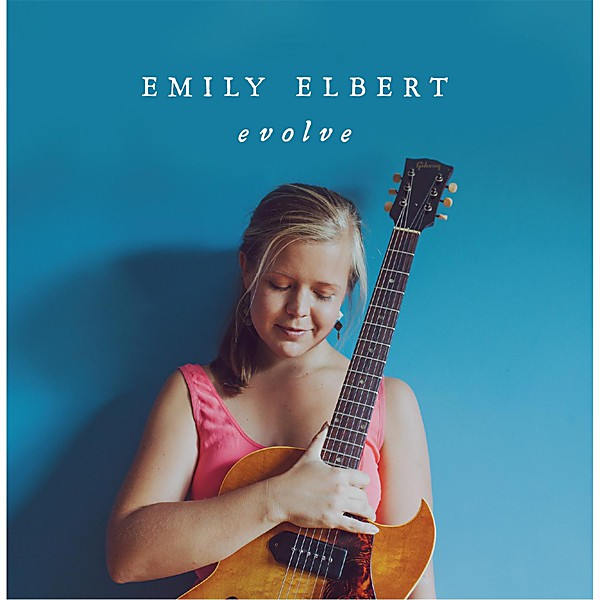

# Evolve

By **Emily Elbert**

## Album Data

- **Catalog:** Beets
- **Format:** Digital, Album
- **Album:** Evolve
- **Artist:** Emily Elbert
- **Albumartist:** Emily Elbert
- **Genre:** Soul
- **MusicBrainz Album Artist ID:** [https](https://musicbrainz.org/artist/https)
- **MusicBrainz Album ID:** [https](https://musicbrainz.org/release/https)
- **MusicBrainz Release Group ID:** 
- **Year:** 2013
- **Catalog #:** 
- **Label:** Emily Elbert
- **Total Tracks:** 04

## Album Tracks

### Track 01 - In With the New

- **Artist:** Emily Elbert
- **Format:** ALAC
- **Genre:** Soul
- **Length:** 3:34
- **MusicBrainz Track ID:** [https](https://musicbrainz.org/recording/https)
- **Title:** In With the New
- **Track:** 01
- **Year:** 2013

### Track 02 - End of the World

- **Artist:** Emily Elbert
- **Format:** ALAC
- **Genre:** Soul
- **Length:** 3:33
- **MusicBrainz Track ID:** [https](https://musicbrainz.org/recording/https)
- **Title:** End of the World
- **Track:** 02
- **Year:** 2013

### Track 03 - Evolve

- **Artist:** Emily Elbert
- **Format:** ALAC
- **Genre:** Soul
- **Length:** 3:52
- **MusicBrainz Track ID:** [https](https://musicbrainz.org/recording/https)
- **Title:** Evolve
- **Track:** 03
- **Year:** 2013

### Track 04 - World Without Your Love

- **Artist:** Emily Elbert
- **Format:** ALAC
- **Genre:** Soul
- **Length:** 3:21
- **MusicBrainz Track ID:** [https](https://musicbrainz.org/recording/https)
- **Title:** World Without Your Love
- **Track:** 04
- **Year:** 2013

## See also

- [Proof](Proof.md)
