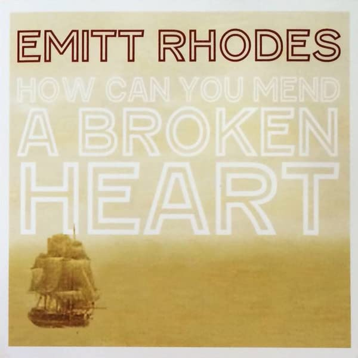

# How Can You Mend A Broken Heart

By **Emitt Rhodes**

## Album Data

- **Catalog:** Beets
- **Format:** Digital, Album
- **Album:** How Can You Mend A Broken Heart
- **Artist:** Emitt Rhodes
- **Albumartist:** Emitt Rhodes
- **Genre:** Power Pop
- **MusicBrainz Album Artist ID:** 
- **MusicBrainz Album ID:** 
- **MusicBrainz Release Group ID:** 
- **Year:** 2015
- **Catalog #:** 
- **Label:** 
- **Total Tracks:** 02

## Album Tracks

### Track 02 - Please Read Me

- **Artist:** Chris Price
- **Format:** MP3
- **Genre:** Synthpop
- **Length:** 1:56
- **MusicBrainz Track ID:** 
- **Title:** Please Read Me
- **Track:** 02
- **Year:** 2015

### Track 01 - How Can You Mend A Broken Heart

- **Artist:** Emitt Rhodes
- **Format:** MP3
- **Genre:** Power Pop
- **Length:** 3:09
- **MusicBrainz Track ID:** 
- **Title:** How Can You Mend A Broken Heart
- **Track:** 01
- **Year:** 2015

## See also

- [Daisy-Fresh From Hawthorne, California (The Best Of The Dunhill Years)](Daisy-Fresh_From_Hawthorne__California_The_Best_Of_The_Dunhill_Years.md)
- [Roon: The Emitt Rhodes Recordings (1969-1973)](../../Roon/Emitt_Rhodes/The_Emitt_Rhodes_Recordings_1969-1973.md)
