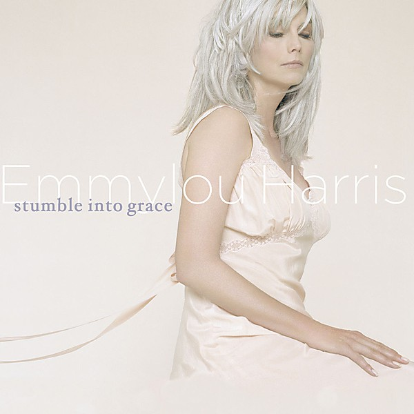

# Stumble Into Grace

By **Emmylou Harris**

## Album Data

- **Catalog:** Beets
- **Format:** Digital, Album
- **Album:** Stumble Into Grace
- **Artist:** Emmylou Harris
- **Albumartist:** Emmylou Harris
- **Genre:** Country
- **MusicBrainz Album Artist ID:** 
- **MusicBrainz Album ID:** 
- **MusicBrainz Release Group ID:** 
- **Year:** 0000
- **Catalog #:** 61854-2
- **Label:** Elektra
- **Total Tracks:** 12

## Album Tracks

### Track 01 - Where Will I Be

- **Artist:** Emmylou Harris
- **Format:** ALAC
- **Genre:** Americana
- **Length:** 4:15
- **MusicBrainz Track ID:** [cfae4de1-3462-4f53-8e66-1fc025634c2e](https://musicbrainz.org/recording/cfae4de1-3462-4f53-8e66-1fc025634c2e)
- **Title:** Where Will I Be
- **Track:** 01
- **Year:** 1995

### Track 02 - Goodbye

- **Artist:** Emmylou Harris
- **Format:** ALAC
- **Genre:** Americana
- **Length:** 4:52
- **MusicBrainz Track ID:** [6b325659-03ea-4706-baaa-2426bdd05a19](https://musicbrainz.org/recording/6b325659-03ea-4706-baaa-2426bdd05a19)
- **Title:** Goodbye
- **Track:** 02
- **Year:** 1995

### Track 03 - All My Tears (Be Washed Away)

- **Artist:** Emmylou Harris
- **Format:** ALAC
- **Genre:** Country
- **Length:** 3:41
- **MusicBrainz Track ID:** [9218eb2d-ce1b-4668-b2cf-9ba27e8dcffb](https://musicbrainz.org/recording/9218eb2d-ce1b-4668-b2cf-9ba27e8dcffb)
- **Title:** All My Tears (Be Washed Away)
- **Track:** 03
- **Year:** 1995

### Track 04 - Wrecking Ball

- **Artist:** Emmylou Harris
- **Format:** ALAC
- **Genre:** Classic Country
- **Length:** 4:49
- **MusicBrainz Track ID:** [4d32fcaa-ae2d-49a2-a187-cd2bb93459f4](https://musicbrainz.org/recording/4d32fcaa-ae2d-49a2-a187-cd2bb93459f4)
- **Title:** Wrecking Ball
- **Track:** 04
- **Year:** 1995

### Track 05 - Goin' Back to Harlan

- **Artist:** Emmylou Harris
- **Format:** ALAC
- **Genre:** Americana
- **Length:** 4:52
- **MusicBrainz Track ID:** [e26ef0a9-56b9-4086-aee0-27f7c77f7f71](https://musicbrainz.org/recording/e26ef0a9-56b9-4086-aee0-27f7c77f7f71)
- **Title:** Goin' Back to Harlan
- **Track:** 05
- **Year:** 1995

### Track 06 - Deeper Well

- **Artist:** Emmylou Harris
- **Format:** ALAC
- **Genre:** Americana
- **Length:** 4:17
- **MusicBrainz Track ID:** [41121bbb-3eaa-467a-b7e2-058c1824ff59](https://musicbrainz.org/recording/41121bbb-3eaa-467a-b7e2-058c1824ff59)
- **Title:** Deeper Well
- **Track:** 06
- **Year:** 1995

### Track 07 - Every Grain of Sand

- **Artist:** Emmylou Harris
- **Format:** ALAC
- **Genre:** Americana
- **Length:** 3:55
- **MusicBrainz Track ID:** [4311d0a2-6739-47e0-9257-00b9a8feb8db](https://musicbrainz.org/recording/4311d0a2-6739-47e0-9257-00b9a8feb8db)
- **Title:** Every Grain of Sand
- **Track:** 07
- **Year:** 1995

### Track 08 - Sweet Old World

- **Artist:** Emmylou Harris
- **Format:** ALAC
- **Genre:** Americana
- **Length:** 5:05
- **MusicBrainz Track ID:** [ef04111a-d285-4cae-a105-50bb756c57c3](https://musicbrainz.org/recording/ef04111a-d285-4cae-a105-50bb756c57c3)
- **Title:** Sweet Old World
- **Track:** 08
- **Year:** 1995

### Track 09 - May This Be Love

- **Artist:** Emmylou Harris
- **Format:** ALAC
- **Genre:** Americana
- **Length:** 4:44
- **MusicBrainz Track ID:** [73867867-a87b-4003-8743-d3486e4c439b](https://musicbrainz.org/recording/73867867-a87b-4003-8743-d3486e4c439b)
- **Title:** May This Be Love
- **Track:** 09
- **Year:** 1995

### Track 10 - Orphan Girl

- **Artist:** Emmylou Harris
- **Format:** ALAC
- **Genre:** Americana
- **Length:** 3:14
- **MusicBrainz Track ID:** [64ff80b0-0cf1-4ebb-92dc-4d5275fe86fe](https://musicbrainz.org/recording/64ff80b0-0cf1-4ebb-92dc-4d5275fe86fe)
- **Title:** Orphan Girl
- **Track:** 10
- **Year:** 1995

### Track 11 - Blackhawk

- **Artist:** Emmylou Harris
- **Format:** ALAC
- **Genre:** Americana
- **Length:** 4:28
- **MusicBrainz Track ID:** [8cd178f6-d04a-4399-9b6f-8a4fbc9ba7f8](https://musicbrainz.org/recording/8cd178f6-d04a-4399-9b6f-8a4fbc9ba7f8)
- **Title:** Blackhawk
- **Track:** 11
- **Year:** 1995

### Track 12 - Waltz Across Texas Tonight

- **Artist:** Emmylou Harris
- **Format:** ALAC
- **Genre:** Country
- **Length:** 4:46
- **MusicBrainz Track ID:** [859cb402-9437-4e8c-8635-4e50a97af67c](https://musicbrainz.org/recording/859cb402-9437-4e8c-8635-4e50a97af67c)
- **Title:** Waltz Across Texas Tonight
- **Track:** 12
- **Year:** 1995

## See also

- [Wrecking Ball](Wrecking_Ball.md)
- [Roon: Cimarron](../../Roon/Emmylou_Harris/Cimarron.md)
- [Roon: Elite Hotel](../../Roon/Emmylou_Harris/Elite_Hotel.md)
- [Roon: Pieces of the Sky (Expanded & Remastered)](../../Roon/Emmylou_Harris/Pieces_of_the_Sky_Expanded_and_Remastered.md)
- [Roon: Wrecking Ball (Deluxe Edition)](../../Roon/Emmylou_Harris/Wrecking_Ball_Deluxe_Edition.md)
