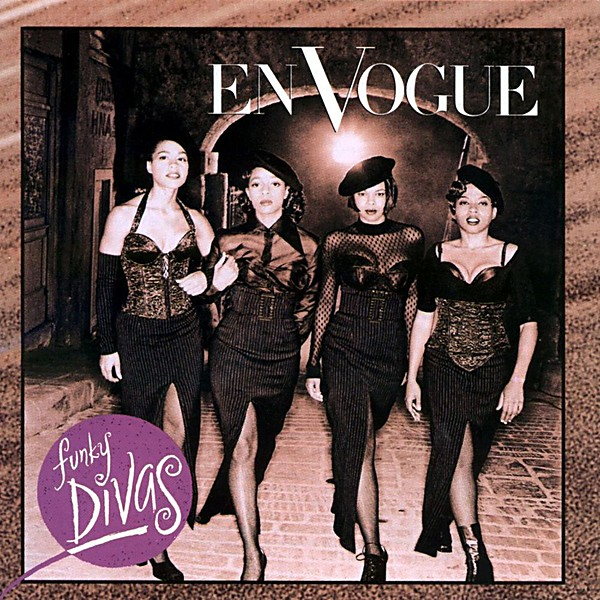

# Funky Divas

By **En Vogue**

## Album Data

- **Catalog:** Beets
- **Format:** Digital, Album
- **Album:** Funky Divas
- **Artist:** En Vogue
- **Albumartist:** En Vogue
- **Genre:** Soul
- **MusicBrainz Album Artist ID:** [9a883a69-436b-4d17-9ffd-122a9bf4419a](https://musicbrainz.org/artist/9a883a69-436b-4d17-9ffd-122a9bf4419a)
- **MusicBrainz Album ID:** [ac5d3ddd-9171-471f-83b2-09cbccfbe40a](https://musicbrainz.org/release/ac5d3ddd-9171-471f-83b2-09cbccfbe40a)
- **MusicBrainz Release Group ID:** [6ec45cd6-66d5-3d6e-93f3-ad3320055dca](https://musicbrainz.org/release-group/6ec45cd6-66d5-3d6e-93f3-ad3320055dca)
- **Year:** 1992
- **Catalog #:** 7 92121-2
- **Label:** EastWest Records America
- **Total Tracks:** 13

## Album Tracks

### Track 01 - This Is Your Life

- **Artist:** En Vogue
- **Format:** ALAC
- **Genre:** Soul
- **Length:** 5:05
- **MusicBrainz Track ID:** [2de90d4d-9195-4eeb-9d1d-4bc006d6105e](https://musicbrainz.org/recording/2de90d4d-9195-4eeb-9d1d-4bc006d6105e)
- **Title:** This Is Your Life
- **Track:** 01
- **Year:** 1992

### Track 02 - My Lovin’ (You’re Never Gonna Get It)

- **Artist:** En Vogue
- **Format:** ALAC
- **Genre:** Soul
- **Length:** 4:42
- **MusicBrainz Track ID:** [9cf2bb20-ca0f-421b-a437-9d626850fc9b](https://musicbrainz.org/recording/9cf2bb20-ca0f-421b-a437-9d626850fc9b)
- **Title:** My Lovin’ (You’re Never Gonna Get It)
- **Track:** 02
- **Year:** 1992

### Track 03 - Hip Hop Lover

- **Artist:** En Vogue
- **Format:** ALAC
- **Genre:** Soul
- **Length:** 5:13
- **MusicBrainz Track ID:** [8f234aa4-424e-470d-a8f1-a11b08f7dde4](https://musicbrainz.org/recording/8f234aa4-424e-470d-a8f1-a11b08f7dde4)
- **Title:** Hip Hop Lover
- **Track:** 03
- **Year:** 1992

### Track 04 - Free Your Mind

- **Artist:** En Vogue
- **Format:** ALAC
- **Genre:** Soul
- **Length:** 4:52
- **MusicBrainz Track ID:** [bce73c68-4c49-441d-be6f-104903f2e91a](https://musicbrainz.org/recording/bce73c68-4c49-441d-be6f-104903f2e91a)
- **Title:** Free Your Mind
- **Track:** 04
- **Year:** 1992

### Track 05 - Desire

- **Artist:** En Vogue
- **Format:** ALAC
- **Genre:** Soul
- **Length:** 4:00
- **MusicBrainz Track ID:** [492cb733-99bc-4c5c-aaeb-c6aed2cc2f93](https://musicbrainz.org/recording/492cb733-99bc-4c5c-aaeb-c6aed2cc2f93)
- **Title:** Desire
- **Track:** 05
- **Year:** 1992

### Track 06 - Giving Him Something He Can Feel

- **Artist:** En Vogue
- **Format:** ALAC
- **Genre:** Soul
- **Length:** 3:58
- **MusicBrainz Track ID:** [57b1bba5-3947-4b3d-9c5f-7a914804b4ef](https://musicbrainz.org/recording/57b1bba5-3947-4b3d-9c5f-7a914804b4ef)
- **Title:** Giving Him Something He Can Feel
- **Track:** 06
- **Year:** 1992

### Track 07 - It Ain’t Over Till the Fat Lady Sings

- **Artist:** En Vogue
- **Format:** ALAC
- **Genre:** Soul
- **Length:** 4:13
- **MusicBrainz Track ID:** [29569873-de0e-4732-b8f4-e3e89f15e9b8](https://musicbrainz.org/recording/29569873-de0e-4732-b8f4-e3e89f15e9b8)
- **Title:** It Ain’t Over Till the Fat Lady Sings
- **Track:** 07
- **Year:** 1992

### Track 08 - Give It Up, Turn It Loose

- **Artist:** En Vogue
- **Format:** ALAC
- **Genre:** Soul
- **Length:** 5:11
- **MusicBrainz Track ID:** [f65fa4ee-9555-4d24-ab1b-dab902658509](https://musicbrainz.org/recording/f65fa4ee-9555-4d24-ab1b-dab902658509)
- **Title:** Give It Up, Turn It Loose
- **Track:** 08
- **Year:** 1992

### Track 09 - Yesterday

- **Artist:** En Vogue
- **Format:** ALAC
- **Genre:** Soul
- **Length:** 2:32
- **MusicBrainz Track ID:** [6b0f2516-5588-420f-85c7-c1c6d0b69ec2](https://musicbrainz.org/recording/6b0f2516-5588-420f-85c7-c1c6d0b69ec2)
- **Title:** Yesterday
- **Track:** 09
- **Year:** 1992

### Track 10 - Hooked on Your Love

- **Artist:** En Vogue
- **Format:** ALAC
- **Genre:** Soul
- **Length:** 3:36
- **MusicBrainz Track ID:** [8962f42d-0ebf-4d81-9d0a-010edfcad264](https://musicbrainz.org/recording/8962f42d-0ebf-4d81-9d0a-010edfcad264)
- **Title:** Hooked on Your Love
- **Track:** 10
- **Year:** 1992

### Track 11 - Love Don’t Love You

- **Artist:** En Vogue
- **Format:** ALAC
- **Genre:** Soul
- **Length:** 3:57
- **MusicBrainz Track ID:** [2921235f-4b44-4384-8097-b230f4f224cf](https://musicbrainz.org/recording/2921235f-4b44-4384-8097-b230f4f224cf)
- **Title:** Love Don’t Love You
- **Track:** 11
- **Year:** 1992

### Track 12 - What Is Love

- **Artist:** En Vogue
- **Format:** ALAC
- **Genre:** Soul
- **Length:** 4:20
- **MusicBrainz Track ID:** [1060b7fe-883a-4cb7-ac3d-c60503519921](https://musicbrainz.org/recording/1060b7fe-883a-4cb7-ac3d-c60503519921)
- **Title:** What Is Love
- **Track:** 12
- **Year:** 1992

### Track 13 - Thanks / Prayer

- **Artist:** En Vogue
- **Format:** ALAC
- **Genre:** Soul
- **Length:** 0:44
- **MusicBrainz Track ID:** [72bc1b34-f2f7-454e-8e54-c4407276eed6](https://musicbrainz.org/recording/72bc1b34-f2f7-454e-8e54-c4407276eed6)
- **Title:** Thanks / Prayer
- **Track:** 13
- **Year:** 1992

