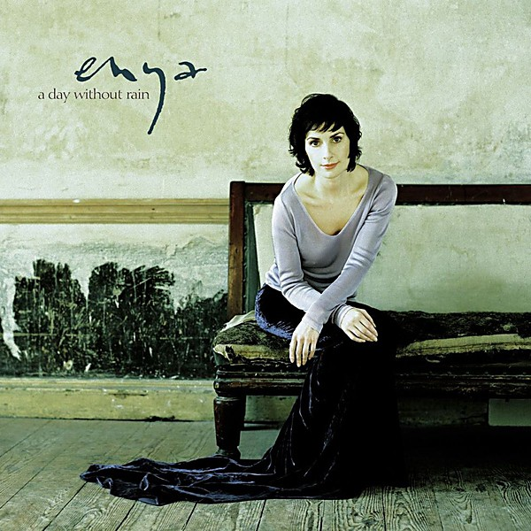

# A Day Without Rain

By **Enya**

## Album Data

- **Catalog:** Beets
- **Format:** Digital, Album
- **Album:** A Day Without Rain
- **Artist:** Enya
- **Albumartist:** Enya
- **Genre:** Ambient
- **MusicBrainz Album Artist ID:** [4967c0a1-b9f3-465e-8440-4598fd9fc33c](https://musicbrainz.org/artist/4967c0a1-b9f3-465e-8440-4598fd9fc33c)
- **MusicBrainz Album ID:** [76d53e8d-a605-3a57-a188-450d6884fff5](https://musicbrainz.org/release/76d53e8d-a605-3a57-a188-450d6884fff5)
- **MusicBrainz Release Group ID:** [ac954fa2-8c31-3667-aa2d-8be1e93c54bc](https://musicbrainz.org/release-group/ac954fa2-8c31-3667-aa2d-8be1e93c54bc)
- **Year:** 2000
- **Catalog #:** 
- **Label:** Wea International
- **Total Tracks:** 00

## Album Tracks

### Track 01 - Miss Clare Remembers

- **Artist:** Enya
- **Format:** MP3
- **Genre:** Ambient
- **Length:** 2:25
- **MusicBrainz Track ID:** 
- **Title:** Miss Clare Remembers
- **Track:** 01
- **Year:** 2001

### Track 02 - Orinoco Flow

- **Artist:** Enya
- **Format:** MP3
- **Genre:** Ambient
- **Length:** 4:09
- **MusicBrainz Track ID:** 
- **Title:** Orinoco Flow
- **Track:** 02
- **Year:** 2001

### Track 03 - Evening Falls...

- **Artist:** Enya
- **Format:** MP3
- **Genre:** Ambient
- **Length:** 3:59
- **MusicBrainz Track ID:** 
- **Title:** Evening Falls...
- **Track:** 03
- **Year:** 2001

### Track 04 - River

- **Artist:** Enya
- **Format:** MP3
- **Genre:** Ambient
- **Length:** 4:04
- **MusicBrainz Track ID:** 
- **Title:** River
- **Track:** 04
- **Year:** 2001

### Track 05 - The Long Ships

- **Artist:** Enya
- **Format:** MP3
- **Genre:** Ambient
- **Length:** 4:21
- **MusicBrainz Track ID:** 
- **Title:** The Long Ships
- **Track:** 05
- **Year:** 2001

### Track 06 - Na Laetha Gael M'Óige

- **Artist:** Enya
- **Format:** MP3
- **Genre:** Ambient
- **Length:** 1:59
- **MusicBrainz Track ID:** 
- **Title:** Na Laetha Gael M'Óige
- **Track:** 06
- **Year:** 2001

### Track 07 - Watermark

- **Artist:** Enya
- **Format:** MP3
- **Genre:** Ambient
- **Length:** 4:25
- **MusicBrainz Track ID:** 
- **Title:** Watermark
- **Track:** 07
- **Year:** 2001

### Track 08 - Cursum Perticio

- **Artist:** Enya
- **Format:** MP3
- **Genre:** Ambient
- **Length:** 3:49
- **MusicBrainz Track ID:** 
- **Title:** Cursum Perticio
- **Track:** 08
- **Year:** 2001

### Track 09 - On Your Shore

- **Artist:** Enya
- **Format:** MP3
- **Genre:** Ambient
- **Length:** 3:11
- **MusicBrainz Track ID:** 
- **Title:** On Your Shore
- **Track:** 09
- **Year:** 2001

### Track 10 - Storms in Africa

- **Artist:** Enya
- **Format:** MP3
- **Genre:** Ambient
- **Length:** 3:39
- **MusicBrainz Track ID:** 
- **Title:** Storms in Africa
- **Track:** 10
- **Year:** 2001

### Track 11 - Eicile

- **Artist:** Enya
- **Format:** MP3
- **Genre:** Ambient
- **Length:** 3:55
- **MusicBrainz Track ID:** 
- **Title:** Eicile
- **Track:** 11
- **Year:** 2001

## See also

- [Enya Box Collection Disc 2](Enya_Box_Collection_Disc_2.md)
- [Watermark](Watermark.md)
