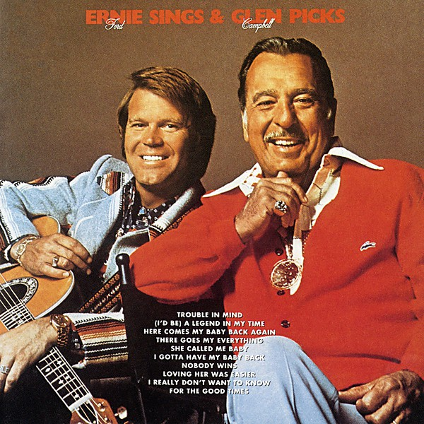

# Ernie Sings and Glen Picks

By **Ernie Ford**

## Album Data

- **Catalog:** Beets
- **Format:** Digital, Album
- **Album:** Ernie Sings and Glen Picks
- **Artist:** Ernie Ford
- **Albumartist:** Ernie Ford
- **Genre:** Classic Country
- **MusicBrainz Album Artist ID:** 
- **MusicBrainz Album ID:** 
- **MusicBrainz Release Group ID:** 
- **Year:** 0000
- **Catalog #:** 
- **Label:** 
- **Total Tracks:** 00

## Album Tracks

### Track 01 - Trouble In Mind

- **Artist:** Ernie Ford
- **Format:** AAC
- **Genre:** Western Swing
- **Length:** 3:06
- **MusicBrainz Track ID:** 
- **Title:** Trouble In Mind
- **Track:** 01
- **Year:** 0000

### Track 02 - (I'd Be) A Legend In My Time

- **Artist:** Ernie Ford
- **Format:** AAC
- **Genre:** Classic Country
- **Length:** 2:37
- **MusicBrainz Track ID:** 
- **Title:** (I'd Be) A Legend In My Time
- **Track:** 02
- **Year:** 0000

### Track 03 - Here Comes My Baby Back Again

- **Artist:** Ernie Ford
- **Format:** AAC
- **Genre:** Classic Country
- **Length:** 2:56
- **MusicBrainz Track ID:** 
- **Title:** Here Comes My Baby Back Again
- **Track:** 03
- **Year:** 0000

### Track 04 - There Goes My Everything

- **Artist:** Ernie Ford
- **Format:** AAC
- **Genre:** Classic Country
- **Length:** 3:01
- **MusicBrainz Track ID:** 
- **Title:** There Goes My Everything
- **Track:** 04
- **Year:** 0000

### Track 05 - She Called Me Baby

- **Artist:** Ernie Ford
- **Format:** AAC
- **Genre:** Classic Country
- **Length:** 3:04
- **MusicBrainz Track ID:** 
- **Title:** She Called Me Baby
- **Track:** 05
- **Year:** 0000

### Track 06 - I Gotta Have My Baby Back

- **Artist:** Ernie Ford
- **Format:** AAC
- **Genre:** Classic Country
- **Length:** 3:44
- **MusicBrainz Track ID:** 
- **Title:** I Gotta Have My Baby Back
- **Track:** 06
- **Year:** 0000

### Track 07 - Nobody Wins

- **Artist:** Ernie Ford
- **Format:** AAC
- **Genre:** Classic Country
- **Length:** 2:56
- **MusicBrainz Track ID:** 
- **Title:** Nobody Wins
- **Track:** 07
- **Year:** 0000

### Track 08 - Loving Her Was Easier (Than Anything I'll Ever Do Again)

- **Artist:** Ernie Ford
- **Format:** AAC
- **Genre:** Classic Country
- **Length:** 3:07
- **MusicBrainz Track ID:** 
- **Title:** Loving Her Was Easier (Than Anything I'll Ever Do Again)
- **Track:** 08
- **Year:** 0000

### Track 09 - I Really Don't Want To Know

- **Artist:** Ernie Ford
- **Format:** AAC
- **Genre:** Classic Country
- **Length:** 2:54
- **MusicBrainz Track ID:** 
- **Title:** I Really Don't Want To Know
- **Track:** 09
- **Year:** 0000

### Track 10 - For The Good Times

- **Artist:** Ernie Ford
- **Format:** AAC
- **Genre:** Classic Country
- **Length:** 3:43
- **MusicBrainz Track ID:** 
- **Title:** For The Good Times
- **Track:** 10
- **Year:** 0000

