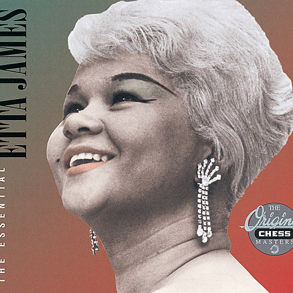

# The Essential Etta James

By **Etta James**

## Album Data

- **Catalog:** Beets
- **Format:** Digital, Album
- **Album:** The Essential Etta James
- **Artist:** Etta James
- **Albumartist:** Etta James
- **Genre:** Soul
- **MusicBrainz Album Artist ID:** 
- **MusicBrainz Album ID:** 
- **MusicBrainz Release Group ID:** 
- **Year:** 1994
- **Catalog #:** 
- **Label:** Hip‐O Records
- **Total Tracks:** 36

## Album Tracks

### Track 01 - The Wallflower (Dance With Me Henry)

- **Artist:** Etta James
- **Format:** ALAC
- **Genre:** Soul
- **Length:** 2:58
- **MusicBrainz Track ID:** [e687a62d-1279-4b55-a36b-cff007235c12](https://musicbrainz.org/recording/e687a62d-1279-4b55-a36b-cff007235c12)
- **Title:** The Wallflower (Dance With Me Henry)
- **Track:** 01
- **Year:** 2007

### Track 02 - Good Rockin' Daddy

- **Artist:** Etta James
- **Format:** ALAC
- **Genre:** Soul
- **Length:** 2:24
- **MusicBrainz Track ID:** [847c61a2-6db6-4a9d-8848-409aae1bb830](https://musicbrainz.org/recording/847c61a2-6db6-4a9d-8848-409aae1bb830)
- **Title:** Good Rockin' Daddy
- **Track:** 02
- **Year:** 2007

### Track 03 - Tough Lover

- **Artist:** Etta James
- **Format:** ALAC
- **Genre:** Psychobilly
- **Length:** 2:10
- **MusicBrainz Track ID:** [33995833-a3dc-4fea-b8d8-8556feacd7bb](https://musicbrainz.org/recording/33995833-a3dc-4fea-b8d8-8556feacd7bb)
- **Title:** Tough Lover
- **Track:** 03
- **Year:** 2007

### Track 04 - All I Could Do Is Cry

- **Artist:** Etta James
- **Format:** ALAC
- **Genre:** Soul
- **Length:** 2:56
- **MusicBrainz Track ID:** [f1b56230-9780-4dbe-833d-7baaecfe18aa](https://musicbrainz.org/recording/f1b56230-9780-4dbe-833d-7baaecfe18aa)
- **Title:** All I Could Do Is Cry
- **Track:** 04
- **Year:** 2007

### Track 05 - If I Can't Have You

- **Artist:** Etta James
- **Format:** ALAC
- **Genre:** Soul
- **Length:** 3:00
- **MusicBrainz Track ID:** [d8438c6b-c901-4a67-b662-5eca97d40ecd](https://musicbrainz.org/recording/d8438c6b-c901-4a67-b662-5eca97d40ecd)
- **Title:** If I Can't Have You
- **Track:** 05
- **Year:** 2007

### Track 06 - My Dearest Darling

- **Artist:** Etta James
- **Format:** ALAC
- **Genre:** Soul
- **Length:** 3:04
- **MusicBrainz Track ID:** [c28a0185-b618-4586-9516-1a681300dc66](https://musicbrainz.org/recording/c28a0185-b618-4586-9516-1a681300dc66)
- **Title:** My Dearest Darling
- **Track:** 06
- **Year:** 2007

### Track 07 - A Sunday Kind Of Love

- **Artist:** Etta James
- **Format:** ALAC
- **Genre:** Soul
- **Length:** 3:17
- **MusicBrainz Track ID:** [8043511e-823e-4195-be36-404474491ab3](https://musicbrainz.org/recording/8043511e-823e-4195-be36-404474491ab3)
- **Title:** A Sunday Kind Of Love
- **Track:** 07
- **Year:** 2007

### Track 08 - At Last

- **Artist:** Etta James
- **Format:** ALAC
- **Genre:** Vocal Jazz
- **Length:** 3:01
- **MusicBrainz Track ID:** [c81a809c-10d0-4fa7-9171-2ce8635ce87c](https://musicbrainz.org/recording/c81a809c-10d0-4fa7-9171-2ce8635ce87c)
- **Title:** At Last
- **Track:** 08
- **Year:** 2007

### Track 09 - Trust In Me

- **Artist:** Etta James
- **Format:** ALAC
- **Genre:** Soul
- **Length:** 2:59
- **MusicBrainz Track ID:** [43df4477-e5da-4b75-970e-69be4c498084](https://musicbrainz.org/recording/43df4477-e5da-4b75-970e-69be4c498084)
- **Title:** Trust In Me
- **Track:** 09
- **Year:** 2007

### Track 10 - Don't Cry Baby

- **Artist:** Etta James
- **Format:** ALAC
- **Genre:** Soul
- **Length:** 2:26
- **MusicBrainz Track ID:** [6855c5ea-90d7-4319-9f52-292e217d1e19](https://musicbrainz.org/recording/6855c5ea-90d7-4319-9f52-292e217d1e19)
- **Title:** Don't Cry Baby
- **Track:** 10
- **Year:** 2007

### Track 11 - Fool That I Am

- **Artist:** Etta James
- **Format:** ALAC
- **Genre:** Soul
- **Length:** 2:58
- **MusicBrainz Track ID:** [f86a2c87-eeea-4b2e-a3f1-7b3b38c6ae68](https://musicbrainz.org/recording/f86a2c87-eeea-4b2e-a3f1-7b3b38c6ae68)
- **Title:** Fool That I Am
- **Track:** 11
- **Year:** 2007

### Track 12 - Waiting For Charlie (To Come Home)

- **Artist:** Etta James
- **Format:** ALAC
- **Genre:** Soul
- **Length:** 2:07
- **MusicBrainz Track ID:** [b788fb26-2f7b-4bcf-9bc1-767b4e1dad85](https://musicbrainz.org/recording/b788fb26-2f7b-4bcf-9bc1-767b4e1dad85)
- **Title:** Waiting For Charlie (To Come Home)
- **Track:** 12
- **Year:** 2007

### Track 13 - Something's Got A Hold On Me

- **Artist:** Etta James
- **Format:** ALAC
- **Genre:** Soul
- **Length:** 2:49
- **MusicBrainz Track ID:** [ce85b7a3-d614-4656-b9cc-29861eccaa27](https://musicbrainz.org/recording/ce85b7a3-d614-4656-b9cc-29861eccaa27)
- **Title:** Something's Got A Hold On Me
- **Track:** 13
- **Year:** 2007

### Track 14 - Next Door To The Blues

- **Artist:** Etta James
- **Format:** ALAC
- **Genre:** Soul
- **Length:** 2:49
- **MusicBrainz Track ID:** [f554509e-a40d-43ec-8b3f-4768cd59f57a](https://musicbrainz.org/recording/f554509e-a40d-43ec-8b3f-4768cd59f57a)
- **Title:** Next Door To The Blues
- **Track:** 14
- **Year:** 2007

### Track 15 - Stop The Wedding

- **Artist:** Etta James
- **Format:** ALAC
- **Genre:** Soul
- **Length:** 2:52
- **MusicBrainz Track ID:** [9805b982-dcc6-4d67-86ff-e2f7e770a620](https://musicbrainz.org/recording/9805b982-dcc6-4d67-86ff-e2f7e770a620)
- **Title:** Stop The Wedding
- **Track:** 15
- **Year:** 2007

### Track 16 - These Foolish Things (Remind Me Of You)

- **Artist:** Etta James
- **Format:** ALAC
- **Genre:** Rhythm And Blues
- **Length:** 3:59
- **MusicBrainz Track ID:** [aad0318a-2b95-45a8-855f-84728bdc6024](https://musicbrainz.org/recording/aad0318a-2b95-45a8-855f-84728bdc6024)
- **Title:** These Foolish Things (Remind Me Of You)
- **Track:** 16
- **Year:** 2007

### Track 17 - Pushover

- **Artist:** Etta James
- **Format:** ALAC
- **Genre:** Soul
- **Length:** 2:56
- **MusicBrainz Track ID:** [8ab2a8d8-932e-4019-9682-783f4a1b6ab0](https://musicbrainz.org/recording/8ab2a8d8-932e-4019-9682-783f4a1b6ab0)
- **Title:** Pushover
- **Track:** 17
- **Year:** 2007

### Track 18 - Baby What You Want Me To Do

- **Artist:** Etta James
- **Format:** ALAC
- **Genre:** Jazz
- **Length:** 4:16
- **MusicBrainz Track ID:** [fd288ae1-86fa-4155-8327-3e9434c01bd3](https://musicbrainz.org/recording/fd288ae1-86fa-4155-8327-3e9434c01bd3)
- **Title:** Baby What You Want Me To Do
- **Track:** 18
- **Year:** 2007

### Track 19 - Loving You More Every Day

- **Artist:** Etta James
- **Format:** ALAC
- **Genre:** Blues
- **Length:** 3:21
- **MusicBrainz Track ID:** [d786070d-6b4e-46dd-a874-d1300c87740e](https://musicbrainz.org/recording/d786070d-6b4e-46dd-a874-d1300c87740e)
- **Title:** Loving You More Every Day
- **Track:** 19
- **Year:** 2007

### Track 21 - Tell Mama

- **Artist:** Etta James
- **Format:** ALAC
- **Genre:** Soul
- **Length:** 2:24
- **MusicBrainz Track ID:** [7444ca41-44a3-4144-b102-2d503cc4e3dd](https://musicbrainz.org/recording/7444ca41-44a3-4144-b102-2d503cc4e3dd)
- **Title:** Tell Mama
- **Track:** 21
- **Year:** 2007

### Track 22 - I'd Rather Go Blind

- **Artist:** Etta James
- **Format:** ALAC
- **Genre:** Soul
- **Length:** 2:35
- **MusicBrainz Track ID:** [1195e3a3-d78c-4521-a5d8-6765d86d4d09](https://musicbrainz.org/recording/1195e3a3-d78c-4521-a5d8-6765d86d4d09)
- **Title:** I'd Rather Go Blind
- **Track:** 22
- **Year:** 2007

### Track 23 - Security

- **Artist:** Etta James
- **Format:** ALAC
- **Genre:** Soul
- **Length:** 2:29
- **MusicBrainz Track ID:** [7a1a6095-658c-4566-ac83-4a47389ebb94](https://musicbrainz.org/recording/7a1a6095-658c-4566-ac83-4a47389ebb94)
- **Title:** Security
- **Track:** 23
- **Year:** 2007

### Track 24 - Almost Persuaded

- **Artist:** Etta James
- **Format:** ALAC
- **Genre:** Vocal Jazz
- **Length:** 3:22
- **MusicBrainz Track ID:** [9e728b63-83d9-42e0-8ea1-8814427c0514](https://musicbrainz.org/recording/9e728b63-83d9-42e0-8ea1-8814427c0514)
- **Title:** Almost Persuaded
- **Track:** 24
- **Year:** 2007

### Track 25 - Losers Weepers, Part 1

- **Artist:** Etta James
- **Format:** ALAC
- **Genre:** Soul
- **Length:** 3:00
- **MusicBrainz Track ID:** [9fd17d23-e571-468a-a265-7da8c04768fe](https://musicbrainz.org/recording/9fd17d23-e571-468a-a265-7da8c04768fe)
- **Title:** Losers Weepers, Part 1
- **Track:** 25
- **Year:** 2007

### Track 26 - All the Way Down

- **Artist:** Etta James
- **Format:** ALAC
- **Genre:** Soul
- **Length:** 5:34
- **MusicBrainz Track ID:** [36a0bf16-cbdb-41bc-a715-44e39d3f79e9](https://musicbrainz.org/recording/36a0bf16-cbdb-41bc-a715-44e39d3f79e9)
- **Title:** All the Way Down
- **Track:** 26
- **Year:** 2007

### Track 27 - God's Song (That's Why I Love Mankind)

- **Artist:** Etta James
- **Format:** ALAC
- **Genre:** Soul
- **Length:** 3:37
- **MusicBrainz Track ID:** [37eeaf6c-5236-4eac-8f84-07af4def85a8](https://musicbrainz.org/recording/37eeaf6c-5236-4eac-8f84-07af4def85a8)
- **Title:** God's Song (That's Why I Love Mankind)
- **Track:** 27
- **Year:** 2007

### Track 28 - Feeling Uneasy

- **Artist:** Etta James
- **Format:** ALAC
- **Genre:** Soul
- **Length:** 2:47
- **MusicBrainz Track ID:** [e83f6d3d-2890-43cf-8051-30cf5d01fc28](https://musicbrainz.org/recording/e83f6d3d-2890-43cf-8051-30cf5d01fc28)
- **Title:** Feeling Uneasy
- **Track:** 28
- **Year:** 2007

### Track 29 - Let's Burn Down the Cornfield

- **Artist:** Etta James
- **Format:** ALAC
- **Genre:** Soul
- **Length:** 3:43
- **MusicBrainz Track ID:** [2cfeac1b-fec9-4388-8cd6-7e5172b6ab3f](https://musicbrainz.org/recording/2cfeac1b-fec9-4388-8cd6-7e5172b6ab3f)
- **Title:** Let's Burn Down the Cornfield
- **Track:** 29
- **Year:** 2007

### Track 30 - Loving Arms

- **Artist:** Etta James
- **Format:** ALAC
- **Genre:** Soul
- **Length:** 3:49
- **MusicBrainz Track ID:** [2beeb7be-4e72-453e-aa54-d179cdfd92e1](https://musicbrainz.org/recording/2beeb7be-4e72-453e-aa54-d179cdfd92e1)
- **Title:** Loving Arms
- **Track:** 30
- **Year:** 2007

### Track 31 - Take It to the Limit

- **Artist:** Etta James
- **Format:** ALAC
- **Genre:** Soul
- **Length:** 4:05
- **MusicBrainz Track ID:** [2a12794e-455d-4a56-b2e3-fd6b2534d65f](https://musicbrainz.org/recording/2a12794e-455d-4a56-b2e3-fd6b2534d65f)
- **Title:** Take It to the Limit
- **Track:** 31
- **Year:** 2007

### Track 32 - Damn Your Eyes

- **Artist:** Etta James
- **Format:** ALAC
- **Genre:** Vocal Jazz
- **Length:** 4:11
- **MusicBrainz Track ID:** [df4e8b82-61b1-4934-a41b-aeb2c3406b37](https://musicbrainz.org/recording/df4e8b82-61b1-4934-a41b-aeb2c3406b37)
- **Title:** Damn Your Eyes
- **Track:** 32
- **Year:** 2007

### Track 33 - Whatever Gets You Through the Night

- **Artist:** Etta James
- **Format:** ALAC
- **Genre:** Soul
- **Length:** 3:50
- **MusicBrainz Track ID:** [b396576c-4656-4487-a966-3b8b6288087d](https://musicbrainz.org/recording/b396576c-4656-4487-a966-3b8b6288087d)
- **Title:** Whatever Gets You Through the Night
- **Track:** 33
- **Year:** 2007

### Track 34 - The Man I Love

- **Artist:** Etta James
- **Format:** ALAC
- **Genre:** Vocal Jazz
- **Length:** 4:25
- **MusicBrainz Track ID:** [5ce8dbff-5c7a-4037-b0c7-c75b3504ee05](https://musicbrainz.org/recording/5ce8dbff-5c7a-4037-b0c7-c75b3504ee05)
- **Title:** The Man I Love
- **Track:** 34
- **Year:** 2007

### Track 35 - The Blues Is My Business

- **Artist:** Etta James
- **Format:** ALAC
- **Genre:** Soul
- **Length:** 3:31
- **MusicBrainz Track ID:** [6b7d74b4-7f8c-42e3-bde8-6c980d9b957c](https://musicbrainz.org/recording/6b7d74b4-7f8c-42e3-bde8-6c980d9b957c)
- **Title:** The Blues Is My Business
- **Track:** 35
- **Year:** 2007

### Track 36 - The Sky Is Crying

- **Artist:** Etta James
- **Format:** ALAC
- **Genre:** Blues
- **Length:** 3:58
- **MusicBrainz Track ID:** [ab5141a0-07c0-41a8-a2c5-4c6c319b3180](https://musicbrainz.org/recording/ab5141a0-07c0-41a8-a2c5-4c6c319b3180)
- **Title:** The Sky Is Crying
- **Track:** 36
- **Year:** 2007

### Track 20 - In the Basement, Part 1

- **Artist:** Etta James feat. Sugar Pie DeSanto
- **Format:** ALAC
- **Genre:** Soul
- **Length:** 2:22
- **MusicBrainz Track ID:** [56e96eab-aa56-4a81-8894-4914a9e91257](https://musicbrainz.org/recording/56e96eab-aa56-4a81-8894-4914a9e91257)
- **Title:** In the Basement, Part 1
- **Track:** 20
- **Year:** 2007

## See also

- [Gold](Gold.md)
