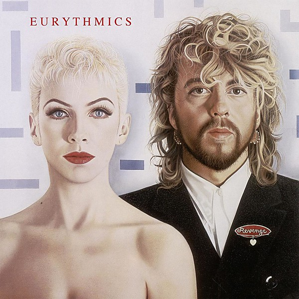

# Revenge

By **Eurythmics**

## Album Data

- **Catalog:** Beets
- **Format:** Digital, Album
- **Album:** Revenge
- **Artist:** Eurythmics
- **Albumartist:** Eurythmics
- **Genre:** Synthpop
- **MusicBrainz Album Artist ID:** 
- **MusicBrainz Album ID:** 
- **MusicBrainz Release Group ID:** 
- **Year:** 0000
- **Catalog #:** 
- **Label:** 
- **Total Tracks:** 00

## Album Tracks

### Track 01 - 01 - 01-Missionary Man

- **Artist:** Eurythmics
- **Format:** MP3
- **Genre:** Synthpop
- **Length:** 4:26
- **MusicBrainz Track ID:** 
- **Title:** 01 - 01-Missionary Man
- **Track:** 01
- **Year:** 0000

### Track 02 - 02 - 02-Thorn In My Side

- **Artist:** Eurythmics
- **Format:** MP3
- **Genre:** Synthpop
- **Length:** 4:18
- **MusicBrainz Track ID:** 
- **Title:** 02 - 02-Thorn In My Side
- **Track:** 02
- **Year:** 0000

### Track 03 - 03 - 03-When Tomorrow Comes

- **Artist:** Eurythmics
- **Format:** MP3
- **Genre:** Synthpop
- **Length:** 4:31
- **MusicBrainz Track ID:** 
- **Title:** 03 - 03-When Tomorrow Comes
- **Track:** 03
- **Year:** 0000

### Track 04 - 04 - 04-The Last Time

- **Artist:** Eurythmics
- **Format:** MP3
- **Genre:** Synthpop
- **Length:** 4:14
- **MusicBrainz Track ID:** 
- **Title:** 04 - 04-The Last Time
- **Track:** 04
- **Year:** 0000

### Track 05 - 05 - 05-The Miracle Of Love

- **Artist:** Eurythmics
- **Format:** MP3
- **Genre:** Synthpop
- **Length:** 5:12
- **MusicBrainz Track ID:** 
- **Title:** 05 - 05-The Miracle Of Love
- **Track:** 05
- **Year:** 0000

## See also

- [Vinyl: ](../../Vinyl/Eurythmics/Eurythmics.md)
- [Vinyl: Touch](../../Vinyl/Eurythmics/Touch.md)
