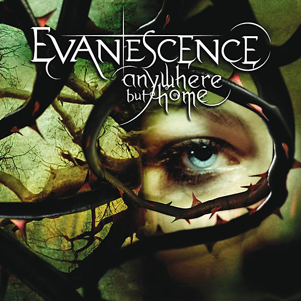

# Anywhere But Home [Live]

By **Evanescence**

## Album Data

- **Catalog:** Beets
- **Format:** Digital, Album
- **Album:** Anywhere But Home [Live]
- **Artist:** Evanescence
- **Albumartist:** Evanescence
- **Genre:** Alternative Rock
- **MusicBrainz Album Artist ID:** 
- **MusicBrainz Album ID:** 
- **MusicBrainz Release Group ID:** 
- **Year:** 2004
- **Catalog #:** 
- **Label:** 
- **Total Tracks:** 12

## Album Tracks

### Track 01 - Going Under

- **Artist:** Evanescence
- **Format:** AAC
- **Genre:** Gothic Rock
- **Length:** 3:33
- **MusicBrainz Track ID:** 
- **Title:** Going Under
- **Track:** 01
- **Year:** 2003

### Track 02 - Bring Me To Life

- **Artist:** Evanescence
- **Format:** AAC
- **Genre:** Gothic Rock
- **Length:** 3:55
- **MusicBrainz Track ID:** 
- **Title:** Bring Me To Life
- **Track:** 02
- **Year:** 2003

### Track 03 - Everybody's Fool

- **Artist:** Evanescence
- **Format:** AAC
- **Genre:** Gothic Rock
- **Length:** 3:15
- **MusicBrainz Track ID:** 
- **Title:** Everybody's Fool
- **Track:** 03
- **Year:** 2003

### Track 04 - My Immortal

- **Artist:** Evanescence
- **Format:** AAC
- **Genre:** Gothic Rock
- **Length:** 4:22
- **MusicBrainz Track ID:** 
- **Title:** My Immortal
- **Track:** 04
- **Year:** 2003

### Track 05 - Haunted

- **Artist:** Evanescence
- **Format:** AAC
- **Genre:** Gothic Rock
- **Length:** 3:06
- **MusicBrainz Track ID:** 
- **Title:** Haunted
- **Track:** 05
- **Year:** 2003

### Track 06 - Tourniquet

- **Artist:** Evanescence
- **Format:** AAC
- **Genre:** Nu Metal
- **Length:** 4:38
- **MusicBrainz Track ID:** 
- **Title:** Tourniquet
- **Track:** 06
- **Year:** 2003

### Track 07 - Imaginary

- **Artist:** Evanescence
- **Format:** AAC
- **Genre:** Gothic Rock
- **Length:** 4:17
- **MusicBrainz Track ID:** 
- **Title:** Imaginary
- **Track:** 07
- **Year:** 2003

### Track 08 - Taking Over Me

- **Artist:** Evanescence
- **Format:** AAC
- **Genre:** Nu Metal
- **Length:** 3:50
- **MusicBrainz Track ID:** 
- **Title:** Taking Over Me
- **Track:** 08
- **Year:** 2003

### Track 09 - Hello

- **Artist:** Evanescence
- **Format:** AAC
- **Genre:** Gothic Rock
- **Length:** 3:40
- **MusicBrainz Track ID:** 
- **Title:** Hello
- **Track:** 09
- **Year:** 2003

### Track 10 - My Last Breath

- **Artist:** Evanescence
- **Format:** AAC
- **Genre:** Gothic Rock
- **Length:** 4:07
- **MusicBrainz Track ID:** 
- **Title:** My Last Breath
- **Track:** 10
- **Year:** 2003

### Track 11 - Whisper

- **Artist:** Evanescence
- **Format:** AAC
- **Genre:** Symphonic Metal
- **Length:** 5:30
- **MusicBrainz Track ID:** 
- **Title:** Whisper
- **Track:** 11
- **Year:** 2003

### Track 12 - My Immortal (Band Version)

- **Artist:** Evanescence
- **Format:** AAC
- **Genre:** Gothic Rock
- **Length:** 4:33
- **MusicBrainz Track ID:** 
- **Title:** My Immortal (Band Version)
- **Track:** 12
- **Year:** 2003

### Track 12 - My Immortal [Band Version]

- **Artist:** Evanescence
- **Format:** ALAC
- **Genre:** Gothic Rock
- **Length:** 4:33
- **MusicBrainz Track ID:** 
- **Title:** My Immortal [Band Version]
- **Track:** 12
- **Year:** 2003

## See also

- [Anywhere but Home](Anywhere_but_Home.md)
- [Fallen](Fallen.md)
- [The Open Door](The_Open_Door.md)
- [Roon: Anywhere But Home (Live)](../../Roon/Evanescence/Anywhere_But_Home_Live.md)
- [Roon: Bring Me To Life (Synthesis)](../../Roon/Evanescence/Bring_Me_To_Life_Synthesis.md)
- [Roon: Evanescence (Deluxe Version)](../../Roon/Evanescence/Evanescence_Deluxe_Version.md)
- [Roon: Fallen](../../Roon/Evanescence/Fallen.md)
- [Roon: Synthesis](../../Roon/Evanescence/Synthesis.md)
- [Roon: The Open Door](../../Roon/Evanescence/The_Open_Door.md)
