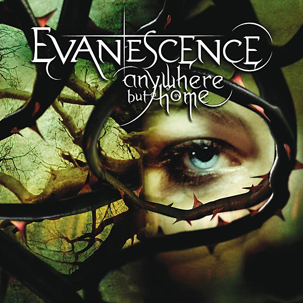

# Anywhere but Home

By **Evanescence**

## Album Data

- **Catalog:** Beets
- **Format:** Digital, Album
- **Album:** Anywhere but Home
- **Artist:** Evanescence
- **Albumartist:** Evanescence
- **Genre:** Gothic Rock
- **MusicBrainz Album Artist ID:** [f4a31f0a-51dd-4fa7-986d-3095c40c5ed9](https://musicbrainz.org/artist/f4a31f0a-51dd-4fa7-986d-3095c40c5ed9)
- **MusicBrainz Album ID:** [f13e4d11-4ad9-3e5f-9155-18c7023a2a9f](https://musicbrainz.org/release/f13e4d11-4ad9-3e5f-9155-18c7023a2a9f)
- **MusicBrainz Release Group ID:** [9ba659df-5814-32f6-b95f-02b738698e7c](https://musicbrainz.org/release-group/9ba659df-5814-32f6-b95f-02b738698e7c)
- **Year:** 2004
- **Catalog #:** 
- **Label:** 
- **Total Tracks:** 14

## Album Tracks

### Track 02 - Going Under [Live]

- **Artist:** Evanescence
- **Format:** ALAC
- **Genre:** Gothic Metal
- **Length:** 3:57
- **MusicBrainz Track ID:** 
- **Title:** Going Under [Live]
- **Track:** 02
- **Year:** 2004

### Track 03 - Taking Over Me [Live]

- **Artist:** Evanescence
- **Format:** ALAC
- **Genre:** Gothic Rock
- **Length:** 3:57
- **MusicBrainz Track ID:** 
- **Title:** Taking Over Me [Live]
- **Track:** 03
- **Year:** 2004

### Track 04 - Everybody's Fool [Live]

- **Artist:** Evanescence
- **Format:** ALAC
- **Genre:** Gothic Rock
- **Length:** 3:27
- **MusicBrainz Track ID:** 
- **Title:** Everybody's Fool [Live]
- **Track:** 04
- **Year:** 2004

### Track 08 - Breathe No More [Live]

- **Artist:** Evanescence
- **Format:** ALAC
- **Genre:** Rock
- **Length:** 3:33
- **MusicBrainz Track ID:** 
- **Title:** Breathe No More [Live]
- **Track:** 08
- **Year:** 2004

### Track 09 - My Immortal [Live]

- **Artist:** Evanescence
- **Format:** ALAC
- **Genre:** Rock
- **Length:** 4:38
- **MusicBrainz Track ID:** 
- **Title:** My Immortal [Live]
- **Track:** 09
- **Year:** 2004

### Track 14 - Missing

- **Artist:** Evanescence
- **Format:** ALAC
- **Genre:** Symphonic Metal
- **Length:** 4:16
- **MusicBrainz Track ID:** [71978c4a-730f-47c1-a5d3-eeb88332b7b6](https://musicbrainz.org/recording/71978c4a-730f-47c1-a5d3-eeb88332b7b6)
- **Title:** Missing
- **Track:** 14
- **Year:** 2004

## See also

- [Anywhere But Home [Live]](Anywhere_But_Home_[Live].md)
- [Fallen](Fallen.md)
- [The Open Door](The_Open_Door.md)
- [Roon: Anywhere But Home (Live)](../../Roon/Evanescence/Anywhere_But_Home_Live.md)
- [Roon: Bring Me To Life (Synthesis)](../../Roon/Evanescence/Bring_Me_To_Life_Synthesis.md)
- [Roon: Evanescence (Deluxe Version)](../../Roon/Evanescence/Evanescence_Deluxe_Version.md)
- [Roon: Fallen](../../Roon/Evanescence/Fallen.md)
- [Roon: Synthesis](../../Roon/Evanescence/Synthesis.md)
- [Roon: The Open Door](../../Roon/Evanescence/The_Open_Door.md)
