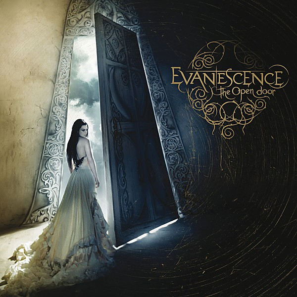

# The Open Door

By **Evanescence**

## Album Data

- **Catalog:** Beets
- **Format:** Digital, Album
- **Album:** The Open Door
- **Artist:** Evanescence
- **Albumartist:** Evanescence
- **Genre:** Gothic Rock
- **MusicBrainz Album Artist ID:** [f4a31f0a-51dd-4fa7-986d-3095c40c5ed9](https://musicbrainz.org/artist/f4a31f0a-51dd-4fa7-986d-3095c40c5ed9)
- **MusicBrainz Album ID:** [92aab8e8-04f5-3c41-b153-4b2aece1ded2](https://musicbrainz.org/release/92aab8e8-04f5-3c41-b153-4b2aece1ded2)
- **MusicBrainz Release Group ID:** [e7e5eaa6-baf3-3539-b163-759431597f3a](https://musicbrainz.org/release-group/e7e5eaa6-baf3-3539-b163-759431597f3a)
- **Year:** 2006
- **Catalog #:** 
- **Label:** Wind‐up
- **Total Tracks:** 13

## Album Tracks

### Track 01 - Sweet Sacrifice

- **Artist:** Evanescence
- **Format:** AAC
- **Genre:** Gothic Rock
- **Length:** 3:05
- **MusicBrainz Track ID:** [51bcdba1-ab49-478a-a8ef-b279573bdee5](https://musicbrainz.org/recording/51bcdba1-ab49-478a-a8ef-b279573bdee5)
- **Title:** Sweet Sacrifice
- **Track:** 01
- **Year:** 2006

### Track 02 - Call Me When You’re Sober

- **Artist:** Evanescence
- **Format:** AAC
- **Genre:** Gothic Rock
- **Length:** 3:34
- **MusicBrainz Track ID:** [778237a1-7465-4a62-924a-64fe66dfa212](https://musicbrainz.org/recording/778237a1-7465-4a62-924a-64fe66dfa212)
- **Title:** Call Me When You’re Sober
- **Track:** 02
- **Year:** 2006

### Track 03 - Weight of the World

- **Artist:** Evanescence
- **Format:** AAC
- **Genre:** Gothic Rock
- **Length:** 3:38
- **MusicBrainz Track ID:** [07de860f-6c79-4147-91e0-a3d5afb6f6f2](https://musicbrainz.org/recording/07de860f-6c79-4147-91e0-a3d5afb6f6f2)
- **Title:** Weight of the World
- **Track:** 03
- **Year:** 2006

### Track 04 - Lithium

- **Artist:** Evanescence
- **Format:** AAC
- **Genre:** Gothic Rock
- **Length:** 3:44
- **MusicBrainz Track ID:** [28e7ee09-f96c-463a-b744-007e94c83a28](https://musicbrainz.org/recording/28e7ee09-f96c-463a-b744-007e94c83a28)
- **Title:** Lithium
- **Track:** 04
- **Year:** 2006

### Track 05 - Cloud Nine

- **Artist:** Evanescence
- **Format:** AAC
- **Genre:** Symphonic Metal
- **Length:** 4:22
- **MusicBrainz Track ID:** [ae512605-bf61-456f-bfd4-465135f17733](https://musicbrainz.org/recording/ae512605-bf61-456f-bfd4-465135f17733)
- **Title:** Cloud Nine
- **Track:** 05
- **Year:** 2006

### Track 06 - Snow White Queen

- **Artist:** Evanescence
- **Format:** AAC
- **Genre:** Symphonic Metal
- **Length:** 4:22
- **MusicBrainz Track ID:** [45420304-02b3-42ac-8de2-b72a478e5577](https://musicbrainz.org/recording/45420304-02b3-42ac-8de2-b72a478e5577)
- **Title:** Snow White Queen
- **Track:** 06
- **Year:** 2006

### Track 07 - Lacrymosa

- **Artist:** Evanescence
- **Format:** AAC
- **Genre:** Symphonic Metal
- **Length:** 3:37
- **MusicBrainz Track ID:** [ec2bfed9-5d09-4373-9144-fb065d01b1d1](https://musicbrainz.org/recording/ec2bfed9-5d09-4373-9144-fb065d01b1d1)
- **Title:** Lacrymosa
- **Track:** 07
- **Year:** 2006

### Track 08 - Like You

- **Artist:** Evanescence
- **Format:** AAC
- **Genre:** Symphonic Metal
- **Length:** 4:17
- **MusicBrainz Track ID:** [25f1b322-35f2-4d2a-87ac-3f65f6b833a4](https://musicbrainz.org/recording/25f1b322-35f2-4d2a-87ac-3f65f6b833a4)
- **Title:** Like You
- **Track:** 08
- **Year:** 2006

### Track 09 - Lose Control

- **Artist:** Evanescence
- **Format:** AAC
- **Genre:** Symphonic Metal
- **Length:** 4:50
- **MusicBrainz Track ID:** [284a4311-e678-4639-917a-9fcbaaca2284](https://musicbrainz.org/recording/284a4311-e678-4639-917a-9fcbaaca2284)
- **Title:** Lose Control
- **Track:** 09
- **Year:** 2006

### Track 10 - The Only One

- **Artist:** Evanescence
- **Format:** AAC
- **Genre:** Gothic Rock
- **Length:** 4:40
- **MusicBrainz Track ID:** [4b7fcd2e-1fba-4b01-951a-9343da9a2f76](https://musicbrainz.org/recording/4b7fcd2e-1fba-4b01-951a-9343da9a2f76)
- **Title:** The Only One
- **Track:** 10
- **Year:** 2006

### Track 11 - Your Star

- **Artist:** Evanescence
- **Format:** AAC
- **Genre:** Symphonic Metal
- **Length:** 4:43
- **MusicBrainz Track ID:** [4140fec8-98d0-4eeb-8a92-c8279f2797bc](https://musicbrainz.org/recording/4140fec8-98d0-4eeb-8a92-c8279f2797bc)
- **Title:** Your Star
- **Track:** 11
- **Year:** 2006

### Track 12 - All That I’m Living For

- **Artist:** Evanescence
- **Format:** AAC
- **Genre:** Gothic Rock
- **Length:** 3:48
- **MusicBrainz Track ID:** [a376e527-b7c7-465a-8588-272aa9f49c44](https://musicbrainz.org/recording/a376e527-b7c7-465a-8588-272aa9f49c44)
- **Title:** All That I’m Living For
- **Track:** 12
- **Year:** 2006

### Track 13 - Good Enough

- **Artist:** Evanescence
- **Format:** AAC
- **Genre:** Gothic Rock
- **Length:** 5:31
- **MusicBrainz Track ID:** [4e0f56a4-bdd8-4072-9027-768af8ad9b85](https://musicbrainz.org/recording/4e0f56a4-bdd8-4072-9027-768af8ad9b85)
- **Title:** Good Enough
- **Track:** 13
- **Year:** 2006

## See also

- [Anywhere But Home [Live]](Anywhere_But_Home_[Live].md)
- [Anywhere but Home](Anywhere_but_Home.md)
- [Fallen](Fallen.md)
- [Roon: Anywhere But Home (Live)](../../Roon/Evanescence/Anywhere_But_Home_Live.md)
- [Roon: Bring Me To Life (Synthesis)](../../Roon/Evanescence/Bring_Me_To_Life_Synthesis.md)
- [Roon: Evanescence (Deluxe Version)](../../Roon/Evanescence/Evanescence_Deluxe_Version.md)
- [Roon: Fallen](../../Roon/Evanescence/Fallen.md)
- [Roon: Synthesis](../../Roon/Evanescence/Synthesis.md)
- [Roon: The Open Door](../../Roon/Evanescence/The_Open_Door.md)
