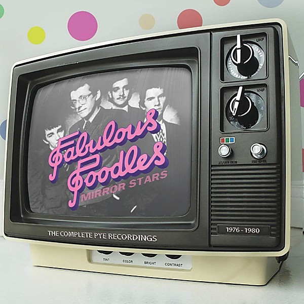

# Mirror Stars

By **Fabulous Poodles**

## Album Data

- **Catalog:** Beets
- **Format:** Digital, Album
- **Album:** Mirror Stars
- **Artist:** Fabulous Poodles
- **Albumartist:** Fabulous Poodles
- **Genre:** Grunge
- **MusicBrainz Album Artist ID:** [bf10b951-004a-47e9-8fb2-136dbab03f9c](https://musicbrainz.org/artist/bf10b951-004a-47e9-8fb2-136dbab03f9c)
- **MusicBrainz Album ID:** [48db4dc8-1e4d-4ed9-b2bd-76436152f4c1](https://musicbrainz.org/release/48db4dc8-1e4d-4ed9-b2bd-76436152f4c1)
- **MusicBrainz Release Group ID:** [3a1841a4-169d-36e1-8189-e8b0db78c6fd](https://musicbrainz.org/release-group/3a1841a4-169d-36e1-8189-e8b0db78c6fd)
- **Year:** 1978
- **Catalog #:** JE 36256
- **Label:** Epic
- **Total Tracks:** 11

## Album Tracks

### Track 01 - Man With Money

- **Artist:** Fabulous Poodles
- **Format:** MP3
- **Genre:** Grunge
- **Length:** 2:34
- **MusicBrainz Track ID:** [9bce053c-8028-413a-872a-555f08719981](https://musicbrainz.org/recording/9bce053c-8028-413a-872a-555f08719981)
- **Title:** Man With Money
- **Track:** 01
- **Year:** 1979

### Track 02 - Bionic Man

- **Artist:** Fabulous Poodles
- **Format:** MP3
- **Genre:** New Wave
- **Length:** 4:33
- **MusicBrainz Track ID:** [7d4a1cae-163b-4c74-9d90-52657104f195](https://musicbrainz.org/recording/7d4a1cae-163b-4c74-9d90-52657104f195)
- **Title:** Bionic Man
- **Track:** 02
- **Year:** 1979

### Track 03 - Any Port In The Storm

- **Artist:** Fabulous Poodles
- **Format:** MP3
- **Genre:** Grunge
- **Length:** 2:47
- **MusicBrainz Track ID:** [b68d380b-4223-4775-bed0-b5667fc1d9e7](https://musicbrainz.org/recording/b68d380b-4223-4775-bed0-b5667fc1d9e7)
- **Title:** Any Port In The Storm
- **Track:** 03
- **Year:** 1979

### Track 04 - (Hollywood) Dragnet

- **Artist:** Fabulous Poodles
- **Format:** MP3
- **Genre:** Grunge
- **Length:** 4:26
- **MusicBrainz Track ID:** [efd3e718-972c-436d-b98f-24e222ed6d18](https://musicbrainz.org/recording/efd3e718-972c-436d-b98f-24e222ed6d18)
- **Title:** (Hollywood) Dragnet
- **Track:** 04
- **Year:** 1979

### Track 05 - Bike Blood

- **Artist:** Fabulous Poodles
- **Format:** MP3
- **Genre:** Grunge
- **Length:** 3:30
- **MusicBrainz Track ID:** [23a49057-5995-4039-bba9-0094ea59b83f](https://musicbrainz.org/recording/23a49057-5995-4039-bba9-0094ea59b83f)
- **Title:** Bike Blood
- **Track:** 05
- **Year:** 1979

### Track 06 - Cossack Cowboy

- **Artist:** Fabulous Poodles
- **Format:** MP3
- **Genre:** Grunge
- **Length:** 4:13
- **MusicBrainz Track ID:** [3cfbe8f4-8273-4c8b-99aa-1ff31fe63b4f](https://musicbrainz.org/recording/3cfbe8f4-8273-4c8b-99aa-1ff31fe63b4f)
- **Title:** Cossack Cowboy
- **Track:** 06
- **Year:** 1979

### Track 07 - Anna Rexia

- **Artist:** Fabulous Poodles
- **Format:** MP3
- **Genre:** New Wave
- **Length:** 3:02
- **MusicBrainz Track ID:** [c94b737c-1ea1-40ec-89d6-c741a9617172](https://musicbrainz.org/recording/c94b737c-1ea1-40ec-89d6-c741a9617172)
- **Title:** Anna Rexia
- **Track:** 07
- **Year:** 1979

### Track 08 - You Wouldn't Listen

- **Artist:** Fabulous Poodles
- **Format:** MP3
- **Genre:** New Wave
- **Length:** 3:16
- **MusicBrainz Track ID:** [2bf4110e-2e60-4786-ad98-213e6483709f](https://musicbrainz.org/recording/2bf4110e-2e60-4786-ad98-213e6483709f)
- **Title:** You Wouldn't Listen
- **Track:** 08
- **Year:** 1979

### Track 09 - Suicide Bridge

- **Artist:** Fabulous Poodles
- **Format:** MP3
- **Genre:** New Wave
- **Length:** 3:38
- **MusicBrainz Track ID:** [391537a5-3785-4849-8e5c-e4bad724a4c3](https://musicbrainz.org/recording/391537a5-3785-4849-8e5c-e4bad724a4c3)
- **Title:** Suicide Bridge
- **Track:** 09
- **Year:** 1979

### Track 10 - Pink City Twist

- **Artist:** Fabulous Poodles
- **Format:** MP3
- **Genre:** New Wave
- **Length:** 2:24
- **MusicBrainz Track ID:** [3c285c7c-f57b-4bcd-834b-af783fc67eca](https://musicbrainz.org/recording/3c285c7c-f57b-4bcd-834b-af783fc67eca)
- **Title:** Pink City Twist
- **Track:** 10
- **Year:** 1979

### Track 11 - Vampire Rock

- **Artist:** Fabulous Poodles
- **Format:** MP3
- **Genre:** Grunge
- **Length:** 3:37
- **MusicBrainz Track ID:** [1541688f-9d9e-4e7d-9e03-5e1e5893f356](https://musicbrainz.org/recording/1541688f-9d9e-4e7d-9e03-5e1e5893f356)
- **Title:** Vampire Rock
- **Track:** 11
- **Year:** 1979

## See also

- [Think Pink](Think_Pink.md)
