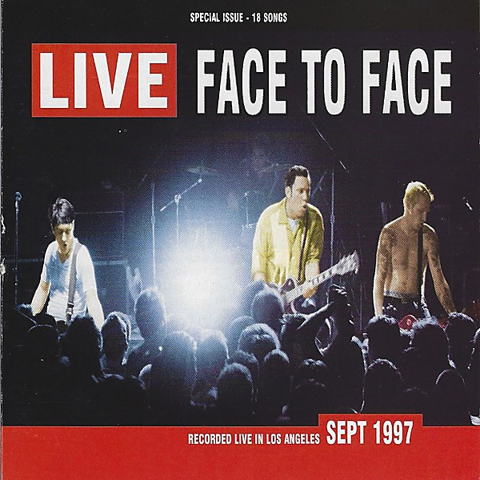

# Live

By **face to face**

## Album Data

- **Catalog:** Beets
- **Format:** Digital, Album
- **Album:** Live
- **Artist:** Face To Face
- **Albumartist:** face to face
- **Genre:** Skate Punk
- **MusicBrainz Album Artist ID:** [8a3be197-2afd-4e80-b795-17f9df3aefac](https://musicbrainz.org/artist/8a3be197-2afd-4e80-b795-17f9df3aefac)
- **MusicBrainz Album ID:** [99adaa36-341c-4e20-b94c-72744312e84c](https://musicbrainz.org/release/99adaa36-341c-4e20-b94c-72744312e84c)
- **MusicBrainz Release Group ID:** [52f85505-c3c5-356f-9d06-a06de24b94fa](https://musicbrainz.org/release-group/52f85505-c3c5-356f-9d06-a06de24b94fa)
- **Year:** 1998
- **Catalog #:** LL03
- **Label:** Lady Luck Records
- **Total Tracks:** 18

## Album Tracks

### Track 01 - Walk the Walk

- **Artist:** face to face
- **Format:** ALAC
- **Genre:** Skate Punk
- **Length:** 3:27
- **MusicBrainz Track ID:** [599b5d81-3565-40e6-a433-795010fcb423](https://musicbrainz.org/recording/599b5d81-3565-40e6-a433-795010fcb423)
- **Title:** Walk the Walk
- **Track:** 01
- **Year:** 1998

### Track 02 - I Want

- **Artist:** face to face
- **Format:** ALAC
- **Genre:** Skate Punk
- **Length:** 2:50
- **MusicBrainz Track ID:** [64b358a9-bcdc-47df-89df-d6586d777dab](https://musicbrainz.org/recording/64b358a9-bcdc-47df-89df-d6586d777dab)
- **Title:** I Want
- **Track:** 02
- **Year:** 1998

### Track 03 - Blind

- **Artist:** face to face
- **Format:** ALAC
- **Genre:** Skate Punk
- **Length:** 2:30
- **MusicBrainz Track ID:** [78a25999-b7e8-4412-b718-41150d9b18f8](https://musicbrainz.org/recording/78a25999-b7e8-4412-b718-41150d9b18f8)
- **Title:** Blind
- **Track:** 03
- **Year:** 1998

### Track 04 - I’m Not Afraid

- **Artist:** face to face
- **Format:** ALAC
- **Genre:** Skate Punk
- **Length:** 2:35
- **MusicBrainz Track ID:** [e819c716-ae36-46d2-8715-497ea166a120](https://musicbrainz.org/recording/e819c716-ae36-46d2-8715-497ea166a120)
- **Title:** I’m Not Afraid
- **Track:** 04
- **Year:** 1998

### Track 05 - It’s Not Over

- **Artist:** face to face
- **Format:** ALAC
- **Genre:** Skate Punk
- **Length:** 2:23
- **MusicBrainz Track ID:** [cc55c7cb-a41b-412a-9b60-1fdb630566c0](https://musicbrainz.org/recording/cc55c7cb-a41b-412a-9b60-1fdb630566c0)
- **Title:** It’s Not Over
- **Track:** 05
- **Year:** 1998

### Track 06 - I Won’t Lie Down

- **Artist:** face to face
- **Format:** ALAC
- **Genre:** Skate Punk
- **Length:** 3:09
- **MusicBrainz Track ID:** [1c99dd07-35a4-4368-a907-9a2a1b8ecc7e](https://musicbrainz.org/recording/1c99dd07-35a4-4368-a907-9a2a1b8ecc7e)
- **Title:** I Won’t Lie Down
- **Track:** 06
- **Year:** 1998

### Track 07 - You Lied

- **Artist:** face to face
- **Format:** ALAC
- **Genre:** Punk Rock
- **Length:** 3:18
- **MusicBrainz Track ID:** [09a9be49-33e0-4642-8467-5ae99b852527](https://musicbrainz.org/recording/09a9be49-33e0-4642-8467-5ae99b852527)
- **Title:** You Lied
- **Track:** 07
- **Year:** 1998

### Track 08 - Ordinary

- **Artist:** face to face
- **Format:** ALAC
- **Genre:** Punk Rock
- **Length:** 3:15
- **MusicBrainz Track ID:** [0bac3e45-901b-4298-8c2b-a75f4133ba38](https://musicbrainz.org/recording/0bac3e45-901b-4298-8c2b-a75f4133ba38)
- **Title:** Ordinary
- **Track:** 08
- **Year:** 1998

### Track 09 - I’m Trying

- **Artist:** face to face
- **Format:** ALAC
- **Genre:** Skate Punk
- **Length:** 3:25
- **MusicBrainz Track ID:** [451421be-e27d-44ae-87fc-3f911cc1ea5a](https://musicbrainz.org/recording/451421be-e27d-44ae-87fc-3f911cc1ea5a)
- **Title:** I’m Trying
- **Track:** 09
- **Year:** 1998

### Track 10 - Telling Them

- **Artist:** face to face
- **Format:** ALAC
- **Genre:** Skate Punk
- **Length:** 3:03
- **MusicBrainz Track ID:** [0ff34ca3-63b6-49bc-aee0-030c93919c2f](https://musicbrainz.org/recording/0ff34ca3-63b6-49bc-aee0-030c93919c2f)
- **Title:** Telling Them
- **Track:** 10
- **Year:** 1998

### Track 11 - Don’t Turn Away

- **Artist:** face to face
- **Format:** ALAC
- **Genre:** Skate Punk
- **Length:** 2:49
- **MusicBrainz Track ID:** [2f20dd16-2073-4235-a235-fff9e762bed9](https://musicbrainz.org/recording/2f20dd16-2073-4235-a235-fff9e762bed9)
- **Title:** Don’t Turn Away
- **Track:** 11
- **Year:** 1998

### Track 12 - A‐OK

- **Artist:** face to face
- **Format:** ALAC
- **Genre:** Pop
- **Length:** 3:16
- **MusicBrainz Track ID:** [78db350a-749a-4f31-b216-3ba901118588](https://musicbrainz.org/recording/78db350a-749a-4f31-b216-3ba901118588)
- **Title:** A‐OK
- **Track:** 12
- **Year:** 1998

### Track 13 - Complicated

- **Artist:** face to face
- **Format:** ALAC
- **Genre:** Punk Rock
- **Length:** 4:12
- **MusicBrainz Track ID:** [cc7ae121-6283-4724-b2bd-f9a192ca0d90](https://musicbrainz.org/recording/cc7ae121-6283-4724-b2bd-f9a192ca0d90)
- **Title:** Complicated
- **Track:** 13
- **Year:** 1998

### Track 14 - Not for Free

- **Artist:** face to face
- **Format:** ALAC
- **Genre:** Skate Punk
- **Length:** 2:06
- **MusicBrainz Track ID:** [78ad01fa-86ab-411c-a42f-eff9a736cb7a](https://musicbrainz.org/recording/78ad01fa-86ab-411c-a42f-eff9a736cb7a)
- **Title:** Not for Free
- **Track:** 14
- **Year:** 1998

### Track 15 - Pastel

- **Artist:** face to face
- **Format:** ALAC
- **Genre:** Punk Rock
- **Length:** 3:17
- **MusicBrainz Track ID:** [55633e81-3bfb-4ed7-bb31-4475bf9cd839](https://musicbrainz.org/recording/55633e81-3bfb-4ed7-bb31-4475bf9cd839)
- **Title:** Pastel
- **Track:** 15
- **Year:** 1998

### Track 16 - Do You Care?

- **Artist:** face to face
- **Format:** ALAC
- **Genre:** Punk Rock
- **Length:** 2:46
- **MusicBrainz Track ID:** [ca2043b9-7981-45d4-8e7d-47a75ee12d81](https://musicbrainz.org/recording/ca2043b9-7981-45d4-8e7d-47a75ee12d81)
- **Title:** Do You Care?
- **Track:** 16
- **Year:** 1998

### Track 17 - Dissension

- **Artist:** face to face
- **Format:** ALAC
- **Genre:** Skate Punk
- **Length:** 2:22
- **MusicBrainz Track ID:** [4d2d92a4-0549-48b9-b0a9-c2d09b12bb4a](https://musicbrainz.org/recording/4d2d92a4-0549-48b9-b0a9-c2d09b12bb4a)
- **Title:** Dissension
- **Track:** 17
- **Year:** 1998

### Track 18 - You’ve Done Nothing

- **Artist:** face to face
- **Format:** ALAC
- **Genre:** Skate Punk
- **Length:** 2:09
- **MusicBrainz Track ID:** [fe58109a-67df-429f-b18e-6c6d14b908aa](https://musicbrainz.org/recording/fe58109a-67df-429f-b18e-6c6d14b908aa)
- **Title:** You’ve Done Nothing
- **Track:** 18
- **Year:** 1998

