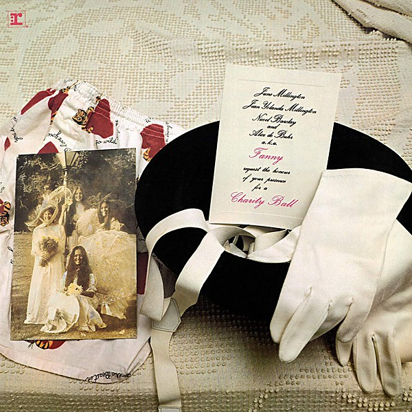

# Charity Ball

By **Fanny**

## Album Data

- **Catalog:** Beets
- **Format:** Digital, Album
- **Album:** Charity Ball
- **Artist:** Fanny
- **Albumartist:** Fanny
- **Genre:** Idm
- **MusicBrainz Album Artist ID:** [680ed212-93dc-4fd2-8d51-8d560060bd86](https://musicbrainz.org/artist/680ed212-93dc-4fd2-8d51-8d560060bd86)
- **MusicBrainz Album ID:** [be85e089-7445-4ba7-b9da-1fc0f47e4eb7](https://musicbrainz.org/release/be85e089-7445-4ba7-b9da-1fc0f47e4eb7)
- **MusicBrainz Release Group ID:** [abf381dd-a70e-3b7e-a5d2-c22fb5277775](https://musicbrainz.org/release-group/abf381dd-a70e-3b7e-a5d2-c22fb5277775)
- **Year:** 1971
- **Catalog #:** RGM-0118
- **Label:** Real Gone Music
- **Total Tracks:** 11

## Album Tracks

### Track 01 - Come and Hold Me

- **Artist:** Fanny
- **Format:** MP3
- **Genre:** Idm
- **Length:** 2:46
- **MusicBrainz Track ID:** [9b2152d1-a51b-464c-bbe9-ccb8df5e822a](https://musicbrainz.org/recording/9b2152d1-a51b-464c-bbe9-ccb8df5e822a)
- **Title:** Come and Hold Me
- **Track:** 01
- **Year:** 2013

### Track 02 - I Just Realized

- **Artist:** Fanny
- **Format:** MP3
- **Genre:** Rock
- **Length:** 4:00
- **MusicBrainz Track ID:** [12996693-d59b-4d10-a714-4d669326ef7d](https://musicbrainz.org/recording/12996693-d59b-4d10-a714-4d669326ef7d)
- **Title:** I Just Realized
- **Track:** 02
- **Year:** 2013

### Track 03 - Candlelighter Man

- **Artist:** Fanny
- **Format:** MP3
- **Genre:** Idm
- **Length:** 3:35
- **MusicBrainz Track ID:** [c35681c0-55d5-41c7-87fe-3b75aaee3a6e](https://musicbrainz.org/recording/c35681c0-55d5-41c7-87fe-3b75aaee3a6e)
- **Title:** Candlelighter Man
- **Track:** 03
- **Year:** 2013

### Track 04 - Conversation With a Cop

- **Artist:** Fanny
- **Format:** MP3
- **Genre:** Rock
- **Length:** 3:10
- **MusicBrainz Track ID:** [cae8bc22-644f-4205-94d6-e9c634d21940](https://musicbrainz.org/recording/cae8bc22-644f-4205-94d6-e9c634d21940)
- **Title:** Conversation With a Cop
- **Track:** 04
- **Year:** 2013

### Track 05 - Badge

- **Artist:** Fanny
- **Format:** MP3
- **Genre:** Rock
- **Length:** 3:01
- **MusicBrainz Track ID:** [c25af905-4bea-4e0f-9ff1-1d3943585997](https://musicbrainz.org/recording/c25af905-4bea-4e0f-9ff1-1d3943585997)
- **Title:** Badge
- **Track:** 05
- **Year:** 2013

### Track 06 - Changing Horses

- **Artist:** Fanny
- **Format:** MP3
- **Genre:** Idm
- **Length:** 3:48
- **MusicBrainz Track ID:** [6f3dc9d0-f49e-4294-aa06-ca1b38f56fca](https://musicbrainz.org/recording/6f3dc9d0-f49e-4294-aa06-ca1b38f56fca)
- **Title:** Changing Horses
- **Track:** 06
- **Year:** 2013

### Track 07 - Bitter Wine

- **Artist:** Fanny
- **Format:** MP3
- **Genre:** Idm
- **Length:** 3:17
- **MusicBrainz Track ID:** [c8d41593-4a49-440b-a6f1-c165dcfe8f68](https://musicbrainz.org/recording/c8d41593-4a49-440b-a6f1-c165dcfe8f68)
- **Title:** Bitter Wine
- **Track:** 07
- **Year:** 2013

### Track 08 - Take a Message to the Captain

- **Artist:** Fanny
- **Format:** MP3
- **Genre:** Idm
- **Length:** 3:31
- **MusicBrainz Track ID:** [1cad261a-5827-4fc1-9bb8-96027032e0c6](https://musicbrainz.org/recording/1cad261a-5827-4fc1-9bb8-96027032e0c6)
- **Title:** Take a Message to the Captain
- **Track:** 08
- **Year:** 2013

### Track 09 - It Takes a Lot of Good Lovin'

- **Artist:** Fanny
- **Format:** MP3
- **Genre:** Rock
- **Length:** 4:26
- **MusicBrainz Track ID:** [a53dbe5c-64fa-47ff-8b28-1d313f5f3803](https://musicbrainz.org/recording/a53dbe5c-64fa-47ff-8b28-1d313f5f3803)
- **Title:** It Takes a Lot of Good Lovin'
- **Track:** 09
- **Year:** 2013

### Track 10 - Shade Me

- **Artist:** Fanny
- **Format:** MP3
- **Genre:** Idm
- **Length:** 4:39
- **MusicBrainz Track ID:** [c4940798-b30d-472b-b876-430101c081b5](https://musicbrainz.org/recording/c4940798-b30d-472b-b876-430101c081b5)
- **Title:** Shade Me
- **Track:** 10
- **Year:** 2013

### Track 11 - Seven Roads

- **Artist:** Fanny
- **Format:** MP3
- **Genre:** Idm
- **Length:** 4:19
- **MusicBrainz Track ID:** [6f53be8c-d528-49a3-a636-4b1014391611](https://musicbrainz.org/recording/6f53be8c-d528-49a3-a636-4b1014391611)
- **Title:** Seven Roads
- **Track:** 11
- **Year:** 2013

## See also

- [Fanny Hill](Fanny_Hill.md)
- [Fanny](Fanny.md)
- [Mother's Pride](Mothers_Pride.md)
- [Roon: Charity Ball](../../Roon/Fanny/Charity_Ball.md)
- [Roon: Fanny Hill](../../Roon/Fanny/Fanny_Hill.md)
- [Roon: Fanny](../../Roon/Fanny/Fanny.md)
- [Roon: First Time In A Long Time](../../Roon/Fanny/First_Time_In_A_Long_Time-_The_Reprise_Recordings.md)
- [Roon: Mothers Pride](../../Roon/Fanny/Mothers_Pride.md)
- [Roon: Rock And Roll Survivors](../../Roon/Fanny/Rock_And_Roll_Survivors.md)
