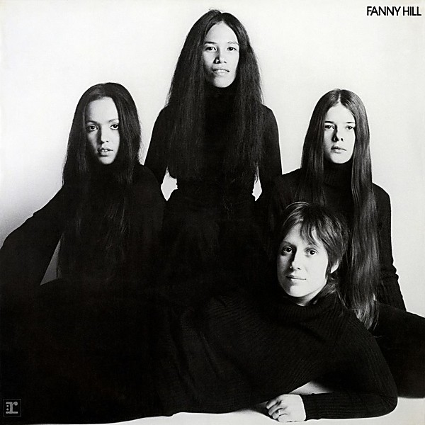

# Fanny Hill

By **Fanny**

## Album Data

- **Catalog:** Beets
- **Format:** Digital, Album
- **Album:** Fanny Hill
- **Artist:** Fanny
- **Albumartist:** Fanny
- **Genre:** Rock
- **MusicBrainz Album Artist ID:** [680ed212-93dc-4fd2-8d51-8d560060bd86](https://musicbrainz.org/artist/680ed212-93dc-4fd2-8d51-8d560060bd86)
- **MusicBrainz Album ID:** [4676564c-9d0b-470d-a4af-89cc75212c0b](https://musicbrainz.org/release/4676564c-9d0b-470d-a4af-89cc75212c0b)
- **MusicBrainz Release Group ID:** [44def5c2-fa69-478c-92b9-0228906453c1](https://musicbrainz.org/release-group/44def5c2-fa69-478c-92b9-0228906453c1)
- **Year:** 2019
- **Catalog #:** MS 2137
- **Label:** Reprise Records
- **Total Tracks:** 13

## Album Tracks

### Track 01 - Last Night I Had a Dream

- **Artist:** Fanny
- **Format:** AAC
- **Genre:** Idm
- **Length:** 3:55
- **MusicBrainz Track ID:** [95339592-b5ca-41c6-8b13-1ca15a8fc57e](https://musicbrainz.org/recording/95339592-b5ca-41c6-8b13-1ca15a8fc57e)
- **Title:** Last Night I Had a Dream
- **Track:** 01
- **Year:** 1973

### Track 02 - Long Road Home

- **Artist:** Fanny
- **Format:** AAC
- **Genre:** Idm
- **Length:** 2:55
- **MusicBrainz Track ID:** [d76a0553-ccff-40d2-9380-2aa22b1e92a7](https://musicbrainz.org/recording/d76a0553-ccff-40d2-9380-2aa22b1e92a7)
- **Title:** Long Road Home
- **Track:** 02
- **Year:** 1973

### Track 03 - Old Hat

- **Artist:** Fanny
- **Format:** AAC
- **Genre:** Idm
- **Length:** 4:14
- **MusicBrainz Track ID:** [cc508258-9314-46e2-9672-7f2ee531ea5b](https://musicbrainz.org/recording/cc508258-9314-46e2-9672-7f2ee531ea5b)
- **Title:** Old Hat
- **Track:** 03
- **Year:** 1973

### Track 04 - Solid Gold

- **Artist:** Fanny
- **Format:** AAC
- **Genre:** Idm
- **Length:** 2:54
- **MusicBrainz Track ID:** [1bc85430-f17b-4a28-a353-e884ab31ff1f](https://musicbrainz.org/recording/1bc85430-f17b-4a28-a353-e884ab31ff1f)
- **Title:** Solid Gold
- **Track:** 04
- **Year:** 1973

### Track 05 - Is It Really You?

- **Artist:** Fanny
- **Format:** AAC
- **Genre:** Idm
- **Length:** 5:23
- **MusicBrainz Track ID:** [642d79d5-0d53-4d0d-8a67-6a5510a0c9b0](https://musicbrainz.org/recording/642d79d5-0d53-4d0d-8a67-6a5510a0c9b0)
- **Title:** Is It Really You?
- **Track:** 05
- **Year:** 1973

### Track 06 - All Mine

- **Artist:** Fanny
- **Format:** AAC
- **Genre:** Idm
- **Length:** 3:24
- **MusicBrainz Track ID:** [0d646842-4be2-4555-96a5-c0d0ebc8a00f](https://musicbrainz.org/recording/0d646842-4be2-4555-96a5-c0d0ebc8a00f)
- **Title:** All Mine
- **Track:** 06
- **Year:** 1973

### Track 07 - Summer Song

- **Artist:** Fanny
- **Format:** AAC
- **Genre:** Rock
- **Length:** 3:11
- **MusicBrainz Track ID:** [e77935f9-7b30-40f1-9dcb-4e6a6f718a1f](https://musicbrainz.org/recording/e77935f9-7b30-40f1-9dcb-4e6a6f718a1f)
- **Title:** Summer Song
- **Track:** 07
- **Year:** 1973

### Track 08 - Polecat Blues

- **Artist:** Fanny
- **Format:** AAC
- **Genre:** Idm
- **Length:** 3:14
- **MusicBrainz Track ID:** [51f24531-971d-4c00-94c0-f09894c1f829](https://musicbrainz.org/recording/51f24531-971d-4c00-94c0-f09894c1f829)
- **Title:** Polecat Blues
- **Track:** 08
- **Year:** 1973

### Track 09 - Beside Myself

- **Artist:** Fanny
- **Format:** AAC
- **Genre:** Idm
- **Length:** 3:54
- **MusicBrainz Track ID:** [9b1615bf-102f-482e-94e6-d33192d0b57a](https://musicbrainz.org/recording/9b1615bf-102f-482e-94e6-d33192d0b57a)
- **Title:** Beside Myself
- **Track:** 09
- **Year:** 1973

### Track 10 - Regular Guy

- **Artist:** Fanny
- **Format:** AAC
- **Genre:** Idm
- **Length:** 2:25
- **MusicBrainz Track ID:** [22c5f9c2-13c5-4cef-8da4-692e1477a5cb](https://musicbrainz.org/recording/22c5f9c2-13c5-4cef-8da4-692e1477a5cb)
- **Title:** Regular Guy
- **Track:** 10
- **Year:** 1973

### Track 11 - I Need You Need Me

- **Artist:** Fanny
- **Format:** AAC
- **Genre:** Idm
- **Length:** 4:55
- **MusicBrainz Track ID:** [d39f88e6-2361-4244-b4b8-1532caa40ede](https://musicbrainz.org/recording/d39f88e6-2361-4244-b4b8-1532caa40ede)
- **Title:** I Need You Need Me
- **Track:** 11
- **Year:** 1973

### Track 12 - Feelings

- **Artist:** Fanny
- **Format:** AAC
- **Genre:** Idm
- **Length:** 1:58
- **MusicBrainz Track ID:** [3d53d6cc-af3f-404f-b8b8-0834785d8754](https://musicbrainz.org/recording/3d53d6cc-af3f-404f-b8b8-0834785d8754)
- **Title:** Feelings
- **Track:** 12
- **Year:** 1973

### Track 13 - I'm Satisfied

- **Artist:** Fanny
- **Format:** AAC
- **Genre:** Idm
- **Length:** 3:08
- **MusicBrainz Track ID:** [d290ad7b-fa3e-4456-8f8c-ae3bde1e95ba](https://musicbrainz.org/recording/d290ad7b-fa3e-4456-8f8c-ae3bde1e95ba)
- **Title:** I'm Satisfied
- **Track:** 13
- **Year:** 1973

## See also

- [Charity Ball](Charity_Ball.md)
- [Fanny](Fanny.md)
- [Mother's Pride](Mothers_Pride.md)
- [Roon: Charity Ball](../../Roon/Fanny/Charity_Ball.md)
- [Roon: Fanny Hill](../../Roon/Fanny/Fanny_Hill.md)
- [Roon: Fanny](../../Roon/Fanny/Fanny.md)
- [Roon: First Time In A Long Time](../../Roon/Fanny/First_Time_In_A_Long_Time-_The_Reprise_Recordings.md)
- [Roon: Mothers Pride](../../Roon/Fanny/Mothers_Pride.md)
- [Roon: Rock And Roll Survivors](../../Roon/Fanny/Rock_And_Roll_Survivors.md)
