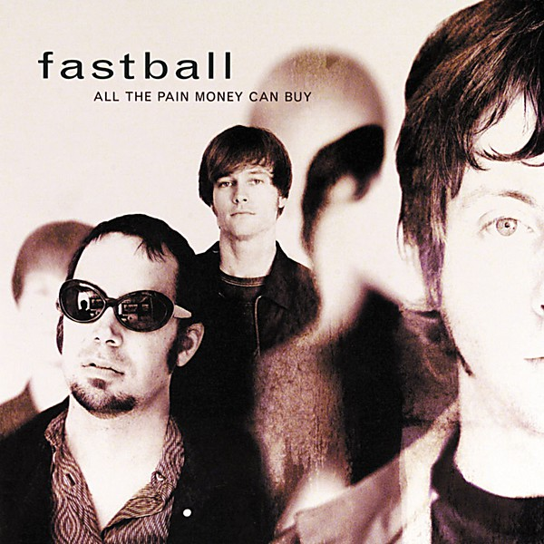

# All the Pain Money Can Buy

By **Fastball**

## Album Data

- **Catalog:** Beets
- **Format:** Digital, Album
- **Album:** All the Pain Money Can Buy
- **Artist:** Fastball
- **Albumartist:** Fastball
- **Genre:** Power Pop
- **MusicBrainz Album Artist ID:** [dc083bd6-41a3-436e-9e0a-28b4dc773820](https://musicbrainz.org/artist/dc083bd6-41a3-436e-9e0a-28b4dc773820)
- **MusicBrainz Album ID:** [58a38efc-17bc-4bab-ba9d-378a9eec5d8b](https://musicbrainz.org/release/58a38efc-17bc-4bab-ba9d-378a9eec5d8b)
- **MusicBrainz Release Group ID:** [36881d35-b032-3705-8371-5e2bf325cc60](https://musicbrainz.org/release-group/36881d35-b032-3705-8371-5e2bf325cc60)
- **Year:** 1998
- **Catalog #:** 
- **Label:** 
- **Total Tracks:** 00

## Album Tracks

### Track 02 - You’re an Ocean

- **Artist:** Fastball
- **Format:** MP3
- **Genre:** Pop Rock
- **Length:** 3:17
- **MusicBrainz Track ID:** [468fad9f-4a14-4474-9dea-a65f567c897d](https://musicbrainz.org/recording/468fad9f-4a14-4474-9dea-a65f567c897d)
- **Title:** You’re an Ocean
- **Track:** 02
- **Year:** 0000

### Track 03 - Goodbye

- **Artist:** Fastball
- **Format:** MP3
- **Genre:** Pop Rock
- **Length:** 3:13
- **MusicBrainz Track ID:** 
- **Title:** Goodbye
- **Track:** 03
- **Year:** 0000

### Track 06 - Wind Me Up

- **Artist:** Fastball
- **Format:** MP3
- **Genre:** Pop Rock
- **Length:** 3:59
- **MusicBrainz Track ID:** 
- **Title:** Wind Me Up
- **Track:** 06
- **Year:** 0000

### Track 10 - Funny How It Fades Away

- **Artist:** Fastball
- **Format:** MP3
- **Genre:** Rock
- **Length:** 4:09
- **MusicBrainz Track ID:** 
- **Title:** Funny How It Fades Away
- **Track:** 10
- **Year:** 0000

### Track 11 - Don't Give Up on Me

- **Artist:** Fastball
- **Format:** MP3
- **Genre:** Pop Rock
- **Length:** 3:33
- **MusicBrainz Track ID:** 
- **Title:** Don't Give Up on Me
- **Track:** 11
- **Year:** 0000

### Track 12 - Whatever Gets You On

- **Artist:** Fastball
- **Format:** MP3
- **Genre:** Pop Rock
- **Length:** 4:17
- **MusicBrainz Track ID:** 
- **Title:** Whatever Gets You On
- **Track:** 12
- **Year:** 0000

## See also

- [Harsh Light of Day [Bonus Tracks]](Harsh_Light_of_Day_[Bonus_Tracks].md)
- [Keep Your Wig On](Keep_Your_Wig_On.md)
- [Make Your Mama Proud](Make_Your_Mama_Proud.md)
- [CD: All The Pain Money Can Buy](../../CD/Fastball/All_The_Pain_Money_Can_Buy.md)
- [CD: ](../../CD/Fastball/Fastball.md)
- [Roon: All The Pain Money Can Buy](../../Roon/Fastball/All_The_Pain_Money_Can_Buy.md)
- [Roon: Keep Your Wig On](../../Roon/Fastball/Keep_Your_Wig_On.md)
- [Roon: Make Your Mama Proud](../../Roon/Fastball/Make_Your_Mama_Proud.md)
- [Roon: Painting The Corners](../../Roon/Fastball/Painting_The_Corners-_The_Best_Of_Fastball.md)
- [Roon: The Harsh Light Of Day](../../Roon/Fastball/The_Harsh_Light_Of_Day.md)
