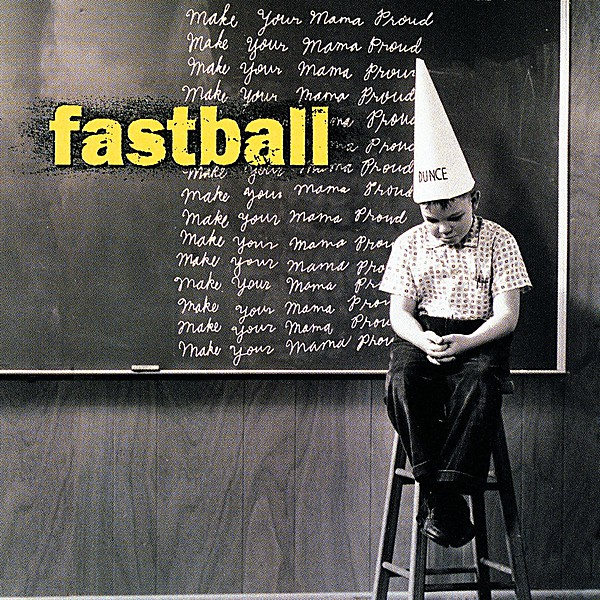

# Make Your Mama Proud

By **Fastball**

## Album Data

- **Catalog:** Beets
- **Format:** Digital, Album
- **Album:** Make Your Mama Proud
- **Artist:** Fastball
- **Albumartist:** Fastball
- **Genre:** Pop Rock
- **MusicBrainz Album Artist ID:** [dc083bd6-41a3-436e-9e0a-28b4dc773820](https://musicbrainz.org/artist/dc083bd6-41a3-436e-9e0a-28b4dc773820)
- **MusicBrainz Album ID:** [8690a65c-55bb-472e-9e15-f0bf3ae69137](https://musicbrainz.org/release/8690a65c-55bb-472e-9e15-f0bf3ae69137)
- **MusicBrainz Release Group ID:** [db6b5af4-7e7b-3fe1-a785-99e7b5f1ef76](https://musicbrainz.org/release-group/db6b5af4-7e7b-3fe1-a785-99e7b5f1ef76)
- **Year:** 1996
- **Catalog #:** HR-62045-2
- **Label:** Hollywood Records
- **Total Tracks:** 14

## Album Tracks

### Track 01 - Human Torch

- **Artist:** Fastball
- **Format:** ALAC
- **Genre:** Rock
- **Length:** 2:40
- **MusicBrainz Track ID:** [7cae3149-baae-4726-9db2-15d9431bef45](https://musicbrainz.org/recording/7cae3149-baae-4726-9db2-15d9431bef45)
- **Title:** Human Torch
- **Track:** 01
- **Year:** 1996

### Track 02 - She Comes 'Round

- **Artist:** Fastball
- **Format:** ALAC
- **Genre:** Rock
- **Length:** 3:27
- **MusicBrainz Track ID:** [cc082be1-ae12-41de-98f3-4a02f468f7ce](https://musicbrainz.org/recording/cc082be1-ae12-41de-98f3-4a02f468f7ce)
- **Title:** She Comes 'Round
- **Track:** 02
- **Year:** 1996

### Track 03 - Make Your Mama Proud

- **Artist:** Fastball
- **Format:** ALAC
- **Genre:** Pop Rock
- **Length:** 2:10
- **MusicBrainz Track ID:** [82516eb5-8260-42c6-ac7e-196eb6482964](https://musicbrainz.org/recording/82516eb5-8260-42c6-ac7e-196eb6482964)
- **Title:** Make Your Mama Proud
- **Track:** 03
- **Year:** 1996

### Track 04 - Back Door

- **Artist:** Fastball
- **Format:** ALAC
- **Genre:** Pop Rock
- **Length:** 2:20
- **MusicBrainz Track ID:** [d5332d05-3d4f-4d74-92fe-a6df63bbbf53](https://musicbrainz.org/recording/d5332d05-3d4f-4d74-92fe-a6df63bbbf53)
- **Title:** Back Door
- **Track:** 04
- **Year:** 1996

### Track 05 - Are You Ready for the Fallout?

- **Artist:** Fastball
- **Format:** ALAC
- **Genre:** Rock
- **Length:** 3:13
- **MusicBrainz Track ID:** [1fd72b87-b6df-47ad-a8c1-d32095e4f784](https://musicbrainz.org/recording/1fd72b87-b6df-47ad-a8c1-d32095e4f784)
- **Title:** Are You Ready for the Fallout?
- **Track:** 05
- **Year:** 1996

### Track 06 - Nothing

- **Artist:** Fastball
- **Format:** ALAC
- **Genre:** Pop Rock
- **Length:** 1:51
- **MusicBrainz Track ID:** [a905971c-9b30-43bf-a886-35c6d805a228](https://musicbrainz.org/recording/a905971c-9b30-43bf-a886-35c6d805a228)
- **Title:** Nothing
- **Track:** 06
- **Year:** 1996

### Track 07 - Boomerang

- **Artist:** Fastball
- **Format:** ALAC
- **Genre:** Hard Rock
- **Length:** 2:57
- **MusicBrainz Track ID:** [d30f517b-c140-4789-b9e7-406a4c85b081](https://musicbrainz.org/recording/d30f517b-c140-4789-b9e7-406a4c85b081)
- **Title:** Boomerang
- **Track:** 07
- **Year:** 1996

### Track 08 - Eater

- **Artist:** Fastball
- **Format:** ALAC
- **Genre:** Pop Rock
- **Length:** 2:42
- **MusicBrainz Track ID:** [7aed5001-967b-431d-80ea-7509f5d522e0](https://musicbrainz.org/recording/7aed5001-967b-431d-80ea-7509f5d522e0)
- **Title:** Eater
- **Track:** 08
- **Year:** 1996

### Track 09 - Knock It Down

- **Artist:** Fastball
- **Format:** ALAC
- **Genre:** Pop Rock
- **Length:** 2:08
- **MusicBrainz Track ID:** [669456b4-429a-44c7-a444-62de9a7f3288](https://musicbrainz.org/recording/669456b4-429a-44c7-a444-62de9a7f3288)
- **Title:** Knock It Down
- **Track:** 09
- **Year:** 1996

### Track 10 - Lender

- **Artist:** Fastball
- **Format:** ALAC
- **Genre:** Pop Rock
- **Length:** 1:58
- **MusicBrainz Track ID:** [b4e4fb9a-f98a-4dc8-8590-8aec73c67aa5](https://musicbrainz.org/recording/b4e4fb9a-f98a-4dc8-8590-8aec73c67aa5)
- **Title:** Lender
- **Track:** 10
- **Year:** 1996

### Track 11 - Altamont

- **Artist:** Fastball
- **Format:** ALAC
- **Genre:** Alternative Rock
- **Length:** 3:08
- **MusicBrainz Track ID:** [55af4d58-eecf-4ff3-88de-23686f67c2c7](https://musicbrainz.org/recording/55af4d58-eecf-4ff3-88de-23686f67c2c7)
- **Title:** Altamont
- **Track:** 11
- **Year:** 1996

### Track 12 - Emily

- **Artist:** Fastball
- **Format:** ALAC
- **Genre:** Pop Rock
- **Length:** 2:07
- **MusicBrainz Track ID:** [29b8e545-97ba-4211-9e7b-a291314995f6](https://musicbrainz.org/recording/29b8e545-97ba-4211-9e7b-a291314995f6)
- **Title:** Emily
- **Track:** 12
- **Year:** 1996

### Track 13 - Seattle

- **Artist:** Fastball
- **Format:** ALAC
- **Genre:** Pop Rock
- **Length:** 2:49
- **MusicBrainz Track ID:** [7c6cdbbd-0f05-4c00-9db1-0fcb15a385d6](https://musicbrainz.org/recording/7c6cdbbd-0f05-4c00-9db1-0fcb15a385d6)
- **Title:** Seattle
- **Track:** 13
- **Year:** 1996

### Track 14 - Telephone Calls

- **Artist:** Fastball
- **Format:** ALAC
- **Genre:** Pop Rock
- **Length:** 2:14
- **MusicBrainz Track ID:** [5b8f589e-6de4-4cb5-b520-4f967ceadc59](https://musicbrainz.org/recording/5b8f589e-6de4-4cb5-b520-4f967ceadc59)
- **Title:** Telephone Calls
- **Track:** 14
- **Year:** 1996

## See also

- [All the Pain Money Can Buy](All_the_Pain_Money_Can_Buy.md)
- [Harsh Light of Day [Bonus Tracks]](Harsh_Light_of_Day_[Bonus_Tracks].md)
- [Keep Your Wig On](Keep_Your_Wig_On.md)
- [CD: All The Pain Money Can Buy](../../CD/Fastball/All_The_Pain_Money_Can_Buy.md)
- [CD: ](../../CD/Fastball/Fastball.md)
- [Roon: All The Pain Money Can Buy](../../Roon/Fastball/All_The_Pain_Money_Can_Buy.md)
- [Roon: Keep Your Wig On](../../Roon/Fastball/Keep_Your_Wig_On.md)
- [Roon: Make Your Mama Proud](../../Roon/Fastball/Make_Your_Mama_Proud.md)
- [Roon: Painting The Corners](../../Roon/Fastball/Painting_The_Corners-_The_Best_Of_Fastball.md)
- [Roon: The Harsh Light Of Day](../../Roon/Fastball/The_Harsh_Light_Of_Day.md)
