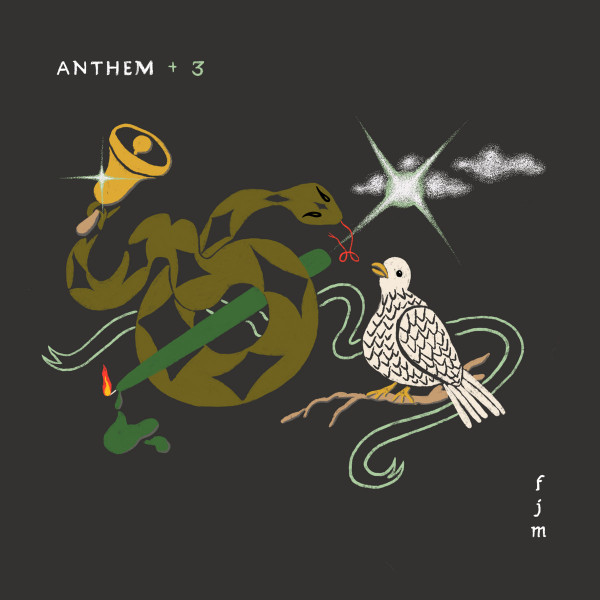

# Anthem +3

By **FATHER JOHN MISTY**

## Album Data

- **Catalog:** Beets
- **Format:** Digital, Album
- **Album:** Anthem +3
- **Artist:** Father John Misty
- **Albumartist:** FATHER JOHN MISTY
- **Genre:** Indie Folk
- **MusicBrainz Album Artist ID:** [https](https://musicbrainz.org/artist/https)
- **MusicBrainz Album ID:** [https](https://musicbrainz.org/release/https)
- **MusicBrainz Release Group ID:** 
- **Year:** 2020
- **Catalog #:** SP970
- **Label:** Sub Pop Records
- **Total Tracks:** 12

## Album Tracks

### Track 01 - Funtimes in Babylon

- **Artist:** Father John Misty
- **Format:** MP3
- **Genre:** Indie Rock
- **Length:** 3:39
- **MusicBrainz Track ID:** [76c32ee4-c7ac-4643-8170-6ee17f30f6a1](https://musicbrainz.org/recording/76c32ee4-c7ac-4643-8170-6ee17f30f6a1)
- **Title:** Funtimes in Babylon
- **Track:** 01
- **Year:** 2012

### Track 02 - Nancy From Now On

- **Artist:** Father John Misty
- **Format:** MP3
- **Genre:** Indie Rock
- **Length:** 3:54
- **MusicBrainz Track ID:** [a5e7f125-2f66-4fa1-abd2-302f95654bf4](https://musicbrainz.org/recording/a5e7f125-2f66-4fa1-abd2-302f95654bf4)
- **Title:** Nancy From Now On
- **Track:** 02
- **Year:** 2012

### Track 03 - Hollywood Forever Cemetery Sings

- **Artist:** Father John Misty
- **Format:** MP3
- **Genre:** Indie Rock
- **Length:** 3:10
- **MusicBrainz Track ID:** [44f4d675-191a-4140-a8d3-b65d0e7062d5](https://musicbrainz.org/recording/44f4d675-191a-4140-a8d3-b65d0e7062d5)
- **Title:** Hollywood Forever Cemetery Sings
- **Track:** 03
- **Year:** 2012

### Track 04 - I’m Writing a Novel

- **Artist:** Father John Misty
- **Format:** MP3
- **Genre:** Soft Rock
- **Length:** 3:35
- **MusicBrainz Track ID:** [71badd2f-d588-4bb3-8bc6-9a00744eef96](https://musicbrainz.org/recording/71badd2f-d588-4bb3-8bc6-9a00744eef96)
- **Title:** I’m Writing a Novel
- **Track:** 04
- **Year:** 2012

### Track 05 - O I Long to Feel Your Arms Around Me

- **Artist:** Father John Misty
- **Format:** MP3
- **Genre:** Indie Rock
- **Length:** 2:23
- **MusicBrainz Track ID:** [92178a07-7a0e-4609-ac66-d06971411dcc](https://musicbrainz.org/recording/92178a07-7a0e-4609-ac66-d06971411dcc)
- **Title:** O I Long to Feel Your Arms Around Me
- **Track:** 05
- **Year:** 2012

### Track 06 - Misty’s Nightmares 1 & 2

- **Artist:** Father John Misty
- **Format:** MP3
- **Genre:** Soft Rock
- **Length:** 3:13
- **MusicBrainz Track ID:** [90306703-1a12-42a4-8a6e-cea138ca2a2f](https://musicbrainz.org/recording/90306703-1a12-42a4-8a6e-cea138ca2a2f)
- **Title:** Misty’s Nightmares 1 & 2
- **Track:** 06
- **Year:** 2012

### Track 07 - Only Son of the Ladiesman

- **Artist:** Father John Misty
- **Format:** MP3
- **Genre:** Indie Rock
- **Length:** 4:09
- **MusicBrainz Track ID:** [50413384-11d8-4623-9e11-d41ab0121455](https://musicbrainz.org/recording/50413384-11d8-4623-9e11-d41ab0121455)
- **Title:** Only Son of the Ladiesman
- **Track:** 07
- **Year:** 2012

### Track 08 - This Is Sally Hatchet

- **Artist:** Father John Misty
- **Format:** MP3
- **Genre:** Indie Rock
- **Length:** 3:57
- **MusicBrainz Track ID:** [65786e55-3bf2-46e6-bbc7-fd4527a3e696](https://musicbrainz.org/recording/65786e55-3bf2-46e6-bbc7-fd4527a3e696)
- **Title:** This Is Sally Hatchet
- **Track:** 08
- **Year:** 2012

### Track 09 - Well, You Can Do It Without Me

- **Artist:** Father John Misty
- **Format:** MP3
- **Genre:** Indie Rock
- **Length:** 2:43
- **MusicBrainz Track ID:** [4fc52cb0-451a-4274-8da2-84e6a55dd690](https://musicbrainz.org/recording/4fc52cb0-451a-4274-8da2-84e6a55dd690)
- **Title:** Well, You Can Do It Without Me
- **Track:** 09
- **Year:** 2012

### Track 10 - Now I’m Learning to Love the War

- **Artist:** Father John Misty
- **Format:** MP3
- **Genre:** Soft Rock
- **Length:** 4:16
- **MusicBrainz Track ID:** [8ecc7a3a-e54f-4ecd-b68a-833adbe8469b](https://musicbrainz.org/recording/8ecc7a3a-e54f-4ecd-b68a-833adbe8469b)
- **Title:** Now I’m Learning to Love the War
- **Track:** 10
- **Year:** 2012

### Track 11 - Tee Pees 1–12

- **Artist:** Father John Misty
- **Format:** MP3
- **Genre:** Soft Rock
- **Length:** 3:16
- **MusicBrainz Track ID:** [381b34c3-4603-4055-b130-57528af30717](https://musicbrainz.org/recording/381b34c3-4603-4055-b130-57528af30717)
- **Title:** Tee Pees 1–12
- **Track:** 11
- **Year:** 2012

### Track 12 - Everyman Needs a Companion

- **Artist:** Father John Misty
- **Format:** MP3
- **Genre:** Indie Rock
- **Length:** 5:19
- **MusicBrainz Track ID:** [b086d269-b5c1-4a51-bee5-965b7fefd952](https://musicbrainz.org/recording/b086d269-b5c1-4a51-bee5-965b7fefd952)
- **Title:** Everyman Needs a Companion
- **Track:** 12
- **Year:** 2012

## See also

- [Fear Fun](Fear_Fun.md)
- [God’s Favorite Customer](God’s_Favorite_Customer.md)
- [I Love You, Honeybear](I_Love_You__Honeybear.md)
- [Off-Key In Hamburg](Off-Key_In_Hamburg.md)
- [Pure Comedy](Pure_Comedy.md)
- [CD: ](../../CD/Father_John_Misty/Father_John_Misty.md)
- [CD: Fear Fun](../../CD/Father_John_Misty/Fear_Fun.md)
- [Roon: Anthem +3](../../Roon/Father_John_Misty/Anthem_+3.md)
- [Roon: Chateau Lobby #4 (in C for Two Virgins)](../../Roon/Father_John_Misty/Chateau_Lobby_4_in_C_for_Two_Virgins.md)
- [Roon: Chloë and the Next 20th Century](../../Roon/Father_John_Misty/Chloë_and_the_Next_20th_Century.md)
- [Roon: Fear Fun](../../Roon/Father_John_Misty/Fear_Fun.md)
- [Roon: God's Favorite Customer](../../Roon/Father_John_Misty/Gods_Favorite_Customer.md)
- [Roon: I Love You, Honeybear](../../Roon/Father_John_Misty/I_Love_You__Honeybear.md)
- [Roon: Off-Key in Hamburg](../../Roon/Father_John_Misty/Off-Key_in_Hamburg.md)
- [Roon: Pure Comedy](../../Roon/Father_John_Misty/Pure_Comedy.md)
- [Roon: Things It Would Have Been Helpful to Know Before the Revolution (The Haxan Cloak Remix)](../../Roon/Father_John_Misty/Things_It_Would_Have_Been_Helpful_to_Know_Before_the_Revolution_The_Haxan_Cloak_Remix.md)
- [Vinyl: ](../../Vinyl/Father_John_Misty/Father_John_Misty.md)
- [Vinyl: Fear Fun](../../Vinyl/Father_John_Misty/Fear_Fun.md)
- [Vinyl: "I Love You, Honeybear"](../../Vinyl/Father_John_Misty/I_Love_You__Honeybear.md)
- [Vinyl: Pure Comedy](../../Vinyl/Father_John_Misty/Pure_Comedy.md)
