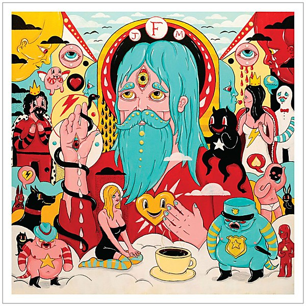

# Fear Fun

By **Father John Misty**

## Album Data

- **Catalog:** Beets
- **Format:** Digital, Album
- **Album:** Fear Fun
- **Artist:** Father John Misty
- **Albumartist:** Father John Misty
- **Genre:** Soft Rock
- **MusicBrainz Album Artist ID:** [172053e5-a7fb-4548-a64d-c53858b5e775](https://musicbrainz.org/artist/172053e5-a7fb-4548-a64d-c53858b5e775)
- **MusicBrainz Album ID:** [bc46cc23-b517-4abf-9bc8-ba16fb38e52d](https://musicbrainz.org/release/bc46cc23-b517-4abf-9bc8-ba16fb38e52d)
- **MusicBrainz Release Group ID:** [d76ee58c-cabb-4aec-b793-326ce29a7d65](https://musicbrainz.org/release-group/d76ee58c-cabb-4aec-b793-326ce29a7d65)
- **Year:** 2012
- **Catalog #:** 
- **Label:** Sub Pop Records
- **Total Tracks:** 10

## Album Tracks

### Track 01 - Hangout at the Gallows

- **Artist:** Father John Misty
- **Format:** ALAC
- **Genre:** Soft Rock
- **Length:** 4:55
- **MusicBrainz Track ID:** [48e2d1f7-050f-4bd4-b1ec-fa377318c294](https://musicbrainz.org/recording/48e2d1f7-050f-4bd4-b1ec-fa377318c294)
- **Title:** Hangout at the Gallows
- **Track:** 01
- **Year:** 2018

### Track 02 - Mr. Tillman

- **Artist:** Father John Misty
- **Format:** ALAC
- **Genre:** Soft Rock
- **Length:** 3:03
- **MusicBrainz Track ID:** [93cd9864-ee54-488e-a94c-7a05fc0a48d1](https://musicbrainz.org/recording/93cd9864-ee54-488e-a94c-7a05fc0a48d1)
- **Title:** Mr. Tillman
- **Track:** 02
- **Year:** 2018

### Track 03 - Just Dumb Enough to Try

- **Artist:** Father John Misty
- **Format:** ALAC
- **Genre:** Soft Rock
- **Length:** 4:02
- **MusicBrainz Track ID:** [7f61f1ed-9b0c-440c-be0b-c021bd7e8e6b](https://musicbrainz.org/recording/7f61f1ed-9b0c-440c-be0b-c021bd7e8e6b)
- **Title:** Just Dumb Enough to Try
- **Track:** 03
- **Year:** 2018

### Track 04 - Date Night

- **Artist:** Father John Misty
- **Format:** ALAC
- **Genre:** Indie Folk
- **Length:** 2:30
- **MusicBrainz Track ID:** [6c2f8740-22e4-46d1-a4de-8a165248dcf9](https://musicbrainz.org/recording/6c2f8740-22e4-46d1-a4de-8a165248dcf9)
- **Title:** Date Night
- **Track:** 04
- **Year:** 2018

### Track 05 - Please Don’t Die

- **Artist:** Father John Misty
- **Format:** ALAC
- **Genre:** Indie Folk
- **Length:** 3:24
- **MusicBrainz Track ID:** [ce8d940c-bdd0-48ef-9064-1a4554ea2c59](https://musicbrainz.org/recording/ce8d940c-bdd0-48ef-9064-1a4554ea2c59)
- **Title:** Please Don’t Die
- **Track:** 05
- **Year:** 2018

### Track 06 - The Palace

- **Artist:** Father John Misty
- **Format:** ALAC
- **Genre:** Indie Folk
- **Length:** 4:09
- **MusicBrainz Track ID:** [a9ca136a-9f04-44b7-8d55-c10159abcaee](https://musicbrainz.org/recording/a9ca136a-9f04-44b7-8d55-c10159abcaee)
- **Title:** The Palace
- **Track:** 06
- **Year:** 2018

### Track 07 - Disappointing Diamonds Are the Rarest of Them All

- **Artist:** Father John Misty
- **Format:** ALAC
- **Genre:** Soft Rock
- **Length:** 2:23
- **MusicBrainz Track ID:** [88ca8fa1-6ea3-4fe6-9ab6-f998803bc5ab](https://musicbrainz.org/recording/88ca8fa1-6ea3-4fe6-9ab6-f998803bc5ab)
- **Title:** Disappointing Diamonds Are the Rarest of Them All
- **Track:** 07
- **Year:** 2018

### Track 08 - God’s Favorite Customer

- **Artist:** Father John Misty
- **Format:** ALAC
- **Genre:** Indie Folk
- **Length:** 5:21
- **MusicBrainz Track ID:** [850c89bc-38c7-4131-b74d-f64ca5b69998](https://musicbrainz.org/recording/850c89bc-38c7-4131-b74d-f64ca5b69998)
- **Title:** God’s Favorite Customer
- **Track:** 08
- **Year:** 2018

### Track 09 - The Songwriter

- **Artist:** Father John Misty
- **Format:** ALAC
- **Genre:** Indie Folk
- **Length:** 3:45
- **MusicBrainz Track ID:** [2ffdea2a-d3c0-48b3-bc1e-aa5883e50e74](https://musicbrainz.org/recording/2ffdea2a-d3c0-48b3-bc1e-aa5883e50e74)
- **Title:** The Songwriter
- **Track:** 09
- **Year:** 2018

### Track 10 - We’re Only People (And There’s Not Much Anyone Can Do About That)

- **Artist:** Father John Misty
- **Format:** ALAC
- **Genre:** Indie Folk
- **Length:** 5:02
- **MusicBrainz Track ID:** [bfbdd6d1-8071-4b1f-b4dd-e31cb27a8057](https://musicbrainz.org/recording/bfbdd6d1-8071-4b1f-b4dd-e31cb27a8057)
- **Title:** We’re Only People (And There’s Not Much Anyone Can Do About That)
- **Track:** 10
- **Year:** 2018

## See also

- [Anthem +3](Anthem_+3.md)
- [God’s Favorite Customer](God’s_Favorite_Customer.md)
- [I Love You, Honeybear](I_Love_You__Honeybear.md)
- [Off-Key In Hamburg](Off-Key_In_Hamburg.md)
- [Pure Comedy](Pure_Comedy.md)
- [CD: ](../../CD/Father_John_Misty/Father_John_Misty.md)
- [CD: Fear Fun](../../CD/Father_John_Misty/Fear_Fun.md)
- [Roon: Anthem +3](../../Roon/Father_John_Misty/Anthem_+3.md)
- [Roon: Chateau Lobby #4 (in C for Two Virgins)](../../Roon/Father_John_Misty/Chateau_Lobby_4_in_C_for_Two_Virgins.md)
- [Roon: Chloë and the Next 20th Century](../../Roon/Father_John_Misty/Chloë_and_the_Next_20th_Century.md)
- [Roon: Fear Fun](../../Roon/Father_John_Misty/Fear_Fun.md)
- [Roon: God's Favorite Customer](../../Roon/Father_John_Misty/Gods_Favorite_Customer.md)
- [Roon: I Love You, Honeybear](../../Roon/Father_John_Misty/I_Love_You__Honeybear.md)
- [Roon: Off-Key in Hamburg](../../Roon/Father_John_Misty/Off-Key_in_Hamburg.md)
- [Roon: Pure Comedy](../../Roon/Father_John_Misty/Pure_Comedy.md)
- [Roon: Things It Would Have Been Helpful to Know Before the Revolution (The Haxan Cloak Remix)](../../Roon/Father_John_Misty/Things_It_Would_Have_Been_Helpful_to_Know_Before_the_Revolution_The_Haxan_Cloak_Remix.md)
- [Vinyl: ](../../Vinyl/Father_John_Misty/Father_John_Misty.md)
- [Vinyl: Fear Fun](../../Vinyl/Father_John_Misty/Fear_Fun.md)
- [Vinyl: "I Love You, Honeybear"](../../Vinyl/Father_John_Misty/I_Love_You__Honeybear.md)
- [Vinyl: Pure Comedy](../../Vinyl/Father_John_Misty/Pure_Comedy.md)
