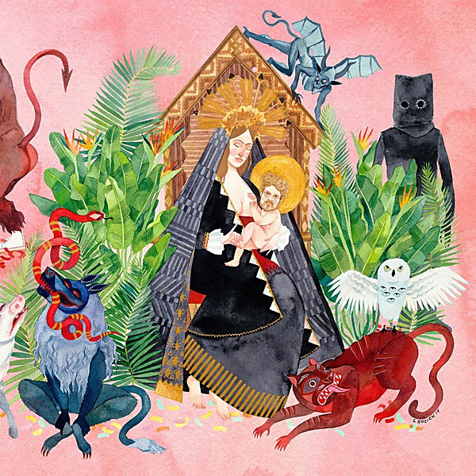

# I Love You, Honeybear

By **FATHER JOHN MISTY**

## Album Data

- **Catalog:** Beets
- **Format:** Digital, Album
- **Album:** I Love You, Honeybear
- **Artist:** Father John Misty
- **Albumartist:** FATHER JOHN MISTY
- **Genre:** Indie Rock
- **MusicBrainz Album Artist ID:** [https](https://musicbrainz.org/artist/https)
- **MusicBrainz Album ID:** [https](https://musicbrainz.org/release/https)
- **MusicBrainz Release Group ID:** 
- **Year:** 2015
- **Catalog #:** COVID-19
- **Label:** FATHER JOHN MISTY
- **Total Tracks:** 20

## Album Tracks

### Track 01 - Hangout At The Gallows

- **Artist:** FATHER JOHN MISTY
- **Format:** FLAC
- **Genre:** Soft Rock
- **Length:** 4:51
- **MusicBrainz Track ID:** [https](https://musicbrainz.org/recording/https)
- **Title:** Hangout At The Gallows
- **Track:** 01
- **Year:** 2020

### Track 01 - Hangout At The Gallows

- **Artist:** FATHER JOHN MISTY
- **Format:** MP3
- **Genre:** Soft Rock
- **Length:** 4:51
- **MusicBrainz Track ID:** [https](https://musicbrainz.org/recording/https)
- **Title:** Hangout At The Gallows
- **Track:** 01
- **Year:** 2020

### Track 02 - Hollywood Forever Cemetery Sings

- **Artist:** FATHER JOHN MISTY
- **Format:** FLAC
- **Genre:** Indie Rock
- **Length:** 3:22
- **MusicBrainz Track ID:** [https](https://musicbrainz.org/recording/https)
- **Title:** Hollywood Forever Cemetery Sings
- **Track:** 02
- **Year:** 2020

### Track 02 - Hollywood Forever Cemetery Sings

- **Artist:** FATHER JOHN MISTY
- **Format:** MP3
- **Genre:** Indie Rock
- **Length:** 3:22
- **MusicBrainz Track ID:** [https](https://musicbrainz.org/recording/https)
- **Title:** Hollywood Forever Cemetery Sings
- **Track:** 02
- **Year:** 2020

### Track 03 - Mr. Tillman

- **Artist:** FATHER JOHN MISTY
- **Format:** FLAC
- **Genre:** Soft Rock
- **Length:** 3:30
- **MusicBrainz Track ID:** [https](https://musicbrainz.org/recording/https)
- **Title:** Mr. Tillman
- **Track:** 03
- **Year:** 2020

### Track 03 - Mr. Tillman

- **Artist:** FATHER JOHN MISTY
- **Format:** MP3
- **Genre:** Soft Rock
- **Length:** 3:30
- **MusicBrainz Track ID:** [https](https://musicbrainz.org/recording/https)
- **Title:** Mr. Tillman
- **Track:** 03
- **Year:** 2020

### Track 04 - Disappointing Diamonds Are The Rarest of Them All

- **Artist:** FATHER JOHN MISTY
- **Format:** FLAC
- **Genre:** Soft Rock
- **Length:** 2:30
- **MusicBrainz Track ID:** [https](https://musicbrainz.org/recording/https)
- **Title:** Disappointing Diamonds Are The Rarest of Them All
- **Track:** 04
- **Year:** 2020

### Track 04 - Disappointing Diamonds Are The Rarest of Them All

- **Artist:** FATHER JOHN MISTY
- **Format:** MP3
- **Genre:** Soft Rock
- **Length:** 2:30
- **MusicBrainz Track ID:** [https](https://musicbrainz.org/recording/https)
- **Title:** Disappointing Diamonds Are The Rarest of Them All
- **Track:** 04
- **Year:** 2020

### Track 05 - The Night Josh Tillman Came To Our Apt.

- **Artist:** FATHER JOHN MISTY
- **Format:** FLAC
- **Genre:** Indie Folk
- **Length:** 3:35
- **MusicBrainz Track ID:** [https](https://musicbrainz.org/recording/https)
- **Title:** The Night Josh Tillman Came To Our Apt.
- **Track:** 05
- **Year:** 2020

### Track 05 - The Night Josh Tillman Came To Our Apt.

- **Artist:** FATHER JOHN MISTY
- **Format:** MP3
- **Genre:** Indie Folk
- **Length:** 3:35
- **MusicBrainz Track ID:** [https](https://musicbrainz.org/recording/https)
- **Title:** The Night Josh Tillman Came To Our Apt.
- **Track:** 05
- **Year:** 2020

### Track 06 - Strange Encounter

- **Artist:** FATHER JOHN MISTY
- **Format:** FLAC
- **Genre:** Indie Folk
- **Length:** 4:19
- **MusicBrainz Track ID:** [https](https://musicbrainz.org/recording/https)
- **Title:** Strange Encounter
- **Track:** 06
- **Year:** 2020

### Track 06 - Strange Encounter

- **Artist:** FATHER JOHN MISTY
- **Format:** MP3
- **Genre:** Indie Folk
- **Length:** 4:19
- **MusicBrainz Track ID:** [https](https://musicbrainz.org/recording/https)
- **Title:** Strange Encounter
- **Track:** 06
- **Year:** 2020

### Track 07 - Total Entertainment Forever

- **Artist:** FATHER JOHN MISTY
- **Format:** FLAC
- **Genre:** Pop
- **Length:** 2:47
- **MusicBrainz Track ID:** [https](https://musicbrainz.org/recording/https)
- **Title:** Total Entertainment Forever
- **Track:** 07
- **Year:** 2020

### Track 07 - Total Entertainment Forever

- **Artist:** FATHER JOHN MISTY
- **Format:** MP3
- **Genre:** Pop
- **Length:** 2:47
- **MusicBrainz Track ID:** [https](https://musicbrainz.org/recording/https)
- **Title:** Total Entertainment Forever
- **Track:** 07
- **Year:** 2020

### Track 08 - Things It Would've Been Helpful To Know Before The Revolution

- **Artist:** FATHER JOHN MISTY
- **Format:** FLAC
- **Genre:** Indie Folk
- **Length:** 4:24
- **MusicBrainz Track ID:** [https](https://musicbrainz.org/recording/https)
- **Title:** Things It Would've Been Helpful To Know Before The Revolution
- **Track:** 08
- **Year:** 2020

### Track 08 - Things It Would've Been Helpful To Know Before The Revolution

- **Artist:** FATHER JOHN MISTY
- **Format:** MP3
- **Genre:** Indie Folk
- **Length:** 4:24
- **MusicBrainz Track ID:** [https](https://musicbrainz.org/recording/https)
- **Title:** Things It Would've Been Helpful To Know Before The Revolution
- **Track:** 08
- **Year:** 2020

### Track 09 - Ballad Of The Dying Man

- **Artist:** FATHER JOHN MISTY
- **Format:** FLAC
- **Genre:** Indie Folk
- **Length:** 5:03
- **MusicBrainz Track ID:** [https](https://musicbrainz.org/recording/https)
- **Title:** Ballad Of The Dying Man
- **Track:** 09
- **Year:** 2020

### Track 09 - Ballad Of The Dying Man

- **Artist:** FATHER JOHN MISTY
- **Format:** MP3
- **Genre:** Indie Folk
- **Length:** 5:03
- **MusicBrainz Track ID:** [https](https://musicbrainz.org/recording/https)
- **Title:** Ballad Of The Dying Man
- **Track:** 09
- **Year:** 2020

### Track 10 - A Bigger Paper Bag

- **Artist:** FATHER JOHN MISTY
- **Format:** FLAC
- **Genre:** Indie Folk
- **Length:** 4:34
- **MusicBrainz Track ID:** [https](https://musicbrainz.org/recording/https)
- **Title:** A Bigger Paper Bag
- **Track:** 10
- **Year:** 2020

### Track 10 - A Bigger Paper Bag

- **Artist:** FATHER JOHN MISTY
- **Format:** MP3
- **Genre:** Indie Folk
- **Length:** 4:34
- **MusicBrainz Track ID:** [https](https://musicbrainz.org/recording/https)
- **Title:** A Bigger Paper Bag
- **Track:** 10
- **Year:** 2020

### Track 11 - I Went To The Store One Day

- **Artist:** FATHER JOHN MISTY
- **Format:** FLAC
- **Genre:** Indie Folk
- **Length:** 4:31
- **MusicBrainz Track ID:** [https](https://musicbrainz.org/recording/https)
- **Title:** I Went To The Store One Day
- **Track:** 11
- **Year:** 2020

### Track 11 - I Went To The Store One Day

- **Artist:** FATHER JOHN MISTY
- **Format:** MP3
- **Genre:** Indie Folk
- **Length:** 4:31
- **MusicBrainz Track ID:** [https](https://musicbrainz.org/recording/https)
- **Title:** I Went To The Store One Day
- **Track:** 11
- **Year:** 2020

### Track 12 - Nancy From Now On

- **Artist:** FATHER JOHN MISTY
- **Format:** FLAC
- **Genre:** Indie Rock
- **Length:** 3:52
- **MusicBrainz Track ID:** [https](https://musicbrainz.org/recording/https)
- **Title:** Nancy From Now On
- **Track:** 12
- **Year:** 2020

### Track 12 - Nancy From Now On

- **Artist:** FATHER JOHN MISTY
- **Format:** MP3
- **Genre:** Indie Rock
- **Length:** 3:52
- **MusicBrainz Track ID:** [https](https://musicbrainz.org/recording/https)
- **Title:** Nancy From Now On
- **Track:** 12
- **Year:** 2020

### Track 13 - Chateau Lobby #4 (In C For Two Virgins)

- **Artist:** FATHER JOHN MISTY
- **Format:** FLAC
- **Genre:** Indie Rock
- **Length:** 3:03
- **MusicBrainz Track ID:** [https](https://musicbrainz.org/recording/https)
- **Title:** Chateau Lobby #4 (In C For Two Virgins)
- **Track:** 13
- **Year:** 2020

### Track 13 - Chateau Lobby #4 (In C For Two Virgins)

- **Artist:** FATHER JOHN MISTY
- **Format:** MP3
- **Genre:** Indie Rock
- **Length:** 3:03
- **MusicBrainz Track ID:** [https](https://musicbrainz.org/recording/https)
- **Title:** Chateau Lobby #4 (In C For Two Virgins)
- **Track:** 13
- **Year:** 2020

### Track 14 - Please Don't Die

- **Artist:** FATHER JOHN MISTY
- **Format:** FLAC
- **Genre:** Soft Rock
- **Length:** 3:30
- **MusicBrainz Track ID:** [https](https://musicbrainz.org/recording/https)
- **Title:** Please Don't Die
- **Track:** 14
- **Year:** 2020

### Track 14 - Please Don't Die

- **Artist:** FATHER JOHN MISTY
- **Format:** MP3
- **Genre:** Soft Rock
- **Length:** 3:30
- **MusicBrainz Track ID:** [https](https://musicbrainz.org/recording/https)
- **Title:** Please Don't Die
- **Track:** 14
- **Year:** 2020

### Track 15 - The Palace

- **Artist:** FATHER JOHN MISTY
- **Format:** FLAC
- **Genre:** Indie Folk
- **Length:** 4:12
- **MusicBrainz Track ID:** [https](https://musicbrainz.org/recording/https)
- **Title:** The Palace
- **Track:** 15
- **Year:** 2020

### Track 15 - The Palace

- **Artist:** FATHER JOHN MISTY
- **Format:** MP3
- **Genre:** Indie Folk
- **Length:** 4:12
- **MusicBrainz Track ID:** [https](https://musicbrainz.org/recording/https)
- **Title:** The Palace
- **Track:** 15
- **Year:** 2020

### Track 16 - God's Favorite Customer

- **Artist:** FATHER JOHN MISTY
- **Format:** FLAC
- **Genre:** Indie Folk
- **Length:** 5:35
- **MusicBrainz Track ID:** [https](https://musicbrainz.org/recording/https)
- **Title:** God's Favorite Customer
- **Track:** 16
- **Year:** 2020

### Track 16 - God's Favorite Customer

- **Artist:** FATHER JOHN MISTY
- **Format:** MP3
- **Genre:** Indie Folk
- **Length:** 5:35
- **MusicBrainz Track ID:** [https](https://musicbrainz.org/recording/https)
- **Title:** God's Favorite Customer
- **Track:** 16
- **Year:** 2020

### Track 17 - Pure Comedy

- **Artist:** FATHER JOHN MISTY
- **Format:** FLAC
- **Genre:** Indie Folk
- **Length:** 6:22
- **MusicBrainz Track ID:** [https](https://musicbrainz.org/recording/https)
- **Title:** Pure Comedy
- **Track:** 17
- **Year:** 2020

### Track 17 - Pure Comedy

- **Artist:** FATHER JOHN MISTY
- **Format:** MP3
- **Genre:** Indie Folk
- **Length:** 6:22
- **MusicBrainz Track ID:** [https](https://musicbrainz.org/recording/https)
- **Title:** Pure Comedy
- **Track:** 17
- **Year:** 2020

### Track 18 - Holy Shit

- **Artist:** FATHER JOHN MISTY
- **Format:** FLAC
- **Genre:** Indie Folk
- **Length:** 4:05
- **MusicBrainz Track ID:** [https](https://musicbrainz.org/recording/https)
- **Title:** Holy Shit
- **Track:** 18
- **Year:** 2020

### Track 18 - Holy Shit

- **Artist:** FATHER JOHN MISTY
- **Format:** MP3
- **Genre:** Indie Folk
- **Length:** 4:05
- **MusicBrainz Track ID:** [https](https://musicbrainz.org/recording/https)
- **Title:** Holy Shit
- **Track:** 18
- **Year:** 2020

### Track 19 - I Love You, Honeybear

- **Artist:** FATHER JOHN MISTY
- **Format:** FLAC
- **Genre:** Indie Folk
- **Length:** 6:04
- **MusicBrainz Track ID:** [https](https://musicbrainz.org/recording/https)
- **Title:** I Love You, Honeybear
- **Track:** 19
- **Year:** 2020

### Track 19 - I Love You, Honeybear

- **Artist:** FATHER JOHN MISTY
- **Format:** MP3
- **Genre:** Indie Folk
- **Length:** 6:04
- **MusicBrainz Track ID:** [https](https://musicbrainz.org/recording/https)
- **Title:** I Love You, Honeybear
- **Track:** 19
- **Year:** 2020

### Track 20 - Leaving LA

- **Artist:** FATHER JOHN MISTY
- **Format:** FLAC
- **Genre:** Indie Folk
- **Length:** 12:28
- **MusicBrainz Track ID:** [https](https://musicbrainz.org/recording/https)
- **Title:** Leaving LA
- **Track:** 20
- **Year:** 2020

### Track 20 - Leaving LA

- **Artist:** FATHER JOHN MISTY
- **Format:** MP3
- **Genre:** Indie Folk
- **Length:** 12:28
- **MusicBrainz Track ID:** [https](https://musicbrainz.org/recording/https)
- **Title:** Leaving LA
- **Track:** 20
- **Year:** 2020

## See also

- [Anthem +3](Anthem_+3.md)
- [Fear Fun](Fear_Fun.md)
- [God’s Favorite Customer](God’s_Favorite_Customer.md)
- [Off-Key In Hamburg](Off-Key_In_Hamburg.md)
- [Pure Comedy](Pure_Comedy.md)
- [CD: ](../../CD/Father_John_Misty/Father_John_Misty.md)
- [CD: Fear Fun](../../CD/Father_John_Misty/Fear_Fun.md)
- [Roon: Anthem +3](../../Roon/Father_John_Misty/Anthem_+3.md)
- [Roon: Chateau Lobby #4 (in C for Two Virgins)](../../Roon/Father_John_Misty/Chateau_Lobby_4_in_C_for_Two_Virgins.md)
- [Roon: Chloë and the Next 20th Century](../../Roon/Father_John_Misty/Chloë_and_the_Next_20th_Century.md)
- [Roon: Fear Fun](../../Roon/Father_John_Misty/Fear_Fun.md)
- [Roon: God's Favorite Customer](../../Roon/Father_John_Misty/Gods_Favorite_Customer.md)
- [Roon: I Love You, Honeybear](../../Roon/Father_John_Misty/I_Love_You__Honeybear.md)
- [Roon: Off-Key in Hamburg](../../Roon/Father_John_Misty/Off-Key_in_Hamburg.md)
- [Roon: Pure Comedy](../../Roon/Father_John_Misty/Pure_Comedy.md)
- [Roon: Things It Would Have Been Helpful to Know Before the Revolution (The Haxan Cloak Remix)](../../Roon/Father_John_Misty/Things_It_Would_Have_Been_Helpful_to_Know_Before_the_Revolution_The_Haxan_Cloak_Remix.md)
- [Vinyl: ](../../Vinyl/Father_John_Misty/Father_John_Misty.md)
- [Vinyl: Fear Fun](../../Vinyl/Father_John_Misty/Fear_Fun.md)
- [Vinyl: "I Love You, Honeybear"](../../Vinyl/Father_John_Misty/I_Love_You__Honeybear.md)
- [Vinyl: Pure Comedy](../../Vinyl/Father_John_Misty/Pure_Comedy.md)
