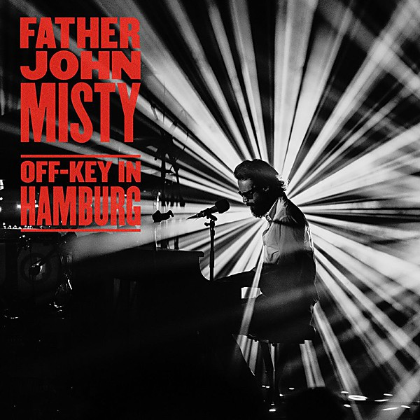

# Off-Key In Hamburg

By **FATHER JOHN MISTY**

## Album Data

- **Catalog:** Beets
- **Format:** Digital, Album
- **Album:** Off-Key In Hamburg
- **Artist:** Father John Misty
- **Albumartist:** FATHER JOHN MISTY
- **Genre:** Indie Folk
- **MusicBrainz Album Artist ID:** [https](https://musicbrainz.org/artist/https)
- **MusicBrainz Album ID:** [https](https://musicbrainz.org/release/https)
- **MusicBrainz Release Group ID:** 
- **Year:** 2020
- **Catalog #:** 
- **Label:** Sub Pop
- **Total Tracks:** 13

## Album Tracks

### Track 01 - Pure Comedy

- **Artist:** FATHER JOHN MISTY
- **Format:** MP3
- **Genre:** Indie Folk
- **Length:** 6:24
- **MusicBrainz Track ID:** [https](https://musicbrainz.org/recording/https)
- **Title:** Pure Comedy
- **Track:** 01
- **Year:** 2017

### Track 02 - Total Entertainment Forever

- **Artist:** FATHER JOHN MISTY
- **Format:** MP3
- **Genre:** Pop
- **Length:** 2:53
- **MusicBrainz Track ID:** [https](https://musicbrainz.org/recording/https)
- **Title:** Total Entertainment Forever
- **Track:** 02
- **Year:** 2017

### Track 03 - Things It Would Have Been Helpful to Know Before the Revolution

- **Artist:** FATHER JOHN MISTY
- **Format:** MP3
- **Genre:** Indie Folk
- **Length:** 4:18
- **MusicBrainz Track ID:** [https](https://musicbrainz.org/recording/https)
- **Title:** Things It Would Have Been Helpful to Know Before the Revolution
- **Track:** 03
- **Year:** 2017

### Track 04 - Ballad of the Dying Man

- **Artist:** FATHER JOHN MISTY
- **Format:** MP3
- **Genre:** Indie Folk
- **Length:** 4:50
- **MusicBrainz Track ID:** [https](https://musicbrainz.org/recording/https)
- **Title:** Ballad of the Dying Man
- **Track:** 04
- **Year:** 2017

### Track 05 - Birdie

- **Artist:** FATHER JOHN MISTY
- **Format:** MP3
- **Genre:** Indie Folk
- **Length:** 5:19
- **MusicBrainz Track ID:** [https](https://musicbrainz.org/recording/https)
- **Title:** Birdie
- **Track:** 05
- **Year:** 2017

### Track 06 - Leaving LA

- **Artist:** FATHER JOHN MISTY
- **Format:** MP3
- **Genre:** Indie Folk
- **Length:** 13:11
- **MusicBrainz Track ID:** [https](https://musicbrainz.org/recording/https)
- **Title:** Leaving LA
- **Track:** 06
- **Year:** 2017

### Track 07 - A Bigger Paper Bag

- **Artist:** FATHER JOHN MISTY
- **Format:** MP3
- **Genre:** Indie Folk
- **Length:** 4:41
- **MusicBrainz Track ID:** [https](https://musicbrainz.org/recording/https)
- **Title:** A Bigger Paper Bag
- **Track:** 07
- **Year:** 2017

### Track 08 - When the God of Love Returns There'll Be Hell to Pay

- **Artist:** FATHER JOHN MISTY
- **Format:** MP3
- **Genre:** Indie Folk
- **Length:** 4:04
- **MusicBrainz Track ID:** [https](https://musicbrainz.org/recording/https)
- **Title:** When the God of Love Returns There'll Be Hell to Pay
- **Track:** 08
- **Year:** 2017

### Track 09 - Smoochie

- **Artist:** FATHER JOHN MISTY
- **Format:** MP3
- **Genre:** Indie Folk
- **Length:** 3:45
- **MusicBrainz Track ID:** [https](https://musicbrainz.org/recording/https)
- **Title:** Smoochie
- **Track:** 09
- **Year:** 2017

### Track 10 - Two Wildly Different Perspectives

- **Artist:** FATHER JOHN MISTY
- **Format:** MP3
- **Genre:** Indie Folk
- **Length:** 3:12
- **MusicBrainz Track ID:** [https](https://musicbrainz.org/recording/https)
- **Title:** Two Wildly Different Perspectives
- **Track:** 10
- **Year:** 2017

### Track 11 - The Memo

- **Artist:** FATHER JOHN MISTY
- **Format:** MP3
- **Genre:** Indie Folk
- **Length:** 5:16
- **MusicBrainz Track ID:** [https](https://musicbrainz.org/recording/https)
- **Title:** The Memo
- **Track:** 11
- **Year:** 2017

### Track 12 - So I'm Growing Old on Magic Mountain

- **Artist:** FATHER JOHN MISTY
- **Format:** MP3
- **Genre:** Indie Folk
- **Length:** 9:58
- **MusicBrainz Track ID:** [https](https://musicbrainz.org/recording/https)
- **Title:** So I'm Growing Old on Magic Mountain
- **Track:** 12
- **Year:** 2017

### Track 13 - In Twenty Years or So

- **Artist:** FATHER JOHN MISTY
- **Format:** MP3
- **Genre:** Indie Folk
- **Length:** 6:27
- **MusicBrainz Track ID:** [https](https://musicbrainz.org/recording/https)
- **Title:** In Twenty Years or So
- **Track:** 13
- **Year:** 2017

## See also

- [Anthem +3](Anthem_+3.md)
- [Fear Fun](Fear_Fun.md)
- [God’s Favorite Customer](God’s_Favorite_Customer.md)
- [I Love You, Honeybear](I_Love_You__Honeybear.md)
- [Pure Comedy](Pure_Comedy.md)
- [CD: ](../../CD/Father_John_Misty/Father_John_Misty.md)
- [CD: Fear Fun](../../CD/Father_John_Misty/Fear_Fun.md)
- [Roon: Anthem +3](../../Roon/Father_John_Misty/Anthem_+3.md)
- [Roon: Chateau Lobby #4 (in C for Two Virgins)](../../Roon/Father_John_Misty/Chateau_Lobby_4_in_C_for_Two_Virgins.md)
- [Roon: Chloë and the Next 20th Century](../../Roon/Father_John_Misty/Chloë_and_the_Next_20th_Century.md)
- [Roon: Fear Fun](../../Roon/Father_John_Misty/Fear_Fun.md)
- [Roon: God's Favorite Customer](../../Roon/Father_John_Misty/Gods_Favorite_Customer.md)
- [Roon: I Love You, Honeybear](../../Roon/Father_John_Misty/I_Love_You__Honeybear.md)
- [Roon: Off-Key in Hamburg](../../Roon/Father_John_Misty/Off-Key_in_Hamburg.md)
- [Roon: Pure Comedy](../../Roon/Father_John_Misty/Pure_Comedy.md)
- [Roon: Things It Would Have Been Helpful to Know Before the Revolution (The Haxan Cloak Remix)](../../Roon/Father_John_Misty/Things_It_Would_Have_Been_Helpful_to_Know_Before_the_Revolution_The_Haxan_Cloak_Remix.md)
- [Vinyl: ](../../Vinyl/Father_John_Misty/Father_John_Misty.md)
- [Vinyl: Fear Fun](../../Vinyl/Father_John_Misty/Fear_Fun.md)
- [Vinyl: "I Love You, Honeybear"](../../Vinyl/Father_John_Misty/I_Love_You__Honeybear.md)
- [Vinyl: Pure Comedy](../../Vinyl/Father_John_Misty/Pure_Comedy.md)
